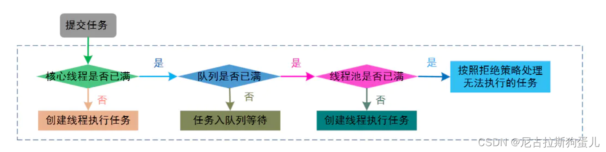

=============================================基础知识=======================================================

1、为什么要使用并发编程？
    提升多核CPU的利用率：充分利用多核CPU的计算能力
    提高程序运行速度

2、并发编程有什么缺点？
    优点：提升多核CPU的利用率;提高程序运行速度
    缺点：内存泄漏、线程安全、死锁

3、并发编程三个必要因素是什么？
    原子性：一个或多个操作要么全部执行成功要么 全部执行失败。
    可见性：一个线程对共享变量的修改,另一个线程能够立刻看到。（synchronized,volatile）
    有序性：程序执行的顺序按照代码的先后顺序执行。（处理器可能会对指令进行重排序）

4、多线程应用场景？
    数据库连接池、文件下载、分批发送短信

5、Java 程序中怎么保证多线程的运行安全？
    synchronized、volatile、LOCK

6、并行、并发、串行有什么区别？
    并发：多个任务在同一个 CPU 核上，按细分的时间片轮流(交替)执行
    并行：多个处理器或多核处理器同时处理多个任务，是真正意义上的“同时进行”。
    串行：有n个任务，由一个线程按顺序执行。
    并发 = 俩个人用一台电脑。
    并行 = 俩个人分配了俩台电脑。
    串行 = 俩个人排队使用一台电脑。

7、什么是多线程？
    多线程是并发编程的一种实现方式；一个进程中同时有多个线程执行任务

8、多线程的好处？
    提高 CPU 的利用率，提高程序的处理效率

9、多线程的劣势？
    资源消耗‌：多线程程序可能导致对计算机资源的竞争（内存、CPU）
    资源竞争与线程安全问题：多个线程可能竞争同一资源，导致数据混乱和程序错误
    性能问题‌：过多的线程会消耗大量的系统资源

10、什么是线程和进程?  
    进程：运行的程序。一个进程至少有一个线程
    线程：进程中的一个执行任务（控制单元）。多个线程可共享数据

11、线程和进程区别？
    根本区别：进程是操作系统资源分配的基本单位，而线程是处理器任务调度和执行的基本单位
    资源开销：每个进程都有独立的代码和数据空间（程序上下文），程序之间的切换会有较大的开销；线程共享代码和数据空间，切换的开销小。
    包含关系：进程内有多个线程；线程是进程的一部分。
    内存分配：进程与进程之间的地址空间和资源是相互独立的；线程共享本进程的地址空间和资源
    影响关系：一个进程崩溃后，不会对其他进程产生影响；一个线程崩溃有可能导致整个进程都崩溃
    执行过程：进程可独立执行；线程不能独立执行，必须依存在应用程序。

12、什么是上下文切换?
    当一个线程的时间片用完的时候就会重新处于就绪状态让给其他线程使用，这个过程就属于一次上下文切换。

13、守护线程和用户线程有什么区别呢？
用户 (User) 线程：执行具体的任务，除了守护线程都是用户线程
守护 (Daemon) 线程：为用户线程服务。所有用户线程都结束运行，守护线程才会结束

14、什么是线程死锁？
    死锁是指两个或两个以上的进程（线程）在执 行过程中，由于竞争资源或者由于彼此通信而造成的一种阻塞的现象，若无外力作用，它们都将无法推进下去。
    即：线程之间由于资源竞争造成的一种阻塞现象

15、形成死锁的四个必要条件是什么？
    互斥条件： 一个资源仅为一个线程所占有
    请求和保持条件： 已经持有了一个资源，但是又要访问一个新的被其他线程占用的资源
    不可剥夺条件： 线程对已经获取的资源未使用完之前不能被剥夺
    循环等待条件：链中每一个线程程已获得的资源同时被链中下一个进程所请求
 

16、如何避免线程死锁？
    避免一个线程同时获得多个锁
    避免一个线程在锁内同时占用多个资源，尽量保证每个锁只占用一个资源
    尝试使用定时锁，使用lock.tryLock(timeout)来替代使用内部锁机制

17、创建线程的四种方式？

    继承 Thread 类run()方法
    public class MyThread extends Thread {
    @Override
    public void run() {
    System.out.println(Thread.currentThread().getName() + " run()方法正在执行...");
    }
    
    实现 Runnable 接口run()方法
	public class MyRunnable implements Runnable {
	@Override
	public void run() {
		System.out.println(Thread.currentThread().getName() + " run()方法执行中...");
	}

    实现 Callable 接口的call()方法
	public class MyCallable implements Callable<Integer> {
		@Override
		public Integer call() {
			System.out.println(Thread.currentThread().getName() + " call()方法执行中...");
			return 1;
		}
	}

    // 1创建一个ExecutorService
    ExecutorService executor = Executors.newSingleThreadExecutor();

    // 2 提交任务并获取Future对象
    Future<String> future = executor.submit(MyCallable);

    // 2使用FutureTask来包装Callable任务
    FutureTask<Integer> futureTask = new FutureTask<>(task);
    // 提交FutureTask到ExecutorService
    executor.execute(futureTask);

    // 3获取异步计算的结果
    Integer result = future.get();

    // 3获取异步计算的结果
    Integer result = futureTask.get(); // 这会阻塞，直到任务完成

    // 4关闭ExecutorService
    executor.shutdown();

    使用匿名内部类方式
	public class CreateRunnable {
		public static void main(String[] args) {
			//创建多线程创建开始
			Thread thread = new Thread(new Runnable() {
				public void run() {
					for (int i = 0; i < 10; i++) {
						System.out.println("i:" + i);
					}
				}
			});
			thread.start();
		}
	}

18、说一下 runnable 和 callable 有什么区别？
    Runnable 接口 run 方法无返回值；
    Callable 接口 call 方法有返回值，是个泛型，和Future或者FutureTask配合可以用来获取异步执行的结果
    Runnable 接口 run 方法只能抛出运行时异常，且无法捕获处理；
    Callable 接口 call 方法允许抛出异常，可以获取异常信息 

_~~19、线程的 run()和 start()有什么区别？~~_
    start() 方法用于启动线程；
    run() 方法用于执行线程的运行时代码

 

20、为什么我们调用 start() 方法时会执行 run() 方法，为什么我们不能直接调用run() 方法？
    start() 方法 可启动线程并使线程进入就绪状态
    run()   方法只是 thread 的一个普通方法调用；直接调用run()方法并没有开启新的线程，还是在主线程里执行

21、什么是 Callable 和 Future?
    Callable用于产生结果
    Future 用于获取结果

22、什么是 FutureTask？
    FutureTask 里面可以传入一个 Callable 的具体实现类，可以对这个异步运算的任务的结果进行等待获取

23、线程的状态
    新建(new)：新创建了一个线程对象。
    就绪（可运行状态）(runnable)：调用start()方法，该线程处于就绪状态，获取cpu的使用权。
    运行(running)：就绪状态的线程获得了cpu时间片，执行程序代码。
    阻塞(block)：处于运行状态中的线程由于某种原因，暂时放弃对CPU的使用权，进入阻塞状态，直到其进入到就绪状态，才有机会再次被CPU调用以进入到运行状态。
        (一). 等待阻塞：运行状态中的线程执行 wait()方法，JVM会把该线程放入等待队列(waitting
        queue)中，使本线程进入到等待阻塞状态；
        (二). 同步阻塞：线程在获取 synchronized 同步锁失败(因为锁被其它线程所占用)，则JVM
        会把该线程放入锁池(lock pool)中，线程会进入同步阻塞状态；
        (三). 其他阻塞: 通过调用线程的 sleep()或 join()或发出了 I/O 请求时，线程会进入到阻塞状
        态。当 sleep()状态超时、join()等待线程终止或者超时、或者 I/O 处理完毕时，线程重新转入
        就绪状态。
    死亡(dead)(结束)：线程run()、main()方法执行结束，或者因异常退出了run()方法，则该线程结束
    生命周期。

24、Java 中用到的线程调度算法是什么？
    Java虚拟机采用抢占式调度模型：是指优先让可运行池中优先级高的线程占用CPU，如果可运行池中的线程优先级相同，那么就随机选择一个线程，使其占用CPU。处于运行状态的线程会一直运行，直至它不得不放弃 CPU。 
    分时调度模型：是指让所有的线程轮流获得 cpu 的使用权，并且平均分配每个线程占用的 CPU 的时间片这个也比较好理解

~~25、 发生以下情况，就会终止线程的运行：~~
    （1）线程体中调用了 yield 方法让出了对 cpu 的占用权利
    （2）线程体中调用了 sleep 方法使线程进入睡眠状态
    （3）线程由于 IO 操作受到阻塞
    （4）另外一个更高优先级线程出现
    （5）在支持时间片的系统中，该线程的时间片用完

26、请说出与线程同步以及线程调度相关的方法？  WaitAndNotifyExample.java
    （1） wait()：使一个线程处于等待（阻塞）状态，并且释放所持有的对象的锁；
    （2）sleep()：使一个正在运行的线程处于睡眠状态，是一个静态方法，调用此方法要处理InterruptedException 异常；
    （3）notify()：唤醒一个处于等待状态的线程，并不能确切的唤醒某一个等待状态的线程，而是由 JVM 确定唤醒哪个线程，而且与优先级无关；
    （4）notityAll()：唤醒所有处于等待状态的线程，让它们竞争，只有获得锁的线程才能进入就绪状态；

27、 sleep() 和 wait() 有什么区别？
    类的不同：sleep() 是 Thread线程类的静态方法，wait() 是 Object类的方法。
    是否释放锁：sleep() 不释放锁；wait() 释放锁。
    用途不同：Wait 通常被用于线程间交互/通信，sleep 通常被用于暂停执行。
    用法不同：wait() 方法被调用后，线程不会自动苏醒，需要别的线程调用同一个对象上的 notify()或者 notifyAll() 方法。sleep() 方法执行完成后，线程会自动苏醒。或者可以使用wait(long timeout)超时后线程会自动苏醒。

28、你是如何调用 wait() 方法的？使用 if 块还是循环？为什么？
    wait() 方法应该在循环调用，因为当线程获取到 CPU 开始执行的时候，其他条件可能还没有满足，所以在处理前，循环检测条件是否满足会更好
    if只会检测一次，而循环会重复检测

    synchronized (monitor) {
        // 判断条件谓词是否得到满足
        while(!locked) { 
        // 等待唤醒
        monitor.wait();
        }
    // 处理其他的业务逻辑
    }

29、为什么线程通信的方法 wait(), notify()和 notifyAll()被定义在 Object 类里？
    因为Java所有类的都继承了Object，Java想让任何对象都可以作为锁

30、为什么 wait(), notify()和 notifyAll()必须在同步方法或者同步块中被调用？
    当一个线程需要调用对象的 wait()方法的时候，这个线程必须拥有该对象的锁，
    接着它就会释放这个对象锁并进入等待状态直到其他线程调用这个对象上的 notify()方法

31、Thread 类中的 yield 方法有什么作用？、
    使当前线程从 运行状态  变为 就绪状态，所有就绪状态的线程重新获取cpu资源。

32、为什么 Thread 类的 sleep()和 yield ()方法是静态的？
    Thread 类的 sleep()和 yield()方法将在 运行状态 的线程上执行

33、线程的 sleep()方法和 yield()方法有什么区别？
    （1） sleep()方法给其他线程运行机会时不考虑线程的优先级；yield()方法只会给相同优先级或更高优先级的线程以运行的机会；
    （2） 线程执行 sleep()方法后转入 阻塞（blocked）状态，而执行 yield()方法后转入 就绪 （ready）状态；
    （3）sleep()方法声明抛出 InterruptedException，而 yield()方法没有声明任何异常；
    （4）sleep()方法比 yield()方法 具有更好的可移植性，通常不建议

34、如何停止一个正在运行的线程？
    run方法正常执行完成
    interrupt()有条件中断线程
    设置标志位

35、Java 中 interrupt 和 interrupted 和 isInterrupted 方法的区别？  InterruptExample.java
    interrupt：非静态方法，用于中断线程。调用该方法的线程的状态为将被置为”中断”状态。
    注意：线程中断仅仅是置线程的中断状态位，不会停止线程。需要用户自己去监视线程的状态为并做处理。线程中断后会抛出interruptedException
    interrupted：是静态方法，查看当前中断信号是true还是false并且清除中断信号。如果一个线程被中断了，第一次调用 interrupted 则返回 true，第二次和后面的就返回 false 了。
    isInterrupted：非静态方法，是可以返回当前中断信号  是true还是false，与interrupt最大的差别

36、同步方法和同步块，哪个是更好的选择？
    同步块是更好，同步的范围越小越好。

37、什么是线程同步，有哪几种实现方式？  SyncExample.java
    同步代码方法：sychronized 关键字修饰的方法
    同步代码块：sychronized 关键字修饰的代码块
    volatile关键字：为域变量的访问提供了一种免锁机制
    重入锁实现线程同步：reentrantlock类是可重入、互斥,实现了Lock接口的锁他与sychronized方法具有相同的基本行为和语义

38、在监视器(Monitor)内部，是如何做线程同步的？
    线程同步：通过锁机制实现的，java 提供了 显式监视器( Lock ) 和 隐式监视器( synchronized ) 两种锁方案
    在 java 虚拟机中，监视器和锁（对象引用）在Java虚拟机中是一块使用的。监视器 监视一块同步代码块，确保一次只有一个线程执行同步代码块。

39、如果你提交任务时，线程池队列已满，这时会发生什么？
    无界队列：如LinkedBlockingQueue 无穷大的队列，可以无限存放任务
    有界队列：如ArrayBlockingQueue  ArrayBlockingQueue 满了，会根据maximumPoolSize 的值增加线程数量，如果增加了线程数量还是处理不过来，ArrayBlockingQueue 继续满，那么则会使用拒绝策略RejectedExecutionHandler处理满了的任务

40、什么叫线程安全？servlet 是线程安全吗?
    线程安全：某个方法在多线程环境中被调用时，能够正确地处理多个线程之间的 共享变量，使程序功能正确完成。
    Servlet：不是线程安全的，servlet 是单实例多线程的
    SpringMVC 的 Controller ：不是线程安全的 与Servlet 类似的处理流程

41、在 Java 程序中怎么保证多线程的运行安全？
    方法一：使用原子类，比如 java.util.concurrent 下的类，使用原子类AtomicInteger
    方法二：使用自动锁 synchronized。
    方法三：使用手动锁 Lock。
    方法四：使用volatile关键字

42、你对线程优先级的理解是什么？
    线程优先级：指定线程在竞争CPU时间片时的优先级顺序。高优先级的线程比低优先级的线程有更高的概率被调度执行；
    线程优先级的设置：通过setPriority()方法实现，但具体的调度由操作系统决定，因此不能完全保证线程按优先级顺序执行。

43、线程类的构造方法、静态块是被哪个线程调用的？
    线程类的构造方法、静态块是被 new这个线程类所在 的线程所调用的，而 run 方法里面的代码才是被线程自身所调用的。
    举个例子：假设 Thread2 中 new 了Thread1，main 函数中 new 了 Thread2，那么：
    （1）Thread2 的构造方法、静态块是 main 线程调用的，Thread2 的 run()方法是Thread2 自己调用的
    （2）Thread1 的构造方法、静态块是 Thread2 调用的，Thread1 的 run()方法是Thread1 自己调用的

44、一个线程运行时发生异常会怎样？
    如果异常没有被捕获该线程将会停止执行。

45、Java 线程数过多会造成什么异常？
    死锁和竞争‌:线程数过多会增加资源竞争和死锁的风险，可能导致应用程序崩溃或死锁‌
    操作系统资源耗尽:操作系统对每个进程能创建的线程数有限制。线程数过多会消耗大量系统资源，如线程表、文件描述符等
    CPU资源利用率降低‌：过多的线程会使CPU在调度线程时的负担增加，导致CPU利用率低下
    内存泄漏：线程数过多会导致系统内存消耗增加，可能引发OutOfMemoryError异常‌

46、多线程的常用方法
    sleep()	强迫一个线程睡眠Ｎ毫秒
    isAlive()	判断一个线程是否存活。
    join()	等待线程终止。
    activeCount()	程序中活跃的线程数。
    enumerate()	枚举程序中的线程。
    currentThread()	得到当前线程。
    isDaemon()	一个线程是否为守护线程。
    setDaemon()	设置一个线程为守护线程。
    setName()	为线程设置一个名称。
    wait()	强迫一个线程等待。 
    notify()	通知一个线程继续运行。
    setPriority()	设置一个线程的优先级。

=============================================并发理论=======================================================

47、什么时候进行垃圾回收？
    垃圾回收：内存中存在 没有引用的对象 或 超过作用域的对象 时进行的。

48、线程之间如何通信及线程之间如何同步
    线程之间的通信：通过共享变量来实现；为了确保通信的正确性，需要使用同步机制来保护共享变量。
    线程之间的同步：synchronized    ReentrantLock   java.util.concurrent

48、Java内存模型(简称JMM)
    线程A与线程B之间如要通信的话，必须要经历下面2个步骤：
        首先，线程A把本地内存A中更新过的共享变量刷新到主内存中去。
        然后，线程B到主内存中去读取线程A之前已更新过的共享变量。

49、如果对象的引用被置为null，垃圾收集器是否会立即释放对象占用的内存？
    不会，在下一个垃圾回调周期中，这个对象将是被可回收的。

50、finalize()方法什么时候被调用？
    垃圾回收器（GC）决定回收某对象时，就会运行该对象的finalize()方法；

51、什么是重排序？
    处理器为了提高程序运行效率，可能会对输入代码进行优化，进行重新排序（重排序），它不保证程序中各个语句的执行先后顺序同代码中的顺序一致，但是它会保证程序最终执行结果和代码顺序执行的结果是一致的。
    重排序对单线程运行是不会有任何问题，但是多线程就不一定了，所以我们在多线程编程时就得考虑这个问题了

52、重排序实际执行的指令步骤
    编译器优化的重排序   指令级并行的重排序     内存系统的重排序

53、重排序遵守的规则
    as-if-serial：
    1.不管怎么排序，结果不能改变
    2.不存在数据依赖的可以被编译器和处理器重排序
    3.一个操作依赖两个操作，这两个操作如果不存在依赖可以重排序
    4.单线程根据此规则不会有问题，但是重排序后多线程会有问题

55、as-if-serial规则和happens-before规则的区别
    as-if-serial：保证单线程内程序的执行结果不被改变
    happens-before：保证正确同步的多线程程序的执行结果不被改变

56、说说自己是怎么使用 synchronized 关键字，在项目中用到了吗？
    修饰实例方法: 作用于当前对象实例加锁，进入同步代码前要获得当前对象实例的锁
    修饰代码块: 指定加锁对象，对给定对象加锁，进入同步代码库前要获得给定对象的锁
    修饰静态方法: 也就是给当前类加锁，会作用于类的所有对象实例，因为静态成员不属于任何一个
                实例对象，是类成员。所以如果一个线程A调用一个实例对象的 非静态 synchronized 方法，而线程B需要调用这个
                实例对象所属类的 静态 synchronized 方法，是允许的，不会发生互斥现象，因为访问静态
                synchronized 方法占用的锁是当前类的锁，而访问非静态 synchronized 方法占用的锁是当前实
                例对象锁。

57、单例模式了解吗？给我解释一下双重检验锁方式实现单例模式！ SingletonExample.java
    单例模式：确保一个类只有一个实例
    双重检验锁（Double-Checked Locking）：是实现单例模式的一种常用方式，它既能保证延迟加载，又能保证线程安全，同时内存效率较高。
    volatile：这是实现双重检验锁的关键主要有两个作用：保证实例的可见性   ‌禁止指令重排序

58、说一下 synchronized 底层实现原理？
    synchronized ：是通过监控器（Monitor）来实现的。每个对象都与一个监控器相关联，监控器负责跟踪对象的锁状态。
    监控器的结构‌：监控器内部包含一个锁（Lock）和一个等待队列（Wait Set）
    锁的获取与释放：当线程尝试进入 synchronized 块时，它会尝试获取监控器中的锁。如果锁已被其他线程持有，则当前线程会被加入到等待队列中。当锁被释放时，等待队列中的一个线程会被唤醒并尝试获取锁
    等待与通知：synchronized 还与 wait() 和 notify()/notifyAll() 方法相关联，这些方法用于线程间的通信

59、synchronized可重入的原理？ReentrantSyncExample.java
    重入锁：指一个线程获取到该锁之后，该线程可以继续获得该锁。
    底层原理：维护一个计数器，当线程获取该锁时，计数器加一，再次获得该锁时继续加一，
            释放锁时，计数器减一，当计数器值为0时，表明该锁未被任何线程所持有，其它线程可以竞争获取锁。

60、什么是自旋？SpinWaitExample.java
    当线程尝试获取一个锁但锁当前被另一个线程持有时，它可能会选择自旋等待而不是进入等待队列。
    这通常是为了减少线程上下文切换的开销，特别是在锁很快就被释放的情况下。

61、多线程中 synchronized 锁升级的原理是什么？
    锁升级的原理：在锁对象的对象头里面有一个 threadid 字段，在第一次访问的时候
                threadid 为空，jvm 让其持有偏向锁，并将 threadid 设置为其线程 id，再次进入的时候会先判断
                threadid 是否与其线程 id 一致，如果一致则可以直接使用此对象，如果不一致，则升级偏向锁为
                轻量级锁，通过自旋循环一定次数来获取锁，执行一定次数之后，如果还没有正常获取到要使用的
                对象，此时就会把锁从轻量级升级为重量级锁
    锁的升级的目的：为了降低锁带来的性能消耗。

偏向锁‌：适用于无竞争的场景，当一个线程访问同步代码块时，如果该锁未被其他线程访问，则锁会偏向该线程，后续该线程再次访问时无需进行同步操作，直接执行代码，从而提高性能。
‌轻量级锁‌：当多个线程竞争同一个锁时，偏向锁会升级为轻量级锁。线程通过自旋尝试获取锁，避免线程阻塞和上下文切换的开销。
‌重量级锁‌：如果轻量级锁的自旋尝试失败或竞争激烈，锁会升级为重量级锁。此时，线程会被阻塞，直到锁被释放，保证线程安全但开销较大。

62、线程 B 怎么知道线程 A 修改了变量（共享变量）
    （1）volatile 修饰变量
    （2）synchronized 修饰修改变量的方法
    （3）wait/notify
    （4）while 轮询

63、当一个线程进入一个对象的 synchronized 方法 A 之后，其它线程是否可进入此对象的 synchronized 方法 B？
    不能。synchronized的方法上的锁是一个对象锁。

64、synchronized、volatile、CAS 比较
    （1）synchronized： 是悲观锁，可以保证方法的原子性和可见性，会引起其他线程阻塞和上下文切换。
    （2）volatile： 保证变量的可见性，但不保证原子性，禁止指令重排序优化，。
    （3）CAS（Compare-And-Swap） ：java.util.concurrent.atomic 包提供了基于 CAS 的原子类。乐观锁（非阻塞），可以避免线程阻塞和上下文切换，但可能导致忙等待和高CPU消耗。

65、synchronized 和 Lock（ReentrantLock） 有什么区别？
    synchronized是关键字，Lock是个Java类；
    synchronized 可以给类、方法、代码块加锁；而 lock 只能给代码块加锁。
    synchronized 不需要手动获取锁和释放锁，发生异常会自动释放锁，不会造成死锁；lock 需要自己加锁和释放锁，如果使用不当没有 unLock()去释放锁就会造成死锁。
    Lock 可以知道有没有成功获取锁，synchronized 却无法办到。

66、volatile 关键字的作用？
    volatile 关键字保证可见性和禁止指令重排序
    实践角度而言，volatile 的一个重要作用就是和 CAS技术 结合，保证了原子性，详细的可以参见java.util.concurrent.atomic 包下的类，比如 AtomicInteger。
    volatile 常用于多线程环境下的单次操作(单次读或者单次写)

67、Java 中能创建 volatile 数组吗？
    能，不过只是一个指向数组的引用，而不是整个数组。

68、volatile 变量和 atomic 变量有什么不同？
    ‌可见性‌：volatile变量和atomic变量都能保证变量的可见性，即一个线程对变量的修改对其他线程立即可见。
    原子性‌：volatile变量不能保证复合操作的原子性，如自增操作；
    应用场景‌：volatile变量适用于简单的 赋值 操作；atomic变量适用于需要进行复合操作的场景，如计数器、累加器等。

69、synchronized 和 volatile 的区别是什么？
    volatile 是变量修饰符；synchronized 可以修饰类、方法、变量。
    volatile 保证变量修改可见性，不能保证原子性；而 synchronized 则可以保证变量的修改可见性和原子性。
    volatile 不会造成线程的阻塞；synchronized 可能会造成线程的阻塞。
    volatile 标记的变量不会被编译器优化；synchronized标记的变量可以被编译器优化。
    volatile 关键字是线程同步的轻量级实现，所以volatile性能肯定比synchronized关键字要好。
            但是volatile 关键字只能用于变量，synchronized关键字可以修饰方法以及代码块。synchronized关键
            字在JavaSE1.6之后引入的偏向锁和轻量级锁了减少获得锁和释放锁带来的性能消耗，实际开发中使用 synchronized 关键字的场
            景还是更多一些。

70、final不可变对象，它对写并发应用有什么帮助？
    final不可变对象： 将类声明为 final;
                    将所有字段声明为 private final;
                    不提供修改字段的方法‌;
                    确保所有字段在构造函数中被正确初始化‌;
                    以创建常量的方式创建对象
    帮助：线程安全，个线程之间共享时不需要进行同步，提升了代码执行效率。

71、Lock 接口和synchronized 对比同步它有什么优势？
更灵活：
    （1）可以使锁更公平
    （2）可以使线程在等待锁的时候响应中断
    （3）可以让线程尝试获取锁，并在无法获取锁的时候立即返回或者等待一段时间
    （4）可以在不同的范围，以不同的顺序获取和释放锁

72、乐观锁和悲观锁的理解及如何实现，有哪些实现方式？
    ‌乐观锁‌：
        ‌理解‌：乐观锁假设数据冲突较少，在访问数据时不加锁，只在更新时检查数据是否被修改。
        ‌实现方式‌：
        ‌版本号机制‌：通过数据表中的版本号字段，确保数据一致性。
        CAS算法‌：通过java.util.concurrent.atomic 包下面的原子类实现
    ‌悲观锁‌：
        ‌理解‌：悲观锁假设数据冲突频繁，因此在访问数据前先加锁，确保数据不会被其他线程修改。
        ‌实现方式‌：
        ‌数据库锁‌：如行锁、表锁等，通过数据库的锁机制实现。
        Java同步关键字‌：如synchronized，保证代码块的互斥执行。
        ReentrantLock‌：Java中的显式锁机制，允许更灵活的锁定和释放。
    应用场景：数据冲突概率高时适合悲观锁，冲突低时适合乐观锁

73、什么是 CAS
    CAS ： compare and swap 的缩写，即我们所说的比较交换。
    三个操作数：内存位置（V）、预期原值（A）、新值(B)。
    CAS 是一种基于锁的操作，而且是乐观锁。CAS主要通过java.util.concurrent.atomic包下的类实现，如AtomicInteger、AtomicBoolean、AtomicLong等。
    CAS是通过无限循环来获取数据的，若果在第一轮循环中，a 线程获取地址里面的值被b 线程修改了，那么 a 线程需要自旋，到下次循环才有可能机会执行。

74、CAS 会产生什么问题？
    1、ABA 问题：
    比如说一个线程 one 从内存位置 V 中取出 A，这时候另一个线程 two 也从内存中取出 A，并且 two 进行了一些操作变成了 B，然后 two 又将 V 位置的数据变成 A，这时候线程 one 进行 CAS 操作发现内存中仍然是 A，然后 one 操作成功。尽管线程 one 的 CAS 操作成功，但可能存在潜藏的问题。从Java1.5 开始 JDK 的 atomic包里提供了一个类 AtomicStampedReference 来解决 ABA 问题。
    2、循环时间长开销大：
    对于资源竞争严重（线程冲突严重）的情况，CAS 自旋的概率会比较大，从而浪费更多的 CPU 资源，效率低于 synchronized。
    3、只能保证一个共享变量的原子操作：
    当对一个共享变量执行操作时，我们可以使用循环 CAS 的方式来保证原子操作，但是对多个共享变量操作时，循环 CAS 就无法保证操作的原子性，这个时候就可以用锁。

75、什么是原子类？
    原子类：是CAS无锁模式的实现
    定义‌：一旦开始执行，就不会被其他线程干扰
    作用‌：保证线程安全，确保多个线程同时访问一个共享变量时的数据一致性
    优势‌：
        粒度细‌：原子变量将竞争范围缩小到变量级别，通常锁的粒度要大于原子变量的粒度。
        效率高‌：除了高度竞争的情况外，使用原子类的效率通常比使用同步互斥锁的效率更高，因为原子类底层利用了CAS操作，不会阻塞线程

76、原子类的常用类
    AtomicBoolean
    AtomicInteger
    AtomicLong
    AtomicReference

77、死锁与活锁的区别，死锁与饥饿的区别？
    死锁：是指两个或两个以上的进程（或线程）在执行过程中，因争夺资源而造成的一种互相等待的现象，若无外力作用，它们都将无法推进下去。
    活锁：任务或者执行者没有被阻塞，由于某些条件没有满足，导致一直重复尝试。
    区别：活锁的实体是在不断的改变状态，这就是所谓的“活”， 而死锁的实体表现为等待；活锁有可能自行解开，死锁则不能。
    饥饿：一个或者多个线程因为种种原因无法获得所需要的资源，导致一直无法执行的状态。
    Java 中导致饥饿的原因：
        1、高优先级线程吞噬所有的低优先级线程的 CPU 时间。
        2、线程被永久堵塞在一个等待进入同步块的状态，因为其他线程总是能在它之前持续地对该同步块进行访问。
        3、线程在等待一个本身也处于永久等待完成的对象(比如调用这个对象的 wait 方法)，因为其他线程总是被持续地获得唤醒

=============================================线程池=======================================================

78、什么是线程池？
    定义： 线程池（ThreadPool）是一种‌基于池化思想‌管理和使用线程的机制。
    作用： 重用线程，减少了创建和销毁线程所需的时间，从而提高效率。
    优点：
        资源控制‌：限制同时运行的线程数量，避免资源耗尽。
        ‌减少开销‌：通过重用线程，减少线程创建和销毁的开销。
        ‌提高响应速度‌：线程池中的线程可以立即执行任务，减少等待时间。
        ‌统一管理‌：方便对线程的状态、生命周期和资源进行统一管理。
        ‌避免竞争‌：有效避免线程间因资源竞争导致的死锁和性能下降问题‌。

79、什么是ThreadPoolExecutor？   ThreadPoolExecutorExample.java
    ThreadPoolExecutor就是线程池：通过传入不同的参数，构造出适用于不同应用场景下的ThreadPoolExecutor（线程池）
    构造参数参数介绍：
        corePoolSize 核心线程数量
        maximumPoolSize 最大线程数量
        keepAliveTime 线程保持时间，N个时间单位
        unit 时间单位（比如秒，分）
        workQueue 阻塞队列
        threadFactory 线程工厂
        handler 线程池拒绝策略：直接抛出异常（默认）、回退给提交任务的线程执行、丢弃、丢弃最早的
    阻塞队列：
           1. ArrayBlockingQueue ：数组组成 的有界阻塞队列（常用）
           2. LinkedBlockingQueue ：链表组成 的有界阻塞队列（常用）
           3. PriorityBlockingQueue ：支持优先级排序 的无界阻塞队列
           4. DelayQueue： 优先级队列实现的 无界阻塞队列
           5. SynchronousQueue： 不存储元素 的阻塞队列（常用）
           6. LinkedTransferQueue： 链表组成 的无界阻塞队列
           7. LinkedBlockingDeque： 链表组成 的双向阻塞队列

80、什么是Executors？  ExecutorsExample.java
    Executors:是一个工厂类，用于创建和管理各种类型的线程池。它提供了一系列静态方法，创建不同构造函数参数的ThreadPoolExecutor.
    常用静态方法:
        newFixedThreadPool(int nThreads):创建一个固定线程数的线程池
        newCachedThreadPool():创建一个可缓存的线程池，线程数不固定，根据需求动态增长或缩减。
        newSingleThreadExecutor():创建一个单线程的线程池，保证任务按顺序执行
        newScheduledThreadPool(int corePoolSize):创建一个定时或周期性的任务执行线程池
        newSingleThreadScheduledExecutor():创建一个单线程的定时或周期性的任务执行器

81、在 Java 中 Executor 和 Executors 的区别？
    Executor：是一个基本的任务执行接口；
    ExecutorService：是一个扩展了Executor并添加了管理功能的接口；
    ThreadPoolExecutor：是一个实现了ExecutorService并提供灵活配置的线程池类。
    Executors：是一个工厂类，它提供了一系列静态方法，用于创建各种类型的线程池。

82、线程池都有哪些状态？
    running：正常的状态，接受新的任务，处理等待队列中的任务。
    shutdown：不接受新的任务提交，但是会继续处理等待队列中的任务。
    stop：不接受新的任务提交，不再处理等待队列中的任务，中断正在执行任务的线程。
    tidying：当所有任务已终止，且线程池中的任务数量为0时，线程池进入此状态。此时会执行terminated()方法。
    terminated：线程池彻底终止。线程池在tidying状态执行完terminated()方法后进入此状态‌。

83、线程池中 submit() 和 execute() 方法有什么区别？
    相同点：向线程池提交任务
    不同点：
        接收参数：execute()只能接收 Runnable 类型的参数；submit()只能接收 Runnable 和Callable 类型的参数。
        返回值：submit()方法返回一个Future 对象；而execute()没有返回值，只把任务提交给线程池去执行。

84、线程池的执行原理？
    处理流程如图：
    线程池的处理流程如下：
    1.判断线程池里的 核心线程是否已满；如果未满，则创建线程执行任务；如果已满，则进入下个流程。
    2.线程池判断队列是否已满；如果队列没有满，则将任务存入队列等待。如果工作队列满了，则进入下个流程。
    3.判断线程池里的 线程是否已满；如果未满，则创建线程执行任务；如果已经满，则采用拒绝策略来处理这个任务。

85、如何合理分配线程池大小?
    CPU密集型任务：消耗CPU资源，避免线程频繁切换导致的开销；线程池大小可设为CPU核心数+1；
    IO密集型任务：涉及网络、文件读取等，CPU计算时间少，大部分时间等待I/O操作完成。可适当增加CPU核心数 如2-4倍

=============================================并发容器（集合）=======================================================
86、你经常使用什么并发容器，为什么？
    Vector：线程安全的动态数组，通过synchronized关键字对方法加锁实现线程安全
    Hashtable：线程安全的键值对集合，通过synchronized关键字实现线程安全
    ConcurrentHashMap：线程安全的哈希表，适用于高并发的读写操作。采用锁分段技术，效率比Hashtable高
    CopyOnWriteArrayList：线程安全的List，适用于读操作频繁、写操作较少的场景
    ConcurrentLinkedQueue：线程安全的LinkedList，非阻塞无限队列‌
    Collections.synchronized*（）：工厂方法返回的容器，内部使用 synchronized 关键字来确保线程安全。

=============================================并发队列=======================================================
87、什么是并发队列
    并发队列：指能够支持多个线程同时对队列进行操作（如插入和删除）的线程安全队列

89、常用并发列队的介绍
    非堵塞队列：
    1.ArrayDeque:数组双端队列
    2.PriorityQueue:优先级队列
    3.ConcurrentLinkedQueue:基于链表的并发队列
    堵塞队列：
    1.DelayQueue:基于时间优先级的队列
    2.ArrayBlockingQueue:基于数组的并发阻塞队列
    3.LinkedBlockingQueue:基于链表的FIFO阻塞队列
    4.LinkedBlockingDeque:基于链表的FIFO双端阻塞队列
    6. SynchronousQueue:并发同步阻塞队列

=============================================并发工具类=======================================================
90、常用的并发工具类有哪些？
    CountDownLatch:类位于java.util.concurrent包下，利用它可以实现类似计数器的功能。CountDownLatchExample.java
    CyclicBarrier(回环栅栏)：作用就是会让所有线程都等待完成后才会继续下一步行动。 CyclicBarrierExample.java
    Semaphore (信号量): Semaphore 是 synchronized 的加强版，作用是控制线程的并发数量（允许自定义多少线程同时访问）

