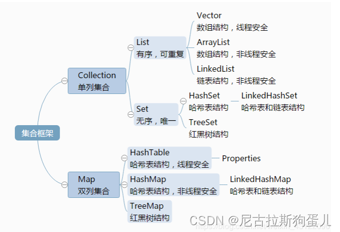

1、什么是集合
    存放对象引用的容器，主要有3种：set(集）、list(列表）和map(映射)

2、集合和数组的区别
    数组是固定长度的；集合可变长度的
    数组可以存储基本数据类型，也可以存储引用数据类型；集合只能存储引用数据类型
    数组存储的元素必须是同一个数据类型；集合存储的对象可以是不同数据类型

3、常用的集合类有哪些？
    Map接口和Collection接口是所有集合框架的父接口
    Collection接口的子接口包括：Set接口和List接口
    Map接口的实现类主要有：HashMap、TreeMap、Hashtable、ConcurrentHashMap以及Properties等
    Set接口的实现类主要有：HashSet、TreeSet、LinkedHashSet等
    List接口的实现类主要有：ArrayList、LinkedList、Stack以及Vector等

4、List，Set，Map三者的区别？  示意图： (重点)
    Collection集合主要有List和Set两大接口：
        List：存取有序、可重复，允许多个null。常用的实现类有 ArrayList、LinkedList 和 Vector。
        Set：存取无序，不可以重，允许一个null。常用实现类是 HashSet、LinkedHashSet 以及TreeSet。
    Map：Key无序，不可以重，允许一个null；value 允许复。Map 的常用实现类：HashMap、TreeMap、HashTable、LinkedHashMap、ConcurrentHashMap

5、集合框架底层数据结构 (重点)
Collection
    List
        Arraylist： Object数组
        Vector： Object数组
        LinkedList： 双向循环链表
  Set
        HashSet（无序，唯一）：HashMap 实现的，底层采用 HashMap 的key来保存元素
        LinkedHashSet： LinkedHashSet 继承于 HashSet通过 LinkedHashMap 来实现的。
        TreeSet（有序，唯一）： 红黑树(自平衡的排序二叉树。)
  Map
      HashMap： 
                HashMap由数组+链表组成的，数组是HashMap的主体，链表则是主要为了解决哈希冲突而存在的（“拉链法”解决冲突），当链表长度大于阈值（默认为8）时，将链表转化为红黑树，以减少搜索时间
      LinkedHashMap：LinkedHashMap 继承自 HashMap，所以它的底层仍然是基于拉链式散
                    列结构即由数组和链表或红黑树组成。另外，LinkedHashMap 在上面结构的基础上，增加
                    了一条双向链表，使得上面的结构可以保持键值对的插入顺序。同时通过对链表进行相应的
                    操作，实现了访问顺序相关逻辑。
      HashTable： 数组+链表组成的，数组是 HashMap 的主体，链表则是主要为了解决哈希冲突而存在的
      TreeMap：   红黑树（自平衡的排序二叉树）

6、哪些集合类是线程安全的？ (重点)
    Vector：比Arraylist多了个 synchronized （线程安全），因为效率较低，现在已经不太建议使用。
    hashTable：就比hashMap多了个synchronized (线程安全)，不建议使用。
    ConcurrentHashMap：支持高并发、高吞吐量的线程安全HashMap实现。（推荐使用）

7、Java集合的快速失败机制 “fail-fast”？
    定义：Java集合的一种错误检测机制，当多个线程对集合进行结构上的改变时，可能会触发此机制
    工作原理‌：迭代器在遍历时使用modCount变量记录集合的修改次数，若遍历程中被修改，modCount值会变化，迭代器会抛出异常。
    解决办法：使用线程安全的集合。如：

8、怎么确保一个集合不能被修改？
    可以使用 Collections.unmodifiableCollection(Collection c) 方法来创建一个只读集合

9、迭代器 Iterator 是什么？
    是一种设计模式，按顺序访问 Collection 集合中的各个元素，具有fail-fast（快速失败）机制

10、Iterator 和 ListIterator 有什么区别？ IteratorExample.java  (重点)
    Iterator 可以遍历 Set 和 List ，而 ListIterator 只能遍历 List
    Iterator 只能单向遍历，而 ListIterator 可以双向遍历（向前/后遍历）。
    ListIterator 实现 Iterator 接口，然后添加了一些额外的功能，比如添加一个元素、替换一个元素、获取前面或后面元素的索引位置

11、遍历一个 List 有哪些不同的方式？每种方法的实现原理是什么？  (重点)
    for 循环遍历
    迭代器遍历：Collections 中支持了 Iterator 模式
    foreach 循环遍历 ：采用了 Iterator 实现   

12、Java 中 RandomAccess接口是什么？
    定义：RandomAccess（随机访问）是指能够快速（通常在常量时间内）访问列表中任意位置元素的能力
    实现了RandomAccess接口的List具备快速随机访问的能力，则使用for循环通过索引遍历通常比使用迭代器更快。反之使用迭代器遍历可能更优

13、说一下 ArrayList 的优缺点 
    优点：
        查询快，因为底层是数组实现，还实现了 RandomAccess（随机访问） 接口。
    缺点：
        增删慢，需要做一次元素复制操作。如果要复制的元素很多，那么就会比较耗费性能。

14、如何实现数组和 List 之间的转换？
    数组  转 List：使用 Arrays. asList(array) 
    List 转 数组：使用 List 自带的 toArray()

15、ArrayList 和 LinkedList 的区别是什么？
    数据结构：ArrayList 是动态数组结构；LinkedList 是双向链表结构
    访问速度：ArrayList 比 LinkedList 在 随机访问 的时候效率要高；因为 LinkedList 需要移动指针从前往后依次查找
    增加和删除：非首尾的增加和删除操作，LinkedList 要比 ArrayList 效率要高；因为ArrayList 增删操作要影响数组内的其他数据的下标
    内存空间：LinkedList 比 ArrayList 更占内存；因为 LinkedList 的节点除了存储数据，还存储了指向前/后两个个元素的引用

16、ArrayList 和 Vector 的区别是什么？
    线程安全性：Vector 使用了 Synchronized 来实现线程同步，是线程安全的； ArrayList 是非线程安全的
    性能：ArrayList 在性能方面要优于 Vector
    扩容：Vector 扩容每次会增加 1 倍；ArrayList 只会增加 50%

17、多线程场景下如何使用 ArrayList？
    使用 Collections 的 synchronizedList 方法将其转换成线程安全的容器后再使用
    使用CopyOnWriteArrayList，适用于读多写少的场景，因为每次写操作都会复制整个数组，开销较大
    使用synchronized关键字对访问ArrayList的方法或代码块进行同步（不推荐）
    使用Vector（不推荐）性能问题较差

18、为什么 ArrayList 的 elementData 加上 transient 修饰？
    transient关键字：修饰的成员变量不参与序列化
    遍历 elementData只序列化已存入的元素；既加快了序列化的速度，又减小了序列化之后的文件大小

19、HashSet如何检查重复？HashSet是如何保证数据不可重复的？
    HashSet调用add ()时，不仅要比较hash值，同时还要比较equles 方法；如果Key相同时，会用新的V覆盖掉旧的V

20、hashCode（）与equals（）的相关规定 
    如果两个对象相等，则hashcode一定也是相同的
    两个对象相等,对两个equals方法返回true
    两个对象有相同的hashcode值，它们也不一定是相等的
    综上，equals方法被覆盖过，则hashCode方法也必须被覆盖

21、==与equals的区别
    ==：比较基本数据类型值是否相等 、 引用类型（如对象）内存地址是否相等
    equals：默认比较两个对象的引用是否相同；通常被重写来比较对象的内容是否相等

22、什么是Hash算法？
    把任意长度的二进制转换为固定长度的较小的二进制值

23、什么是链表
    将物理地址上不连续的数据连接起来，分为单链表和双向链表、单向循环链表、双向循环链表等
    单链表:每个节点包含两部分,一部分存放数据变量的data,另一部分是指向下一节点的next指针
    双向链表:除了包含单链表的部分,还增加了前一个节点的指针
    优点：插入删除速度快；可以使用内存不连续的空间，内存利用率高；大小没有固定
    缺点：查找效率低，必须从第一个开始遍历，不能随机查找

24、说一下HashMap的实现原理？ (重点)
    数据结构：数组+链表；链表长度大于阈值（默认为8）时，将链表转化为红黑树，以减少搜索时间；数组中的每个元素是一个链表（或红黑树），用于存储哈希值相同的键值对
    算法实现：HashMap在put元素时，利用key的hashCode（）方法来计算键的哈希值对应数组中的下标；
            如果出现hash值相同的key，如果key相同，则覆盖原Value值；如果key不同（出现哈希冲突），则将当前的key-value放入链表中
            获取时，直接找到hash值对应的下标，在进一步判断key是否相同，从而找到对应值。
    扩容机制：默认容量数组长度16，默认阈值0.75；容量大于16*0.75时扩容， 16*2 （好处，数据迁移时，只有部分数据需要迁移）
    数据结构图：

25、HashMap在JDK1.7和JDK1.8中有哪些不同？
    JDK1.7：数组+链表；
    JDK1.8：数组+链表+红黑树；当链表长度大于阈值（默认为8）时，将链表转化为红黑树，以减少搜索时间。（链表查询效率低）

26、什么是红黑树 (重点)
    定义：一种特殊的二叉查找树。每个结点上增加一个存储位表示节点的颜色
    特性：节点要么红色或黑色；根节点是黑色；所有叶子都是黑色；如果一个节点是红色的，则它的两个子节点都是黑色
    操作：在对红黑树进行添加或删除之后，都会用到旋转方法和重新着色；搜索操作与普通二叉查找树相同（新插入的节点默认红色，然后旋转、重新着色）

27、HashMap的put方法的具体流程？  (重点)
    计算哈希值‌：键（key）调用 hashCode() 方法，计算其哈希值
    ‌定位桶位置‌:哈希值与数组长度减一进行位与操作 (index = (n - 1) & hash)，以确定键值对应该存放在底层数组（桶数组、table）的哪个索引位置（桶）
    插入数据:如果桶为空，直接将新的键值对（以 Node 对象形式）放入该桶; 如果不为空，说明存在哈希冲突;
    处理冲突:
            链表结构:如果存在相同的键，则更新该键对应的值（value）；如果不存在相同的键，则将新的键值对插入链表的末尾;如果链表长度超过树化阈值（默认是 8），则将链表转换为红黑树
            红黑树结构:按照红黑树的规则插入新的键值对，并调整树结构以保持其特性(旋转节点、重新着色)
    数组扩容‌:HashMap 中的元素数量超过一定的填充比例（加载因子 * 数组容量），则需要进行数组扩容
    返回旧值:插入过程中发现了相同的键，并更新了其对应的值，那么 put 方法会返回旧的值；

28、 HashMap的扩容操作是怎么实现的？  (重点)
    大于阀值时或者初始化时,用resize()方法进行扩容
    每次扩展的时候，都是扩展2倍;如果初始容量大于最大容量（MAXIMUM_CAPACITY）的一半，那么新容量会直接设置为最大容量(MAXIMUM_CAPACITY)。
    将每个桶（bucket）中的元素重新分布到新的Node数组中,扩容后需要重新分布元素

29、HashMap中String、Integer等包装类适合作为Key的原因  (重点)
    不可变性‌:String、Integer保存数据的变量都有final关键字；String保存到：private final char[] value    Integer保存到：private final int value
    减少Hash冲突:重写了hashCode() equals()方法

30、HashMap为什么不直接使用hashCode()处理后的哈希值直接作为table的下标？  (重点)
    原因：hashCode() 方法返回的是int整数类型，其范围为-(2 ^ 31)~(2 ^ 31 - 1) ，
            而HashMap的容量范围是在16（初始化默认值）~2 ^ 30，HashMap通常情况下是取不到最
            大值的，从而导致通过 hashCode() 计算出的哈希值可能不在数组大小范围内，进而无法匹配存储位置；
    下标计算方式：哈希值与数组长度减一进行位与操作 (index = (length - 1) & hash)

31、HashMap 的长度为什么是2的幂次方  (重点)
    扩容方式：HashMap的初始容量是16，每次扩容2倍；
    原因：当数组长度为2的幂次方时，(length - 1) & hash)才等价于hash%length；采用二进制位操作&运算效率更高

32、HashMap 与 HashTable 有什么区别？  (重点)
    线程安全： HashMap 是非线程安全的，HashTable 是线程安全的；synchronized 修饰方法保证线程安全 。
    效率：HashMap 要比 HashTable 效率高
    对Null key 和Null value的支持：HashMap允许有一个key为null，多个value为空；HashTable 不允许key、value为null
    初始容量大小和每次扩充容量大小的不同 ：Hashtable初始大小为11，每次扩充为原来的2n+1；HashMap初始化大小为16，每次扩容为原来的2倍
    推荐使用：单线程环使用 HashMap；多线程使用ConcurrentHashMap

33、什么是TreeMap 简介!
    TreeMap 是一个有序的key-value集合，它是通过红黑树实现的。根据其键的自然顺序进行排序（数字顺序、字母顺序）

34、如何决定使用 HashMap 还是 TreeMap？
    插入、删除和查找操作HashMap通常性能更优
    若需按key排序，TreeMap是选择

35、讲讲ConcurrentHashMap？  (重点)
    HashTable 不允许key、value为null
    线程安全，采用Node + CAS + Synchronized来保证并发安全进行实现，synchronized只锁定当前链表或红黑二叉树的首节点，这样只要hash不冲突，就不会产生并发，效率又提升N倍
    相对于HashTable的synchronized锁的粒度更精细，并发性能更好;

36、Array 和 ArrayList 有何区别？
    Array 可以存储基本数据类型和对象，ArrayList 只能存储对象。
    Array 是指定固定大小的，而 ArrayList 大小是自动扩展的。
    Array 内置方法没有 ArrayList 多

37、comparable 和 comparator的区别？ (重点)
    comparable接口实际上是出自java.lang包，它有一个 compareTo(Object obj)方法用来排序 ComparableExample.java
    comparator接口实际上是出自 java.util 包，它有一个compare(Object obj1, Object obj2)方法用来排序 ComparatorExample.java

38、Collection 和 Collections 有什么区别？ 
    Collection 是一个集合接口
    Collections则是集合类的一个工具类/帮助类，Collections则是集合类的一个工具类/帮助类

