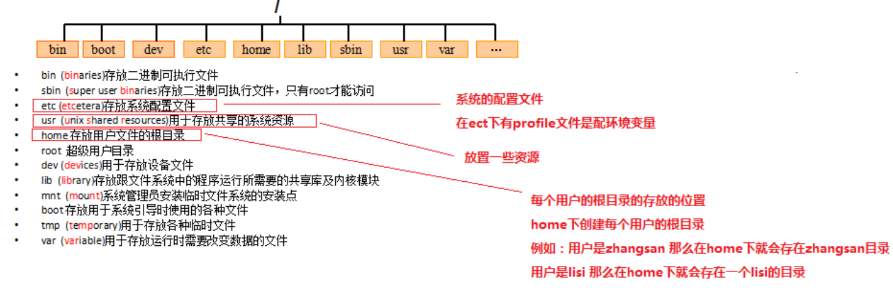
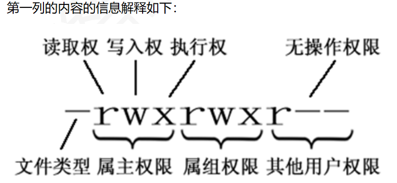

1、Linux目录结构（和Windows有所不一样）

2、切换目录（当用户刚刚登陆时处于用户主目录）
1）cd .. /   ==   cd ..  ：返回上一级目录
2）cd ~     ==   cd  :   返回到用户主目录    (/root)
3）cd - ：返回到进入此目录之前的目录
4）cd  home ：切换到当前目录下的home目录
5）cd  /home ：从跟目录到home目录
6）cd /：到根目录   （/）

3、打印当前目录
1）pwd

4、列表显示
1）ls  （/dir）: 查看当前/指定目录下的所有文件
2）ls  -al  (/dir) : 查看当前/指定目录下的所有文件详细信息，包括隐藏文件
3）ll (/dir) ： 查看当前/指定目录下的所有文件详细信息

5、创建目录
1）mkdir  test ：在当前目录下创建一个test目录
2）mkdir -p  t1/t11 :在当前目录下创建一个多级目录
3）mkdir -m 777 c   ：常见一个权限为777 的目录 c

6、查找文件和目录
1）find /  -name  '*test*'  : 按名字查找根目录下有test的目录，其中*表示通配符

7、移动目录/文件，并且可以重命名
1）mv  t1 t : 修改t1为t
2）mv  t11/t111  t123 :  将t11下的t111移动到当前目录下，并重命名为t123（没有t123目录）

8、拷贝目录/文件  ：   r：递归
1）cp filename  /dir  :  拷贝当前目录下的文件到指定目录下
2）cp -r dir /dir : 拷贝当前目录下的目录到指定目录下 （-r表示递归执行）

9、删除文件/文件夹：    f：  不提示    r：递归

1）rm –f n.txt 不提示
2）rm –rf dirname 不提示递归删除目录下所以内容
3）rm –rf * 删除所有文件
4）rm –rf /* 删除所有子目录所有和文件

10、创建文件（空文件）
1）touch a.txt : 在当前目录创建一个后缀为txt的文件
2)   vi  vim

11、查看文件内容
1）cat  a.txt : 只会显示内容的最后一屏幕, 加-n时会有行号
2）tac  a.txt : 逆序
3）nl  a.txt : 等价于 cat  -n  a.tct
4）more  a.txt : 显示第一屏，“空格”下一页，“回车”下一行，“q”退出
5）less a.txt : 操作与more相似，多了“PG UP”上一页和“PG Dn”下一页的功能
6）tail -10  a.txt : 查看最后10行数据； 可以用于检测日志文件的变化
7）tail –f nginx.conf 动态查看日志，方便查看日志新增的信息

12、内容修改：vim编辑器是Linux中的强大组件，是vi编辑器的加强版
1）vim  a.txt : 进入文件（没有会自动创建）
2）i :  在光标前开始编辑           按a：在光标后开始编辑            按o：在当前行的下一行开始编辑             按u：撤销输入内容
3）ESC ：进入低行模式
4）：wq  : 保存并退出 ， ：q!  退出不保存

13、打包并压缩
1）z : 进行压缩
2）c : 打包为一个文件
3）v : 显示运行过程
4）f : 指定文件名
5） tar  -zcvf  aaa.tar.gz   ./*  : 打包当前目录并压缩（也可以指定几个具体的文件）

14、解压
1）x : 解压文件
2）v : 显示运行过程
3）f ：指定文件名
4）tar -xvf  aaa.tar.gz  : 解压到当前目录
5）tar -xvf  aaa.tar.gz  -C  /dir : 解压到指定目录

15、搜索文件内容（与CRTL+F类似） ：  -n  :  显示行数     - v : 不含关键字的
1）grep  a  aaa.txt  : 在文件aaa.txt中搜索关键字a

16、查看进程
1）ps  -ef  : 查看当前所有进程信息

17、管道命令（将上一句命令输出的内容作为下一句命令的输入）
1）ps  -ef  |  grep  daemon  :  将进程信息作为要查询的文件

18、杀死进程
1）kill  -9  1215： 杀死进程PID为1215的进程

19、查看网卡信息
1）ip  addr

20、查看与某台机器的连接情况
1）ping  ip地址/域名

21、建立链接：（快捷键）
1）ln -s  aaa.txt  /test1/aaa.soft  :  建立软链接
2） ln  aaa.txt   /test1/bbb   :   建立硬链接

22、查看命令参数
1）ls  --help  ： 查看ls命令有什么参数

23、权限命令（ll命令结果的第一行）

1）d 开头：表示文件夹
2）- 开头：表示文件
3）l 开头：表示链接
4）r可读
5）w可写
6）x可执行
7）chmod u=rwx,g=wrx,o=r  /test   :  改变test目录的权限
8）chmod 774  /test   :  数字表示

24.查看IP：Windows是ipconfig

1）ifconfig   
2）ip addr
 

