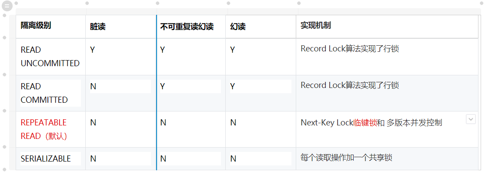
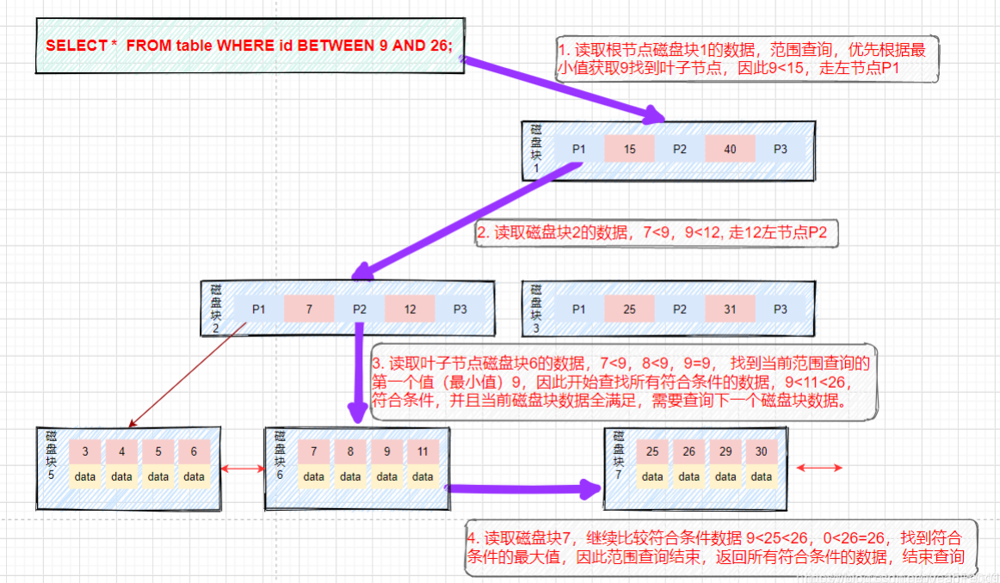

1、MySQL 中有哪几种锁？ 从不同角度分类
    按照锁的粒度分类
        全局锁：锁整个数据库，通常用于全库备份等场合。使用 FLUSH TABLES WITH READ LOCK 命令
        表级锁：锁整个表；开销小，并发能力弱；在 MyISAM、MEMORY 和 CSV 等存储引擎中使用较多。
        行级锁：锁某一行或某几行；更高的并发能力，但开销更大，锁的竞争更激烈，可能出现死锁；主要用在 InnoDB 存储引擎中
        页面锁：锁定数据库中的某个页面；较少使用，因为页面锁的开销介于表锁和行锁之间
    按照锁的性质分类（InnoDB存储引擎下的行级锁；都属于悲观锁）
        共享锁（S 锁）：允许事务读取一行，但不允许对该行进行修改；（一个锁有多把钥匙）
        排他锁（X 锁）：允许事务读取和修改一行；其他事务不能获取该行的任何锁
    注意：乐观锁和悲观锁是处理并发访问的策略；排他锁和共享锁是悲观锁策略中的一种实现方式
    按照锁的用途分类
        记录锁：单行记录上的锁
        ‌意向锁：表级别的锁，意向共享锁（IS Lock），事务想要获得一张表中某几行的共享锁；意向排他锁（IX Lock），事务想要获得一张表中某几行的排他锁InnoDB 特有
        ‌间隙锁：用于锁定一个范围的数据，而不是特定的行；用于防止幻读；InnoDB 特有
        临键锁：记录锁和间隙锁的结合体，锁定一个范围，并包括该范围内的行；用于防止幻读；InnoDB 特有
        自增长锁：专用于有自增列的表，在插入操作时使用，以确保自增列的唯一性和连续性

2、MySQL 中有哪些不同的引擎（表格）？
    InnoDB‌：支持ACID事务、行锁定和外键约束，适用于高并发的事务处理系统。
    MyISAM‌：不支持事务和行锁定，采用表级锁定，适用于只读应用和快速查询场景，支持全文搜索。
    MEMORY‌：数据存储在内存中，访问速度快，但数据在MySQL重启或崩溃时会丢失，适用于临时存储和快速访问。
    CSV‌：数据以CSV格式存储，适用于数据交换和简单的数据存储。
    ARCHIVE‌：用于存档数据，具有高压缩比，适用于存储大量历史数据。

3、简述在MySQL 数据库中 MyISAM 和InnoDB 的区别
    MyISAM：不支持事务，支持表锁，非聚簇索引
    InnoDb：支持事务、行锁定和外键约束；支持写并发；聚簇索引和非聚簇索引

4、MySQL 中InnoDB 支持的四种事务隔离级别（REPEATABLE READ默认隔离级别）？ (重点)
    读未提交（READ UNCOMMITTED）：可能会导致‌脏读‌
    读已提交（READ COMMITTED）‌：防止了脏读，但可能会出现‌不可重复读（oracle默认）
    可重复读（REPEATABLE READ）：防止了脏读和不可重复读，但可能会出现‌幻读‌（InnoDB 实际上进一步防止了幻读 通过：多版本并发控制机制来解决幻读）
    可序列化（SERIALIZABLE）：强制事务串行化执行，防止脏读、不可重复读和幻读。

5、操作可能存在的三类问题 (重点)
    脏读：当前事务(A)中可以读到其他事务(B)未提交的数据（脏数据），这种现象是脏读。
    不可重复读：在事务A中先后两次读取同一个数据，两次读取的 数据 不一样，这种现象称为不可重复读。
    幻读：在事务A中按照某个条件先后两次查询数据库，两次查询结果的 条数 不同，这种现象称为幻读。不可重复读与幻读的区别可以通俗的理解为：前者是数据变了，后者是数据的行数变了。

6、CHAR 和VARCHAR 的区别？
    CHAR：固定长度；适用于存储长度固定的数据  如国家代码、电话号码等
    VARCHAR：可变长度；适用于存储长度可变的数据 如用户姓名、地址等

7、 DateTime 和 TimeStamp类型区别(重点)
    范围：DateTime是1000到9999 ; TimeStamp是1970到2038 
    时区：DateTime无视时区‌ ;  TimeStamp转换为时间戳‌（如1970年以来的秒数）
    自动更新:DateTime需手动初始化/更新   TimeStamp支持自动初始化/更新

8、查看表中所有索引？
    SHOW INDEX FROM 表名;
    CREATE INDEX 索引名 ON 表名 (字段名);

9、BLOB 和TEXT 有什么区别？
    BLOB：存储二进制数据；如图像、音频、视频等
    TEXT：存储非二进制的大字符串数据；如文章、日志、JSON 或 XML 文档等

10、MySQL 如何优化DISTINCT？
    DISTINCT 在所有列上转换为 GROUP BY

11、可以使用多少列创建索引？
    MySQL InnoDB中单个复合索引最多包含16列，一个表最多可有65个索引（包括主键）

12、 NOW（）和 CURRENT_DATE（）有什么区别？
    NOW()：返回当前的日期和时间，格式为 YYYY-MM-DD HH:MM:SS
    CURRENT_DATE()：只返回当前的日期，格式为 YYYY-MM-DD

13、什么是通用 SQL 函数？
    通用SQL函数：指多种数据库管理系统（DBMS）中都支持的SQL函数MySQL、PostgreSQL、SQL Server、Oracle
    如：字符串函数‌、 数值函数、 日期和时间函数‌、 聚合函数等

14、MySQL 支持事务吗？
    InnoDB存储引擎是支持事务的，而MyISAM存储引擎则不支持事务

15、MySQL 里记录货币用什么字段类型好
    DECIMAL：推荐；精确度高，无浮点误差；例如 DECIMAL(10,2) 表示最多10位数，其中2位是小数
    BIGINT：适用‌；存储单位为分
    FLOAT/DOUBLE：不推荐；运算后误差可能导致货币值不准确

16、MySQL 数据库作发布系统的存储，一天五万条以上的增量，预计运维三年,怎么优化？(重点)
    垂直拆分‌：将高频更新字段（如内容状态）与低频字段（如发布时间）分离，减少单行宽度 
    水平分表‌：按时间维度分表（如按月/年），或业务维度分表（如按栏目ID哈希），控制单表数据量在 500万行以内‌
    读写分离：主库处理写操作，从库承担读请求，通过‌主从复制‌分摊压力
    查询优化：避免使用SELECT *；，减少数据库负载；高并发场景下，可以考虑使用读写分离架构
    硬件优化：升级服务器的CPU、内存、磁盘

17、数据库锁的优化策略
    读写分离：‌MyISAM‌适用于读多写少的场景；‌InnoDB适用于高并发环境
    减少锁的范围
    减少持有时间‌
    多个线程尽量以相同的顺序去获取资源：避免死锁‌

18、索引的底层实现原理(重点)
    B+树：所有实际数据都存储在叶子节点中，且叶子节点之间通过链表相连，便于范围查询
    

19、如何避免索引失效(重点)
    使用组合索引时，没有遵循“最左前缀”原则（查询条件必须包含索引定义中最左边的列，并且顺序要与索引定义中的顺序一致）
    不在索引列上做任何操作，例如计算、函数、类型转换，会导致索引失效而转向全表扫描
    不等于（!=或者<>）、LIKE以通配符开头（%abc）、or  索引会失效 会导致全表扫描
    字符串不加单引号会导致索引失效（可能发生了索引列的隐式转换）会导致全表扫描
    减少 select * 覆盖索引能减少回表次数

20、简单描述 MySQL 中，索引，主键，唯一索引，联合索引
    索引:数据库表中一种数据结构，它可以帮助数据库快速检索数据
    主键:一个表只能有一个主键,自动创建唯一索引
    唯一索引:索引列中的每个值都是唯一的
    联合索引:两列或多列创建的索引

21、事务四个特性ACID(重点)
    原子性（Atomicity）‌： 事务是最小的执行单位，要么全部提交成功，要么全部失败回滚。
    ‌一致性（Consistency）‌： 事务执行前后，数据具有一致性
    ‌隔离性（Isolation）‌： 事务之间相互隔离，使用锁来实现。涉及4种隔离级别
    ‌持久性（Durability）‌： 事务提交后，对数据库的改变就是永久性的
ACID特性分别是怎么实现的：
* 实现原子性：靠的是undo log回滚日志，回滚时 做与之前相反的工作
* 实现持久性： 从数据库读取数据时，首先从Buffer Pool中读取，如果Buffer Pool中没有，则从磁盘读取后放入Buffer Pool。 向数据库写入数据时，会首先写入Buffer Pool，Buffer Pool中修改的数据会定期刷新到磁盘中（这一过程称为刷脏）。 MySQL宕机redo log日志被引入来解决 Buffer Pool中修改的数据还没有刷新到磁盘。 MySQL宕机，重启时可以读取redo log重做日志中的数据，对数据库进行恢复。
* 实现隔离性： (一个事务)写操作对(另一个事务)写操作的影响：锁机制保证隔离性。
* 实现一致性： 原子性、持久性和隔离性，都是为了保证数据库状态的一致性。

22、SQL 注入漏洞产生的原因？如何防止？(重点)
    原因：SQL代码伪装到输入参数中，从而篡改原本的SQL查询逻辑
    防止：避免动态拼接SQL、验证和过滤用户输入、使用预编译语句

23、有关索引的几个问题(重点)
    索引的目的是什么：提高查询速度
    负面影响是什么：创建索引和维护索引需要耗费时间；占用物理空间；增、删、改、的时候索引也要动态维护
    建立索引的原则：最频繁使用的、用以缩小查询范围的字段；频繁使用的、需要排序的字段
    不宜建立索引的情况:很少涉及的列;重复值比较多的列;表记录太少;经常增删改的表

24、解释 MySQL 外连接、内连接与自连接的区别
    内连接：返回两个表中根据连接条件匹配的记录
    外连接：‌左外连接返回左表中的所有记录，以及右表中与左表匹配的记录；右外连接回右表中的所有记录，以及左表中与右表匹配的记录
    自连接：表与自身的连接。通常用于查找表内部的关联数据

25、Myql 中的事务回滚机制概述(重点)
    回滚机制的工作原理：
        二进制日志（Binary Log）‌：记录对数据库造成更改的SQL语句，用于数据恢复和主从复制。
        ‌重做日志（Redo Log）‌：在InnoDB存储引擎中，记录事务的数据页更改，以便在崩溃后恢复数据。
        ‌回滚日志（Undo Log）‌：在InnoDB存储引擎中，记录事务的反向操作，以便在回滚时撤销已执行的操作。
    工作原理：
        读取与当前事务相关的回滚日志（Undo Log），根据回滚日志中的记录，反向执行已执行的操作。

26、SQL 语言包括哪几部分？每部分都有哪些操作关键字？
    数据定义(DDL):Create Table,Alter Table,Drop Table, Craete/Drop Index
    数据操纵(DML):insert,update,delete
    数据控制(DCL):grant,revoke
    数据查询(DQL):select

27、完整性约束包括哪些？
    主键约束、外键约束、‌唯一约束、非空约束、检查约束、‌默认值约束、自动递增

28、MySQL中跟踪排查慢SQL(重点)
    通过查看慢查询日志是否开启：slow_query_log
    开启慢查询日志‌： slow_query_log=ON
    设置慢查询阈值：long_query_time
    使用EXPLAIN执行计划，识别索引使用情况、连接类型

29、SQL执行顺序(重点)
    1. FROM
    2. WHERE
    3. GROUP BY
    4. HAVING
    5. SELECT  DISTINCT
    6. ORDER BY
    7. LIMIT

