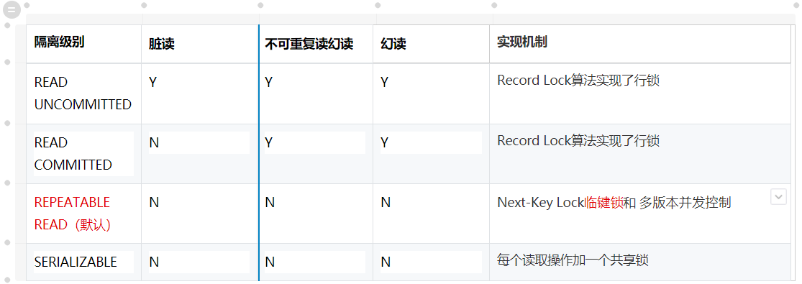
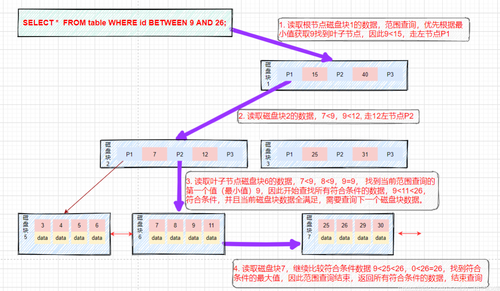

@Transactional失效情况：
`   方法访问修饰符不是 public(AOP默认只对 public 方法生效)
    自调用问题（非事务方法调用同一个类中的事务方法）： 拆分  类自我注入
    要么不使用try-catch,要么在catch中抛出异常`

使用事物导致锁表：
`   业务场景：对账-发票确认时 需要推送SAP 文档 金税 多方系统，并回写数据到SRM，并且是串行的前一个接口返回值 作为下一个接口的入参，就使用了嵌套事物  （根本原因：事务中调用接口耗时，导致数据库连接池耗尽，连接池满后，应用层请求因无法获取连接而阻塞，进而占满应用服务器线程池，从而导致服务器崩溃）
    解决方案： 临时解决：kill被锁的线程   根治：严谨事务内部调用接口
    mysql默认隔离级别 可重复读，可以使用嵌套事物
    sqlserver默认事物隔离级别为 已提交读；在嵌套事物中 不可重复读 
`

2、MySQL 中有哪些不同的引擎（表格）？
`   InnoDB‌：支持ACID事务、行锁定和外键约束，适用于高并发的事务处理系统。
    MyISAM‌：不支持事务和行锁定，采用表级锁定，适用于只读应用和快速查询场景，支持全文搜索。
    MEMORY‌：数据存储在内存中，访问速度快，但数据在MySQL重启或崩溃时会丢失，适用于临时存储和快速访问。`
    CSV‌：数据以CSV格式存储，适用于数据交换和简单的数据存储。
    ARCHIVE‌：用于存档数据，具有高压缩比，适用于存储大量历史数据。

3、简述在MySQL 数据库中 MyISAM 和InnoDB 的区别
`   MyISAM：不支持事务，支持表锁，非聚簇索引；适用于只读
    InnoDb：支持事务、行锁定、聚簇索引和非聚簇索引、外键约束；适用于高并发事务、读写分离`

聚簇索引与非聚簇索引区别
`   聚簇索引：叶子节点直接存储了完整的行数据，一张表只能有一个聚簇索引，通常是主键
    非聚簇索引（二级索引）： 叶子节点存储的是“索引列的值 + 对应的主键 ID”`

回表： `查询的字段有任何一个不在当前索引树里，就会触发回表；拿着非聚簇索引（二级索引）查到的主键，再去聚簇索引（主键索引）里查一次完整数据；`

覆盖索引：`避免回表，查询的字段被索引全部覆盖`

MySQL中 索引下推(即ICP)是什么：
`   作用：减少回表
    下推条件：必须走二级索引； 必须发生回表；WHERE 条件中必须有“存在于索引中，但未能用于定位（如不满足最左前缀）”的字段`

1、MySQL 中有哪几种锁？ 从不同角度分类
    按照锁的粒度分类
        全局锁：锁整个数据库，通常用于全库`备份`等场合。使用 FLUSH TABLES WITH READ LOCK 命令
        表级锁：锁整个表；`开销小，并发能力弱`；通常用于`表结构变更、大批量数据导入`； MyISAM 和 InnoDB 引擎均支持。 （意向锁、元数据锁、自增长锁）
        页级锁：锁定数据库中的某个页面（一般为 16KB）；较少使用，页面锁的`开销和并发介于表锁和行锁之间`
        行级锁：锁某一行或某几行；`更高的并发能力，但开销更大`，锁的竞争更激烈，可能出现死锁；主要用在 InnoDB 存储引擎中 （`记录锁、‌间隙锁、临键锁、插入意向锁`）
    按照锁的操作类型分类：
        共享锁（S 锁）：也称`读锁`；允许多个事务同时读取同一份数据，但禁止写入；（一个锁有多把钥匙）
        排他锁（X 锁）：也称`写锁`；当前事务会阻断其他事务的读和写操作。
        意向锁：表级别的锁，表锁与行锁的协调；当需要对整张表加锁时，引擎只需检查表上是否有意向锁，就能快速判断表内是否有行锁正在执行，避免逐行检查带来的性能损耗；InnoDB 特有
    按照InnoDB 行级锁的底层算法分类
        记录锁：`单条`记录上的锁
        ‌间隙锁：锁定索引记录`之间的间隙`，防止其他事务在该范围内插入新数据；用于`防止幻读`；InnoDB 特有
        临键锁：`记录锁和间隙锁的结合体`，锁定一个范围及其行；用于`防止幻读`；InnoDB 特有
        插入意向锁：`一种特殊的间隙锁`，专门针对 INSERT 操作，表示事务打算在某个间隙插入记录。
    其他特殊用途锁：
        元数据锁：系统`自动加锁`，用于维护表元数据的一致性，防止在表上有活动事务时，表结构被并发修改（如 DDL 操作）。
        自增长锁：专用于有`自增列的表`，在插入操作时使用，以确保自增列的唯一性和连续性
    按锁的机制划分：
        悲观锁：假定大概率会发生并发冲突，在访问数据前先加排他锁，整个处理过程中锁定数据（如 SELECT ... FOR UPDATE）。
        乐观锁：假定大概率不会发生冲突，处理数据时不加锁，仅在更新提交时通过版本号或时间戳判断是否有冲突
    注意：行锁、页锁、表级锁都是自动加锁；共享锁 、 排他锁 手动加锁

4、MySQL 中InnoDB 支持的四种事务隔离级别（REPEATABLE READ默认隔离级别）？ (重点)
`   读未提交（READ UNCOMMITTED）：可能会导致‌脏读‌ 、  不可重复读 、 幻读
    读已提交（READ COMMITTED-oracle默认）‌：防止了脏读，可能会导致‌不可重复读 、 幻读
    可重复读（REPEATABLE READ-默认）：防止了脏读和不可重复读，但可能会出现‌幻读‌（InnoDB 实际上进一步防止了幻读 通过：MVCC（多版本并发控制机制-乐观）+ Next-Key Lock（临键锁）来解决幻读）
    可序列化（SERIALIZABLE）：强制事务串行化执行，防止脏读、不可重复读和幻读。`

5、并发事务引发的三大问题 (重点)
`   脏读：当前事务(A)中可以读到其他事务(B)未提交的数据（脏数据），这种现象是脏读。
    不可重复读：在同一个事务内A，两次读取同一条数据项，得到了不同的结果。
    幻读：在同一个事务内A，两次执行相同的查询条件，返回的结果集行数不同。`

21、事务四个特性ACID(重点)
`   原子性（Atomicity）‌： 事务是最小的执行单位，要么全部提交成功，要么全部失败回滚。
    ‌一致性（Consistency）‌： 事务执行前后，数据具有一致性
    ‌隔离性（Isolation）‌： 事务之间相互隔离，使用锁 + MVCC（多版本并发控制）来实现。涉及4种隔离级别
    ‌持久性（Durability）‌： 事务提交后，对数据库的改变就是永久性的`
ACID特性分别是怎么实现的：
`   * 实现原子性：靠的是undo log回滚日志，回滚时 做与之前相反的工作
    * 实现持久性： 从数据库读取数据时，首先从Buffer Pool中读取，如果Buffer Pool中没有，则从磁盘读取后放入Buffer Pool。 向数据库写入数据时，会首先写入Buffer Pool，Buffer Pool中修改的数据会定期刷新到磁盘中（这一过程称为刷脏）。 MySQL宕机redo log日志被引入来解决 Buffer Pool中修改的数据还没有刷新到磁盘。 MySQL宕机，重启时可以读取redo log重做日志中的数据，对数据库进行恢复。
    * 实现隔离性： 锁 + MVCC（多版本并发控制）来实现。
    * 实现一致性： 原子性、持久性和隔离性，都是为了保证数据库状态的一致性。`

6、CHAR 和VARCHAR 的区别？
    CHAR：固定长度；适用于存储长度固定的数据  如国家代码、电话号码等
    VARCHAR：可变长度；适用于存储长度可变的数据 如用户姓名、地址等

7、 DateTime 和 TimeStamp类型区别(重点)
    范围：DateTime是1000到9999 ; TimeStamp是1970到2038 
    时区：DateTime无视时区‌ ;  TimeStamp转换为时间戳‌（如1970年以来的秒数）
    自动更新:DateTime需手动初始化/更新   TimeStamp支持自动初始化/更新

8、查看表中所有索引？
    SHOW INDEX FROM 表名;
    CREATE INDEX 索引名 ON 表名 (字段名);

9、BLOB 和TEXT 有什么区别？
    BLOB：存储二进制数据；如图像、音频、视频等
    TEXT：存储非二进制的大字符串数据；如文章、日志、JSON 或 XML 文档等

10、MySQL 如何优化DISTINCT？
`   DISTINCT 在所有列上转换为 GROUP BY`

11、可以使用多少列创建索引？
    MySQL InnoDB中单个复合索引最多包含16列，一个表最多可有65个索引（包括主键）

12、 NOW（）和 CURRENT_DATE（）有什么区别？
    NOW()：返回当前的日期和时间，格式为 YYYY-MM-DD HH:MM:SS
    CURRENT_DATE()：只返回当前的日期，格式为 YYYY-MM-DD

13、什么是通用 SQL 函数？
    通用SQL函数：指多种数据库管理系统（DBMS）中都支持的SQL函数MySQL、PostgreSQL、SQL Server、Oracle
    如：字符串函数‌、 数值函数、 日期和时间函数‌、 聚合函数等

14、MySQL 支持事务吗？
    InnoDB存储引擎是支持事务的，而MyISAM存储引擎则不支持事务

15、MySQL 里记录货币用什么字段类型好
`   DECIMAL：推荐；精确度高，无浮点误差；例如 DECIMAL(10,2) 表示最多10位数，其中2位是小数`
    BIGINT：适用‌；存储单位为分
    FLOAT/DOUBLE：不推荐；运算后误差可能导致货币值不准确

16、MySQL 数据库作发布系统的存储，一天五万条以上的增量，预计运维三年,怎么优化？(重点)
`   垂直拆分‌：将高频更新字段（如内容状态）与低频字段（如发布时间）分离，减少单行宽度 
    水平分表‌：按时间维度分表（如按月/年），或业务维度分表（如按栏目ID哈希），控制单表数据量在 500万行以内‌
    读写分离：主库处理写操作，从库承担读请求，通过‌主从复制‌分摊压力
    查询优化：避免使用SELECT *；，减少数据库负载；高并发场景下，可以考虑使用读写分离架构
    硬件优化：升级服务器的CPU、内存、磁盘` 

17、数据库锁的优化策略
    读写分离：‌MyISAM‌适用于读多写少的场景；‌InnoDB适用于高并发环境
    减少锁的范围
    减少持有时间‌
    多个线程尽量以相同的顺序去获取资源：避免死锁‌

18、索引的底层实现原理(重点)
`   B+树：非叶子节点仅存储键值（Key），不存数据；所有实际数据都存储在叶子节点中，且叶子节点之间通过双向链表相连，便于范围查询` 
    

19、如何避免索引失效(重点)
`   使用组合索引时，没有遵循“最左前缀”原则（查询条件必须包含索引定义中最左边的列，并且顺序要与索引定义中的顺序一致）
    不在索引列上做任何操作，例如计算、函数、类型转换，会导致索引失效而转向全表扫描
    范围查询（!=或者<>、 >、<、BETWEEN）右边的列会立即失效
    LIKE以通配符开头（%abc）
    确保 OR 两边的字段都建有索引
    隐式类型转换：字符串不加单引号会导致索引失效，导致全表扫描
    查询结果集过大（1/3）：即使走了索引，数据库优化器也会主动放弃，改为全表扫描
`

20、简单描述 MySQL 中，索引，主键，唯一索引，联合索引
    索引:数据库表中一种数据结构，它可以帮助数据库快速检索数据
    主键:一个表只能有一个主键,自动创建唯一索引
    唯一索引:索引列中的每个值都是唯一的
    联合索引:两列或多列创建的索引

22、SQL 注入漏洞产生的原因？如何防止？(重点)
`   原因：SQL代码伪装到输入参数中，从而篡改原本的SQL查询逻辑
    防止：避免动态拼接SQL、验证和过滤用户输入、使用预编译语句`

23、有关索引的几个问题(重点)
`   索引的目的是什么：提高查询速度
    负面影响是什么：创建索引和维护索引需要耗费时间；占用物理空间；增、删、改、的时候索引也要动态维护
    建立索引的原则：最频繁使用的、用以缩小查询范围的字段；频繁使用的、需要排序的字段
    不宜建立索引的情况:重复值比较多的列、经常增删改、表记录太少;`

24、解释 MySQL 外连接、内连接与自连接的区别
`   内连接：返回两个表中根据连接条件匹配的记录
    外连接：‌左外连接返回左表中的所有记录，以及右表中与左表匹配的记录；右外连接回右表中的所有记录，以及左表中与右表匹配的记录
    自连接：表与自身的连接。通常用于查找表内部的关联数据`

25、MySql 中的事务回滚机制概述(重点)
`   利用 Undo Log 记录反向操作指令，进行回滚`

事务的二阶段提交：
`   准备阶段：InnoDB 将事务的修改写入 Redo Log，将 Redo Log 的状态标记为 prepare（准备状态），并持久化到磁盘
    写 Binlog 阶段： MySQL Server 层生成该事务的 Binlog，并将其刷入磁盘
    提交阶段：Binlog 写入成功后，Server 层通知 InnoDB 引擎 将 状态从 prepare 改为 commit（提交状态）
    崩溃恢复：准备状态，Binlog 不存在或不完整（回滚）；准备状态，Binlog 写入失败或未落盘（回滚）；准备状态， Binlog 写入成功并落盘（提交）`
事务涉及的日志：
`   二进制日志（Binary Log）‌：记录对数据库造成更改的SQL语句，用于数据恢复、主从复制 保证高可用、容灾。
    ‌重做日志（Redo Log）‌：在InnoDB存储引擎中，记录事务的数据页更改（修改细节），用于崩溃恢复 保证数据的持久性。
    ‌回滚日志（Undo Log）‌：在InnoDB存储引擎中，记录事务的反向操作，回滚的绝对核心。`

WAL机制-预写日志： `体现在  Redo Log（重做日志） 实现上`

26、SQL 语言包括哪几部分？每部分都有哪些操作关键字？
    数据定义(DDL):Create Table,Alter Table,Drop Table, Craete/Drop Index
    数据操纵(DML):insert,update,delete
    数据控制(DCL):grant,revoke
    数据查询(DQL):select

27、完整性约束包括哪些？
    主键约束、外键约束、‌唯一约束、非空约束、检查约束、‌默认值约束、自动递增 

28、MySQL中跟踪排查慢SQL(重点)
`   通过查看慢查询日志是否开启：slow_query_log
    开启慢查询日志‌： slow_query_log=ON
    设置慢查询阈值：long_query_time
    使用EXPLAIN执行计划，分析索引情况`

EXPLAIN分析字段说明：
`   type：访问类型。性能从好到差依次为 const > eq_ref > ref > range > ALL。如果出现 ALL，说明发生了全表扫描，极度危险。
    key：实际使用的索引。如果为 NULL，说明没有命中任何索引。
    rows：预估需要扫描的行数。数值越大，查询越慢。
    Extra：附加信息。如果出现 Using filesort（文件排序）或 Using temporary（使用临时表），通常意味着需要优化索引或改写 SQL`

29、SQL执行顺序(重点)
`   1. FROM
    2. WHERE
    3. GROUP BY
    4. HAVING
    5. SELECT  DISTINCT
    6. ORDER BY
    7. LIMIT`

主键的使用：
`   自增主键：数据库自动生成，单体架构首选，索引性能友好
    UUID：应用层/数据库 UUID() 函数 生成，占用空间大，随机插入；安全性高、索引性能差，极少推荐（医疗 政务）
    雪花 ID：应用层生成，趋势递增，分布式架构首选；索引性能优化`

大字段建索引： `前缀索引、 全文索引`

三层B+树：
`   第一层： 一个页， 大小16KB，能装 1170 个索引
    第二层：1170 个页，每个页同样能装 1170 个指针，此时共有 1170 × 1170 = 136万
    第三层：136万个页，每页装16 条记录，总共能存储 136万 × 16 ≈ 2190万 条记录
    总结：三层B+树，是最优的设计结构，2000w条数据，3次I/O就能就能精准查找数据； 超过三层需要引入 分库分表 策略`

MySQL中 Limit 100000000,10 和 Limit 10 的执行速度是否相同： 扫描数量  I/O和CPU消耗
    扫描数量：扫描前100000010条数据    扫描10条记录
    I/O 和 CPU: 消耗巨大     
    替代方案： num>99999999  再 limit 10

MySQL中 delete  truncate  trop 的区别是什么：作用范围  事务支持  执行速度   自增重置

MySQL中 如何监控和优化慢SQL ：` 启用慢查询日志、EXPLAIN 分析执行计划；索引优化、sql重写、缓存、分表、读写分离`

MySQL中 如何解决深度分页的问题：延迟关联(子查询+覆盖索引快速定位目标数据)、游标分页(有序字段)、覆盖索引优化(使用联合索引避免回表)

MySQL中 为什么不推荐使用多表Join：在高并发的在线核心接口中，应尽量采用“单表查询 + 应用层组装”或“宽表/冗余设计”；以下场景仍可放心使用：数据量可控的小表（2~3 张）、所有关联字段都有索引；

MySQL中 Buffer Log 是什么，有什么作用：内存缓冲区；用于存储即将写入磁盘的 Redo Log（重做日志）；

数据库的三大范式是什么： 每列不可再分的最小数据单元‌、所有非主属性必须完全依赖主键‌、非主属性不能传递依赖于主键

MySQL中 详细讲解B+树中查询数据的全过程
    SQL 解析与优化：SQL 语句解析，优化器判断走哪条路
    内存缓存查找：先查内存Buffer Pool
    B+ 树检索过程：定位根节点、二分查找定位区间、进入下一层重复二分查找、叶子节点精准匹配
    提取主键与回表：

主从同步+读写分离如何实现: 
`           原理：主库 收到数据变更后，写入binlog； 从库 连接主库，请求 Binlog 内容，收到后将它们写入从库本地的 Relay Log
            数据库配置：修改my.cnf文件-----主库创建复制账号------从库设置主库信息------从库启动同步
            代码实现-读写分离：基于ShardingSphere-JDBC依赖----改yml：master/slave、读写分离
            读主库场景：配置transactionalReadQueryStrategy为PRIMARY 强制事物读走主库；  特定场景 HintManager 强制读主库
            同步模式： 异步复制（默认 一致性差  性能高）   半同步复制（至少一个从库一致   一致性较高  性能中等）   强同步（所有从库一致   一致性极高   性能差）   应用层： 写后读强一致性场景，读写都走主库
`

分区如何实现：
`   本质：单机（一个数据库），水平拆分
    维度：范围（年 地区）  类型   hash
    实现步骤：创建表时定义分表，分区字段必须作为主键的一部分； 业务层不需要额外配置
    优点：代码不需要指定分表，只要where条件包含分区键，就能提升性能，否则全表扫描
`
CREATE TABLE sales (
id INT AUTO_INCREMENT,
sale_date DATE NOT NULL,
amount DECIMAL(10,2) NOT NULL,
PRIMARY KEY (id, sale_date)  -- 分区键必须是主键/唯一键的一部分
)
PARTITION BY RANGE (YEAR(sale_date)) (  -- 以 sale_date 的年份作为分区依据[reference:2]
PARTITION p2022 VALUES LESS THAN (2023), -- 2022年及之前的数据
PARTITION p2023 VALUES LESS THAN (2024), -- 2023年的数据
PARTITION p2024 VALUES LESS THAN (2025), -- 2024年的数据
PARTITION p_future VALUES LESS THAN MAXVALUE -- 2025年及以后的数据[reference:3]
);

分库分表如何实现：
`   本质：多机，水平拆分
    维度：分库：业务、字段       分表：范围（年 地区）  类型   hash取模 
    实现步骤：基于ShardingSphere-JDBC依赖 --------  在yml中配置 分库分表 读写分离策略
    场景：根据 分片键 查询，路由到指定数据库； 没有 分片键 查询，查询所有数据库
`
        

分区与分库分表区别：`分区是“单机内”的物理拆分，分库分表是“多机间”的分布式拆分`

Prometheus+Grafana监控平台
    Prometheus数据仓库：专门采集和存储时间序列数据（如CPU使用率、请求数量等）
    Grafana数据看板：一个开源的数据可视化平台，负责将Prometheus等数据源中的数字，变成直观的图表和仪表盘