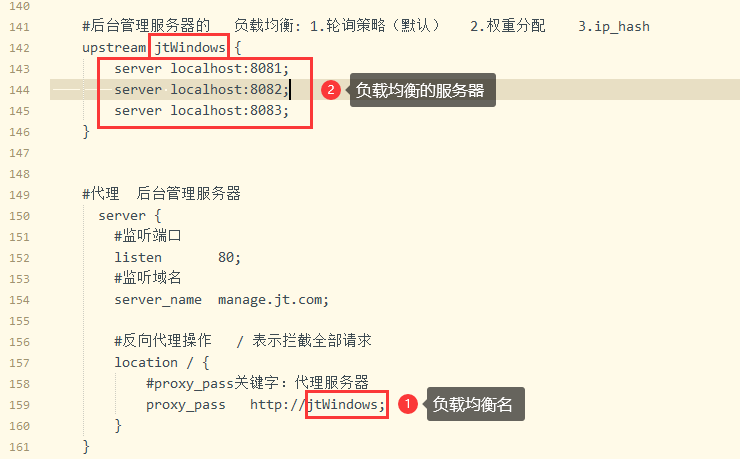
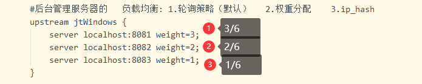
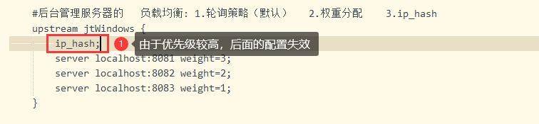

1、什么是Nginx
`   Nginx是一个 轻量级/高性能的反向代理Web服务器;实现非常高效的反向代理、负载平衡、动静分离` 

2、为什么要用Nginx
    反向代理与负载均衡‌：隐藏后端服务器地址，提高安全性；同时支持多种负载均衡算法
    高性能与低资源消耗‌：采用异步非阻塞架构，能高效处理大量并发连接，且内存和CPU使用率低
    稳定性与可靠性‌：Nginx稳定性强，宕机概率小，支持热部署，可不间断服务进行软件版本或配置升级，几乎达到7×24小时不间断运行
    丰富功能与灵活配置‌：Nginx支持SSL/TLS加密、HTTP基本认证等安全特性，配置文件结构简单灵活，还支持模块化设计
    静态内容服务‌：Nginx擅长处理静态文件，如HTML、CSS、JavaScript等，直接读取并发送给客户端，提升服务效率

3、为什么Nginx性能这么高？ 
    异步非阻塞，可以处理2-3万并发连接数

4、Nginx怎么处理请求的？
    nginx接收一个请求后，首先由listen和server_name指令匹配server模块，再匹配server模块里的location，location就是实际地址
    server { # 第一个Server区块开始，表示一个独立的虚拟主机站点
        listen 80； # 提供服务的端口，默认80
        server_name localhost； # 提供服务的域名主机名
        location / { # 第一个location区块开始
            root html； # 站点的根目录，相当于Nginx的安装目录
            index index.html index.htm； # 默认的首页文件，多个用空格分开
        } # 第一个location区块结果
    }

5、什么是正向代理和反向代理？
    正向代理：发送一个请求直接就到达了目标的服务器
    反方代理：请求统一被Nginx接收，nginx按照一定的规则分发给后端的目标服务器进行处理

6、Nginx的优缺点？
    优点：`占内存小、并发能力强、配置简单、反向代理、负载均衡、安全性好`
    缺点：动态处理差（处理静态文件好,耗费内存少）

7、Nginx应用场景？
    http服务器：可以做网页静态服务器
    虚拟主机：实现在一台服务器虚拟出多个网站
    反向代理，负载均衡：单台服务器不能满足用户的请求时，多台服务器集群可以使用nginx做反向代理，并且可以平均分担负载

8、Nginx负载均衡的策略有哪些?
`   轮询（默认）：循环分发到不同的后端服务器，服务器down掉能自动剔除。适合服务器配置相当的服务使用‌
    权重‌：在轮询基础上指定轮询几率，weight和访问比率成正比，用于后端服务器性能不均的情况‌
    IP绑定（ip_hash）： 每个请求按访问IP的hash结果分配，固定访客访问一个后端服务器，解决session问题‌`
    fair(第三方插件)：对比 weight、ip_hash更加智能的负载均衡算法
    url_hash(第三方插件)：按访问url的hash结果来分配请求

完整配置示例：

# ================= 全局块 =================
user nginx;                          # 指定运行 Nginx 进程的系统用户和组
worker_processes auto;               # 设置工作进程数，auto 表示自动与 CPU 核心数一致
error_log /var/log/nginx/error.log warn; # 定义全局错误日志的路径及记录级别（warn及以上）
pid /var/run/nginx.pid;              # 记录 Nginx 主进程 PID 的文件路径

# ================= 事件块 =================
events {
worker_connections 1024;         # 设置每个工作进程允许的最大并发连接数
use epoll;                       # 使用 epoll 模型，大幅提升 Linux 下的高并发网络 I/O 性能
}

# ================= HTTP 全局块 =================
http {
include mime.types;              # 引入 MIME 类型映射文件，让 Nginx 能正确识别各类文件的 Content-Type
default_type application/octet-stream; # 对于无法识别的文件，默认作为二进制流处理

    # 定义访问日志的格式，记录客户端IP、时间、请求内容、状态码、浏览器UA等
    log_format main '$remote_addr - $remote_user [$time_local] "$request" '
                   '$status $body_bytes_sent "$http_referer" '
                   '"$http_user_agent" "$http_x_forwarded_for"';
    access_log /var/log/nginx/access.log main; # 指定访问日志路径并应用上述格式

    # 性能优化参数
    sendfile on;                     # 开启零拷贝文件传输，静态资源提速必备
    tcp_nopush on;                   # 配合 sendfile，将数据包累积到一定大小后再发送，减少网络报文数量
    keepalive_timeout 65;            # 设置客户端长连接的超时时间为 65 秒
    gzip on;                         # 开启 Gzip 压缩，大幅减少传输体积

    # ================= 1. 负载均衡配置 =================
    # 定义上游服务器组（后端 API 集群）
    upstream api_servers {
        # 采用加权轮询策略，weight 值越大，分配到的请求比例越高
        server 192.168.1.101:8080 weight=3 max_fails=3 fail_timeout=30s; # 主节点1，权重3，30秒内失败3次则标记为不可用
        server 192.168.1.102:8080 weight=2 max_fails=3 fail_timeout=30s; # 主节点2，权重2
        server 192.168.1.103:8080 backup;                                # 备用节点，仅当所有主节点都宕机时才启用
    }

    # ================= 2. HTTP 自动跳转 HTTPS =================
    server {
        listen 80;                   # 监听 80 端口，接收未加密的 HTTP 请求
        server_name www.example.com; # 绑定的域名
        return 301 https://$host$request_uri; # 返回 301 永久重定向，将用户的 HTTP 请求强制跳转到对应的 HTTPS 地址
    }

    # ================= 3. HTTPS 主服务 + 动静分离 + 反向代理 =================
    server {
        listen 443 ssl http2;        # 监听 443 端口，开启 SSL 加密并启用 HTTP/2 协议
        server_name www.example.com; # 绑定的域名

        # --- SSL 证书与安全配置 ---
        ssl_certificate      /etc/nginx/ssl/www.example.com.pem;  # 指定 SSL 证书文件路径
        ssl_certificate_key  /etc/nginx/ssl/www.example.com.key;  # 指定 SSL 证书对应的私钥文件路径
        ssl_protocols TLSv1.2 TLSv1.3;                            # 限制仅允许使用安全的 TLS 协议版本
        ssl_ciphers ECDHE-RSA-AES128-GCM-SHA256:HIGH:!aNULL:!MD5; # 配置加密套件，禁用不安全的算法
        ssl_prefer_server_ciphers on;                             # 优先使用服务端的加密套件配置
        ssl_session_cache shared:SSL:10m;                         # 开启 SSL 会话缓存，减少重复握手开销
        ssl_session_timeout 10m;                                  # 设置 SSL 会话缓存的超时时间

        # --- 4. 动静分离：静态资源托管 ---
        # 匹配所有静态资源请求（如 CSS/JS/图片等）
        location ~* \.(html|css|js|png|jpg|jpeg|gif|ico)$ {
            root /data/static;         # 指定静态资源在服务器磁盘上的存放根目录
            expires 7d;                # 设置浏览器缓存过期时间为 7 天，减轻服务器带宽压力
            access_log off;            # 静态资源请求频繁，关闭访问日志以提升性能
        }

        # --- 5. 反向代理：动态 API 请求转发 ---
        # 匹配所有以 /api 开头的动态请求
        location /api {
            proxy_pass http://api_servers; # 将请求反向代理到前面定义的 upstream 负载均衡集群
            
            # 传递真实的客户端信息给后端，防止后端获取到 Nginx 的 IP
            proxy_set_header Host $host;
            proxy_set_header X-Real-IP $remote_addr;
            proxy_set_header X-Forwarded-For $proxy_add_x_forwarded_for;
            proxy_set_header X-Forwarded-Proto https; # 告知后端当前使用的是 HTTPS 协议
        }

        # --- 6. 根路径默认首页 ---
        location ^~ / {
            root /data/static/html;    # 前端打包后的静态文件目录
            index index.html;          # 默认首页文件名
            try_files $uri $uri/ /index.html; # 解决前端单页应用(SPA)刷新页面出现 404 的问题
        }
    }

# ================= 7. 定义限流区域 =================
    # 语法：limit_req_zone key zone=name:size rate=rate;
    limit_req_zone $binary_remote_addr zone=api_limit:10m rate=10r/s;
    # $binary_remote_addr : 使用客户端 IP 作为限流的标识（使用 binary_ 前缀可以压缩存储，节省内存空间）
    # zone=api_limit:10m  : 分配 10MB 的共享内存空间，命名为 api_limit（10MB 约可存储 16万个 IP 的状态）
    # rate=10r/s          : 限制每个 IP 每秒最多允许 10 个请求（也可配置为 30r/m 表示每分钟30个）

}

