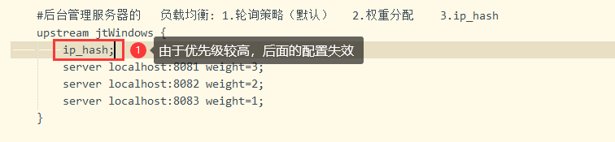

1、什么是Nginx
    Nginx是一个 轻量级/高性能的反向代理Web服务器;实现非常高效的反向代理、负载平衡

2、为什么要用Nginx
    反向代理与负载均衡‌：隐藏后端服务器地址，提高安全性；同时支持多种负载均衡算法
    高性能与低资源消耗‌：采用异步非阻塞架构，能高效处理大量并发连接，且内存和CPU使用率低
    稳定性与可靠性‌：Nginx稳定性强，宕机概率小，支持热部署，可不间断服务进行软件版本或配置升级，几乎达到7×24小时不间断运行
    丰富功能与灵活配置‌：Nginx支持SSL/TLS加密、HTTP基本认证等安全特性，配置文件结构简单灵活，还支持模块化设计
    静态内容服务‌：Nginx擅长处理静态文件，如HTML、CSS、JavaScript等，直接读取并发送给客户端，提升服务效率

3、为什么Nginx性能这么高？ 
    异步非阻塞，可以处理2-3万并发连接数

4、Nginx怎么处理请求的？
    nginx接收一个请求后，首先由listen和server_name指令匹配server模块，再匹配server模块里的location，location就是实际地址
    server { # 第一个Server区块开始，表示一个独立的虚拟主机站点
        listen 80； # 提供服务的端口，默认80
        server_name localhost； # 提供服务的域名主机名
        location / { # 第一个location区块开始
            root html； # 站点的根目录，相当于Nginx的安装目录
            index index.html index.htm； # 默认的首页文件，多个用空格分开
        } # 第一个location区块结果
    }

5、什么是正向代理和反向代理？
    正向代理：发送一个请求直接就到达了目标的服务器
    反方代理：请求统一被Nginx接收，nginx按照一定的规则分发给后端的目标服务器进行处理

6、Nginx的优缺点？
    优点：占内存小、并发能力强、配置简单、反向代理、负载均衡、安全性好
    缺点：动态处理差（处理静态文件好,耗费内存少）

7、Nginx应用场景？
    http服务器：可以做网页静态服务器
    虚拟主机：实现在一台服务器虚拟出多个网站
    反向代理，负载均衡：单台服务器不能满足用户的请求时，多台服务器集群可以使用nginx做反向代理，并且可以平均分担负载

8、Nginx负载均衡的策略有哪些?
    轮询（默认）：循环分发到不同的后端服务器，服务器down掉能自动剔除。适合服务器配置相当的服务使用‌
    权重‌：在轮询基础上指定轮询几率，weight和访问比率成正比，用于后端服务器性能不均的情况‌
    IP绑定（ip_hash）： 每个请求按访问IP的hash结果分配，固定访客访问一个后端服务器，解决session问题‌
    fair(第三方插件)：对比 weight、ip_hash更加智能的负载均衡算法
    url_hash(第三方插件)：按访问url的hash结果来分配请求

9、限流怎么做的？
    正常限制访问频率：
        # 定义一个限流区域，名称为"one"
        # $binary_remote_addr 表示基于客户端的IP地址（以二进制形式）进行限流 
        # zone=one:10m 表示为限流区域"one"分配10MB的内存空间
        # rate=1r/m 表示每分钟允许1个请求通过
        limit_req_zone $binary_remote_addr zone=one:10m rate=1r/m;
        
        # 在http块或server块中定义了一个虚拟主机（这里省略了其他server配置）
        server {
            # 定义一个location块，用于处理对/seckill.html的请求
            location /seckill.html {
                # 使用前面定义的限流区域"one"进行限流
                limit_req zone=one;
        
                # 当请求被限流时，将请求转发到http://lj_seckill这个后端服务（可以是另一个服务器、应用或负载均衡器）
                proxy_pass http://lj_seckill;
            }
        }

    突发限制访问频率：
        # 定义限流维度，即基于客户端的IP地址进行限流
        # $binary_remote_addr 表示使用客户端的IP地址（二进制形式）作为限流的键
        # zone=one:10m 表示创建一个名为"one"的限流区域，并为其分配10MB的内存空间
        # rate=1r/m 表示每分钟允许1个请求通过
        limit_req_zone $binary_remote_addr zone=one:10m rate=1r/m;
        
        # 定义一个server块，其中包含对特定URI的限流配置
        server {
            # 定义一个location块，用于处理对/seckill.html的请求
            location /seckill.html {
                        # 绑定前面定义的限流区域"one"，并设置一些额外的限流参数
                        # burst=5 表示允许一个突发请求队列，队列长度为5（即允许最多5个请求在短时间内超过限流速率）
                        # nodelay 表示在队列中的请求不会延迟处理，而是立即执行（如果可能的话）
                        limit_req zone=one burst=5 nodelay;
                
                        # 将请求转发到后端服务http://lj_seckill
                        proxy_pass http://lj_seckill;
                }
        }

限制并发连接数：

Nginx配置文件nginx.conf有哪些属性模块? 
全局设置模块：
    # 指定Nginx运行时的用户及用户组
    user nginx nginx;
    
    # 定义Nginx工作进程的数量，通常与CPU核心数相匹配
    worker_processes 4;
    
    # 指定错误日志的路径和日志级别（debug, info, notice, warn, error, crit, alert, emerg）
    error_log /var/log/nginx/error.log warn;
    
    # 指定Nginx主进程的PID文件路径
    pid /var/run/nginx.pid;

事件模块:
# 定义事件处理模型
events {
    # 在Linux上使用epoll事件模型（默认），在其他平台上可能需要使用其他模型如kqueue、select等
    use epoll;
    
    # 设置单个工作进程可以同时建立的最大连接数
    worker_connections 1024;
}

HTTP模块:
# 定义HTTP服务器的配置
http {
    # 包含其他配置文件，便于管理
    include /etc/nginx/mime.types;

    # 默认文件类型
    default_type application/octet-stream;

    # 定义日志格式
    log_format main '$remote_addr - $remote_user [$time_local] "$request" '
                      '$status $body_bytes_sent "$http_referer" '
                      '"$http_user_agent" "$http_x_forwarded_for"';

    # 指定访问日志的路径和格式
    access_log /var/log/nginx/access.log main;

    # 发送超时时间
    send_timeout 30;

    # 连接超时时间
    keepalive_timeout 65;

    # 开启gzip压缩
    gzip on;

    # 定义一个虚拟主机/域名
    server {
        # 指定监听的IP地址和端口，可以是80（HTTP）或443（HTTPS）等
        listen 80;

        # 定义域名，可以使用通配符或正则表达式
        server_name example.com;

        # 处理静态文件请求的根目录
        root /usr/share/nginx/html;

        # 默认请求的文件，当URI为目录时返回这些文件之一
        index index.html index.htm;

        # 定义URI的处理规则
        location / {
            # 其他配置指令，如代理、重写等
        }

        # 处理特定URI的配置，如错误页面
        location /error {
            # 返回404错误页面
            return 404;
        }
    }

    # 其他server块配置...
}

反向代理模块:
    # 指定请求应被转发到的后端服务器地址
    proxy_pass http://backend_server;

    # 设置转发给后端服务器的请求头，可以添加、修改或删除请求头
    proxy_set_header Host $host;
    proxy_set_header X-Real-IP $remote_addr;
    proxy_set_header X-Forwarded-For $proxy_add_x_forwarded_for;

负载均衡模块:
    # 定义一组后端服务器，用于负载均衡
    upstream backend_servers {
    # 指定后端服务器的地址和参数，可以使用IP、域名或Unix套接字
    server backend1.example.com weight=5;
    server backend2.example.com;
    # 其他后端服务器配置...
    }
    
    # 在server块或location块内使用upstream定义的服务器组进行负载均衡
    location / {
    proxy_pass http://backend_servers;
    }

SSL/TLS模块:
    # 指定SSL证书文件路径
    ssl_certificate /etc/nginx/ssl/example.com.crt;
    
    # 指定SSL证书密钥文件路径
    ssl_certificate_key /etc/nginx/ssl/example.com.key;
    
    # 指定支持的SSL/TLS协议版本
    ssl_protocols TLSv1.2 TLSv1.3;

