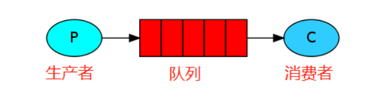
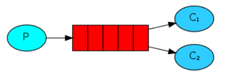
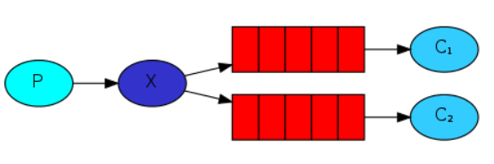
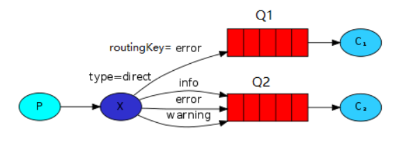
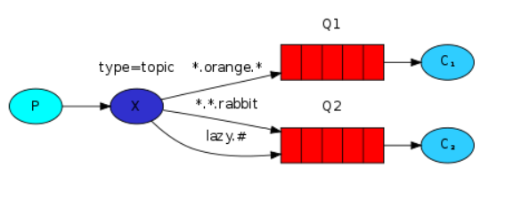

1、MQ（消息队列）作用：  解耦、异步、削峰

2、应用场景
    1）任务异步处理：不需要同步,且耗时长的任务
    2）应用程序解耦：生产方通过MQ与消费方交互， 相当于中介
    3）削峰填谷： 并发量大于数据库承受能力时，MQ控制并发量

3、实现MQ的方式： AMQP   JMS
    1）AMQP：一种链接协议（ 高级消息队列协议），不 从API层进行限制（不限制语言），而是直接定义网络交换的数据格式
    2）JMS： java消息服务应用程序接口，面向消息消息中间件的API，两个程序之间进行异步通信，或者分布式系统中发送消息
    3）区别： JMS定义统一接口，AMQP定义协议来统一数据交互的格式
            JMS限制java语言，AMQP不限制语言
            JMS规定了两种消息，AMQP消息模式更加丰富

4、消息队列常见产品
    1）RabbitMQ：基于AMQP协议，稳定性好，多用于分布式系统
    2）ActiveMQ：基于JMS
    3）RocketMQ：基于JMS，阿里巴巴产品
    4）ZeroMQ： 基于C语言开发
    5）Kafka：类似于MQ的产品，分布式消息系统，高吞吐量，多用于大数据

5、Rabbit六种模式：(重点)
    简单模式:一个消息生产者，一个消息消费者，一个队列   
    work模式:一个消息生产者，一个交换器，一个消息队列，多个消费者  
    Publish/Subscribe发布与订阅模式:一个消息生产者，一个交换机（交换机类型为fanout），多个消息队列，多个消费者  
    Routing路由模式:在发布/订阅模式的基础上，指定固定的路由键 routingKey       
    Topic主题模式:模糊匹配路由键 routingKey   
    RPC远程调用模式:  拥有请求/回复;也就是有响应的

6、生产者与消费者模式
    主要是包含了两类线程。一种是生产者线程用于生产数据，另一种是消费者线程用于消费数据，为了解耦生产者和消费者的关系，通常会采用共享的数据区域，就像是一个仓库

7、如何保证顺序消费(重点)
    如消费者A执行了增加，消费者B执行了修改，消费者C执行了删除，但是消费者C执行比消费者B快，消费者B又比消费者A快，就会导致消费 binlog 执行到数据库的时候顺序错乱，本该顺序是增加、修改、删除，变成了删除、修改、增加。
    单队列单消费者:强顺序低并发
    消息分组路由:  需要保证顺序消费的数据放到同一个队列里，提高并发能力
    业务层排序：消费者消费时，判断当前消费序号是否与期望序号一致

8、如何保证消息不丢/RabbitMQ如何保证消息已达(重点)
    1. 生产者丢消息：开启确认模式和退回模式
       生产者将数据发送到RabbitMQ的时候，可能在传输过程中因为网络等问题而将数据弄丢了。
       可以开启confirm模式。在生产者那里设置开启了confirm模式之后，每次写的消息都会分配一个唯一的id，如果写入了RabbitMQ之中，RabbitMQ会给你回传一个ack消息，告诉你这个消息发送OK了。如果RabbitMQ没能处理这个消息，会回调你一个nack接口，告诉你这个消息失败了，
    2.RabbitMQ自己丢消息：发送消息时开启持久化
        如果没有开启RabbitMQ的持久化，那么RabbitMQ一旦重启数据就丢了。所以必须开启持久化将消息持久化到磁盘，这样就算RabbitMQ挂了，恢复之后会自动读取之前存储的数据，一般数据不会丢失。除非极其罕见的情况，RabbitMQ还没来得及持久化自己就挂了，这样可能导致一部分数据丢失。
        设置消息持久化到磁盘， 创建queue的时候将其设置为持久化； 将消息持久化到磁盘上，发送消息的时候讲消息的deliveryMode设置为2。 跟生产的confirm机制配合起来，只有消息持久化到了磁盘之后，才会通知生产者ack，这样就算是在持久化之前RabbitMQ挂了，数据丢了，生产者收不到ack回调也会进行消息重发。
    3.消费端丢消息：开启手动ack
        主要是因为消费者消费时，刚消费到还没有处理，结果消费者就挂了，这样你重启之后，RabbitMQ就认为你已经消费过了，然后就丢了数据。
        使用RabbitMQ提供的ack机制，首先关闭RabbitMQ的自动ack，然后每次在确保处理完这个消息之后，在代码里手动调用ack。这样就可以避免消息还没有处理完就ack。

9、如何防止重复消费(重点)
    因为网络传输等等故障，确认信息没有传送到消息队列，导致消息队列不知道自己已经消费过该消息了，再次将消息分发给其他的消费者。
    解决方案：每条消息携带一个唯一ID
    1)如果消息是做数据库的insert操作，给这个消息做一个唯一主键，那么就算出现重复消费的情况，就会导致主键冲突，避免数据库出现脏数据。
    2)如果消息是做redis的set的操作，不用解决，因为无论set几次结果都是一样的，set操作本来就算幂等操作。
    3)如果以上两种情况还不行，可以准备一个第三方介质,来做消费记录。以redis为例，给消息分配一个全局id，只要消费过该消息，将<id,message>以K-V形式写入redis。那消费者开始消费前，先去redis中查询有没消费记录即可。

10、如何限流
    1) 消费端：设置prefetch=10 在未ack确认前,最多可以向该消费者推送10条消息

死信交换机：用于接收“死信”的专用交换机，通过死信交换机重新路由到死信队列(死信：消息被明确拒绝/消息过期/队列容量超限)
RabbitMQ 如何实现延迟队列：死信交换机+TTL(队列设置：死信交换机+死信路由key+TTL—>消息过期-> 路由到延迟队列->消费者监听延迟队列)
延迟队列：延迟执行的任务或消息(RabbitMQ的死信交换机+消息TTL；Redis的Sorted Set的Score作为过期时间)

6种交换机模式详解：https://www.cnblogs.com/wei325/p/15174212.html

 

