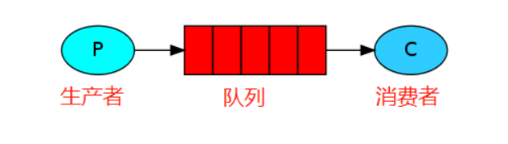
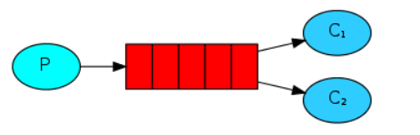
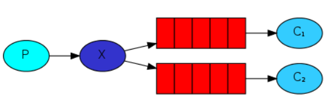
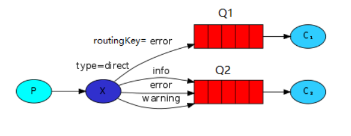
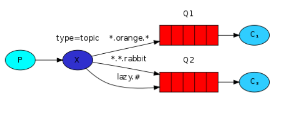

1、MQ（消息队列）作用： ` 解耦、异步、削峰`

2、应用场景
`   1）任务异步处理：不需要同步,且耗时长的任务
    2）应用程序解耦：生产方通过MQ与消费方交互， 相当于中介
    3）削峰填谷： 并发量大于数据库承受能力时，MQ控制并发量`

3、实现MQ的方式： AMQP   JMS
    1）AMQP：一种链接协议（ 高级消息队列协议），不 从API层进行限制（不限制语言），而是直接定义网络交换的数据格式
    2）JMS： java消息服务应用程序接口，面向消息消息中间件的API，两个程序之间进行异步通信，或者分布式系统中发送消息
    3）区别： JMS定义统一接口，AMQP定义协议来统一数据交互的格式
            JMS限制java语言，AMQP不限制语言
            JMS规定了两种消息，AMQP消息模式更加丰富

4、消息队列常见产品
    1）RabbitMQ：基于AMQP协议，稳定性好，多用于分布式系统
    2）ActiveMQ：基于JMS
    3）RocketMQ：基于JMS，阿里巴巴产品
    4）ZeroMQ： 基于C语言开发
    5）Kafka：类似于MQ的产品，分布式消息系统，高吞吐量，多用于大数据

5、Rabbit六种模式：(重点)
`   简单模式:一个消息生产者，一个消息消费者，一个队列   
    work模式:一个消息生产者，一个消息队列，多个消费者  
    Publish/Subscribe发布与订阅模式:一个消息生产者，一个交换机（交换机类型为fanout），多个消息队列（都能收到完整的消息），多个消费者  
    Routing路由模式:一个消息生产者，一个交换机（交换机类型为direct），多个消息队列（队列接收相同key的消息），精准路由key, 多个消费者       
    Topic主题模式:一个消息生产者，一个交换机（交换机类型为topic），多个消息队列（接收 模糊匹配 到的消息），模糊路由key, 多个消费者         *：匹配恰好一个单词      #：匹配零个或多个单词`
    RPC远程调用模式:  拥有请求/回复;也就是有响应的

6、生产者与消费者模式
    主要是包含了两类线程。一种是生产者线程用于生产数据，另一种是消费者线程用于消费数据，为了解耦生产者和消费者的关系，通常会采用共享的数据区域，就像是一个仓库

7、如何保证顺序消费(重点)
`   如消费者A执行了增加，消费者B执行了修改，消费者C执行了删除，但是消费者C执行比消费者B快，消费者B又比消费者A快，就会导致消费 binlog 执行到数据库的时候顺序错乱，本该顺序是增加、修改、删除，变成了删除、修改、增加。
    单队列+单消费者:强顺序低并发
    多队列+单消费者: 需要保证顺序消费的数据路由到同一个队列里，提高并发能力  （推荐： 如订单号 % 10，将消息分发到 0~9 号队列，消费者线程进行串行处理，确保同一个订单的所有消息（创建、支付、发货）永远只会进入同一个队列）  
    业务层排序：生产者将序号注入到消息header, 消费者并发拉去消息放入buffer中，业务处理代码块：获取期望序号与消费序号一致的数据 （单队列+多消费者+业务处理加同步锁）`

8、如何保证消息不丢/RabbitMQ如何保证消息已达(重点)
`  1. 生产者丢消息：开启确认模式和退回模式
        Confirm模式：确保消息从生产者成功传递到了交换机。回调函数返回的ack判断是否丢失（ack=true 收到，false 未收到）
        Return模式：确保消息从交换机成功路由到了队列。回调函数处理丢失
    2.RabbitMQ自己丢消息：发送消息时开启持久化
        说明：如果没有开启RabbitMQ的持久化，那么RabbitMQ一旦重启数据就丢了。所以必须开启持久化将消息持久化到磁盘，这样就算RabbitMQ挂了，恢复之后会自动读取之前存储的数据，一般数据不会丢失。除非极其罕见的情况，RabbitMQ还没来得及持久化自己就挂了，这样可能导致一部分数据丢失。
        队列持久化：创建queue的时候将其设置为持久化；
        消息持久化：发送消息的时候讲消息的deliveryMode设置为2。
        跟生产的confirm机制配合起来，只有消息持久化到了磁盘之后，才会通知生产者ack，这样就算是在持久化之前RabbitMQ挂了，数据丢了，生产者收不到ack回调也会进行消息重发。
    3.消费端丢消息：开启手动ack
        说明：主要是因为消费者消费时，刚消费到还没有处理，结果消费者就挂了，这样你重启之后，RabbitMQ就认为你已经消费过了，然后就丢了数据。
        开启手动确认（ack）：首先关闭RabbitMQ的自动ack，执行成功后，手动调用ack。
        死信队列处理异常：消息处理失败，消费者可以调用 basicNack 或 basicReject 拒绝该消息；设置有限重试次数，超过阈值后将其打入死信队列，由人工或定时任务进行补偿处理
`

9、如何防止重复消费(重点)
`   因为网络传输等等故障，确认信息没有传送到消息队列，导致消息队列不知道自己已经消费过该消息了，再次将消息分发给其他的消费者。
    解决方案：每条消息携带一个唯一ID
    1)如果消息是做数据库的insert操作，给这个消息做一个唯一主键，那么就算出现重复消费的情况，就会导致主键冲突，避免数据库出现脏数据。
    2)如果消息是做redis的set的操作，不用解决，因为无论set几次结果都是一样的，set操作本来就算幂等操作。
    3)唯一标识+消费状态：数据库加消费状态字段，redis用key-value`

10、如何限流
    1) 消费端：设置prefetch=10 在未ack确认前,最多可以向该消费者推送10条消息

死信队列：
`   定义：死信队列本质上是一个普通的队列，只是被配置为接收其他队列中“死亡”的消息。 定义普通队列时，有绑定死信队列的方法
    用途：用于处理异常消息（如消费者拒绝、队列满、消息过期等）`

延迟队列：
`   定义：没有原生的延迟队列
    用途：用于实现定时或延时任务（如订单超时取消）
    方案一：创建一个没有消费者的普通队列，并设置消息的 TTL（过期时间）。消息在队列中等待 TTL 到期后，自动路由到绑定的死信队列；缺点：存在队头阻塞（如果前面的消息延迟时间很长，后面的短延迟消息也会被阻塞）
    方案二（推荐）：延迟消息插件，声明一种特殊类型的交换机 x-delayed-message。消息在交换机内部暂存，到达延迟时间后再投递到目标队列。支持每条消息设置不同的延迟时间`

RabbitMQ 如何实现延迟队列：`死信交换机+TTL(队列设置：死信交换机+死信路由key+TTL—>消息过期-> 路由到延迟队列->消费者监听延迟队列)`

6种交换机模式详解：https://www.cnblogs.com/wei325/p/15174212.html

 

