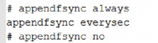
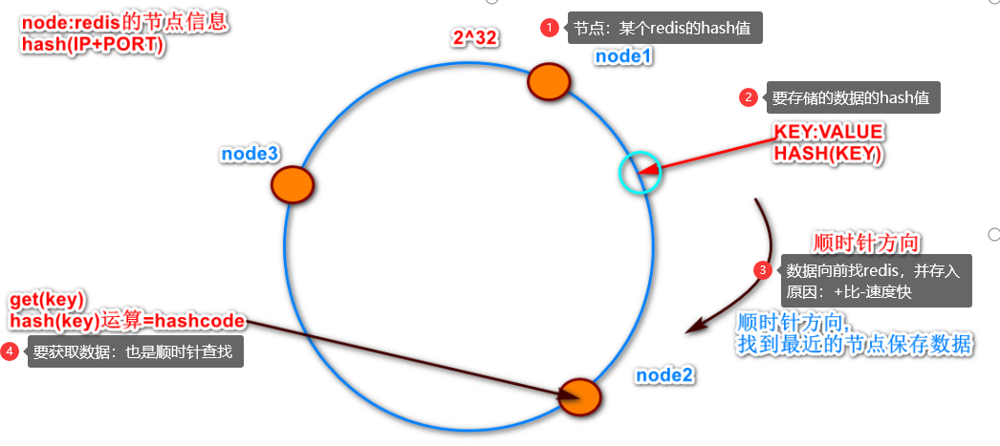
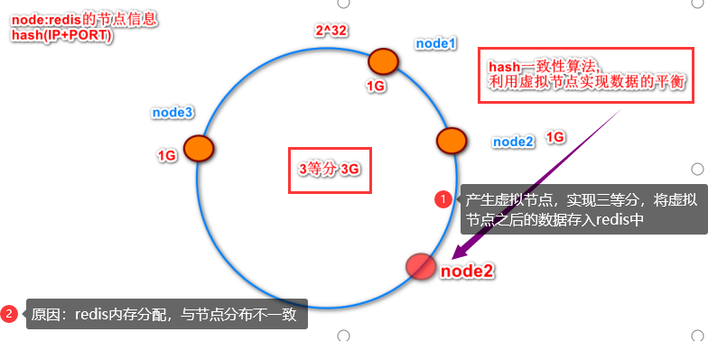

1、什么是Redis？
    Redis是一个开源的、基于内存的、使用C语言编写的key-value非关系型数据库
    其中value支持5种数据类型：string(字符串)、list(链表)、set(集合)、zset(sorted set --有序集合)、 hash（哈希）
    由于数据存储在内存中，读写非常快

2、Redis有哪些优缺点
    优点：
        读写很快：数据存储在内存；单线程
        支持数据持久化：AOF（日志）和RDB（快照）
        数据结构丰富：string(字符串)、list(链表)、set(集合)、zset(sorted set --有序集合)、 hash（哈希）
        原子性操作：操作都是原子性的
        支持主从复制：主机会自动将数据同步到从机，可以进行读写分离
    缺点：
        数据库容量受限‌：数据库容量受到物理内存的限制
        在线扩容复杂：在线扩容很复杂，需上线时确保有足够的空间‌
        不支持结构化查询：不如关系型数据库
        存在数据一致性问题：主从复制延迟或网络故障，可能会导致数据不一致

3、Redis的应用场景
    缓存：将热点数据放到内存
    排行榜‌：利用Redis的有序集合（Sorted Set）数据结构
    计数器：对 String 进行自增自减运算

4、Redis 的持久化机制是什么？各自的优缺点？
    RDB(Redis Database)：快照
        介绍：
            RDB默认的持久化方式。按照一定的时间间隔，将内存中的数据以快照的方式写入到二进制文件dump.rdb中。
            当Redis重新启动时，会读取这个文件来恢复数据
        优点：效率高、恢复快、文件小
        缺点：数据安全性低（按时间段更新，系统崩溃时，容易丢失数据）
        同步机制（redis.conf文件）：
    AOF(Append Only File)：日志
        介绍：
            记录每次对数据库执行写操作时的命令，以追加的方式写入到AOF文件中。
            当Redis重新启动时，会重新执行AOF文件中的命令来恢复数据
        优点：数据安全性更好
        缺点：性能较低、恢复速度较慢、‌文件较大‌
        同步机制（redis.conf文件）：每次修改同步、每秒同步、不同步

5、如何选择合适的持久化方式
    数据：AOF数据安全性更好
    性能：RDB性能更好
    存储空间：RDB占用更小

6、Redis key的过期时间怎么设置？
    expire  key  time  ：设置key的过期时间   单位：秒
    pexpire  key  time  ：设置key的过期时间   单位：毫秒
    
7、Redis的过期键的删除策略
    定时删除：设置了过期时间的键创建一个定时器，时间到达时，定时器会立即执行删除操作‌。CPU资源消耗较大‌
    惰性删除：不会主动检查键是否过期，每次访问键时才检查其是否过期。存在内存占用问题‌
    定期删除：定期（默认每隔100毫秒）随机抽取一部分键进行检查，如果键已过期，则执行删除操作‌

8、MySQL里有2000w数据，redis中只存20w的数据，如何保证redis中的数据都是热点数据
    redis内存不足时，LFU淘汰策略、分片、集群

9、Redis的内存淘汰策略有哪些
    noeviction（默认策略）‌：不淘汰任何数据，内存满时拒绝写入新的数据‌。
    volatile-lru‌：在设置了过期时间的键中，淘汰最近最少使用的键‌。 
    volatile-lfu‌：在设置了过期时间的键中，淘汰使用频率最低的键‌。
    volatile-ttl‌：在设置了过期时间的键中，淘汰剩余存活时间最短的键‌。
    volatile-random‌：在设置了过期时间的键中，随机淘汰某个键‌。
    allkeys-lru‌：在所有键中，淘汰最近最少使用的键，不区分是否设置了过期时间。
    allkeys-lfu‌：在所有键中，淘汰使用频率最低的键，不区分是否设置了过期时间‌。
    allkeys-random‌：在所有键中，随机淘汰某个键，不区分是否设置了过期时间‌
    算法说明：
        LRU（Least Recently Used）算法：淘汰链表尾部的数据，即最久未访问的数据
        LFU（Least Frequently Used）算法：据数据的访问频率来淘汰数据，淘汰访问次数最少的数据
        TTL（Time to Live，生存时间）：淘汰那些剩余生存时间最短的键；不是一种独立的淘汰策略，而是与键的过期时间相关。
        Random（随机）算法：随机选择并淘汰

10、Redis主要消耗什么物理资源？
    内存：数据读写都是在内存中完成

11、Redis的内存用完了会发生什么？
    写命令会返回错误信息，读命令还可以正常返回；如果配置内存淘汰机制，当内存用完了会冲刷掉旧的内容

12、Redis事务相关命令
    Redis事务：与关系型数据库中的事务有所差别，如果一条命令出现异常，其他命令依然会执行并不会事务回滚、
    相关命令： MULTI(开启事务) EXEC(执行事务) DISCARD(取消事务) WATCH(监视一个或多个键)

13、Redis事务支持隔离性吗
    Redis 是单进程

14、哨兵模式的介绍
    实现 redis 集群的高可用，主要用于监控Redis主从集群的运行状态，并进行自动化的故障转移（failover）和通知

15、哨兵的作用
    集群监控：负责监控 redis master 和 slave 进程是否正常工作。
    消息通知：如果某个 redis 实例有故障，那么哨兵负责发送消息作为报警通知给管理员。
    故障转移：如果 master node 挂掉了，会自动转移到 slave node 上。
    配置中心：如果故障转移发生了，通知 client 客户端新的 master 地址

16、哨兵的工作机制
    哨兵集群：哨兵之间会相互通信，共享监控信息，并进行协作决策
    监控与心跳‌：哨兵会定期向Redis主从节点发送心跳命令（如PING）
    选举与决策‌：主节点出现故障时，哨兵集群会通过选举机制选出一个领导者哨兵来进行故障转移操作。
    ‌故障转移‌：领导者哨兵会向选定的从节点发送SLAVEOF NO ONE命令，使其成为新的主节点，并更新其他从节点的配置，使它们指向新的主节点；并将故障转移的结果通知给管理员和其他哨兵。

17、Redis 集群工作原理
    槽分配：每个节点都被分配了一定数量的槽（从 0 到 16383）
    保存节点信息：Redis的所有节点都会保存当前redis集群中的全部主从状态信息.
    节点间通信‌：每个节点都能够相互通信.
    故障检测：当一个节点发生宕机现象.则集群中的其他节点通过PING-PONG检测机制检查Redis节点是否宕机.
    故障转移‌：当有半数以上的节点认为宕机.则认为主节点宕机.同时由Redis剩余的主节点进入选举机制.投票选举链接宕机的主节点的从机.实现故障迁移.

18、集群崩溃条件
    特点:集群中如果主机宕机,那么从机可以继续提供服务,当主机中没有从机时,则向其它主机借用多余的从机.继续提供服务.如果主机宕机时没有从机可用,则集群崩溃.
    答案:9个redis节点,节点宕机5-7次时集群才崩溃.    3主机

19、Redis 集群中的 key 寻址过程
    计算 key 的哈希值：CRC16（循环冗余校验码16位） 算法来计算这个哈希值，并将结果对 16384 取模，以确定这个 key 应该属于哪个哈希槽
    查找负责哈希槽的节点‌：查询集群的元数据来实现，元数据包含了哈希槽到节点的映射关系
    与负责节点通信‌：执行相应的操作（如 GET、SET 等）
    数据重定向‌：客户端最初连接到了一个不负责目标哈希槽的节点，那么该节点会返回一个 MOVED 错误，并告诉客户端正确的节点地址

20、分布式寻址算法有哪些？（确定数据应该存储在哪个节点上的算法）
    ‌一致性哈希算法‌：将数据均匀地分布在多个节点上，并且在节点变动时只影响少量数据的重新分配。具有较好的平衡性和可扩展性。
    哈希取模法‌：通过对数据的哈希值进行取模运算来确定存储节点。这种方法简单且易于实现，但扩展性较差，因为增加或删除节点时可能需要重新分配所有数据。
    ‌虚拟节点法‌：在一致性哈希算法的基础上，通过引入虚拟节点来进一步优化数据分布和负载均衡。虚拟节点是实际节点的映射，它们被均匀地分布在哈希环上，从而提高了数据分布的均匀性

21、一致性哈希算法
    哈希环： 将数据的键值哈希到一个固定的范围内，通常是一个环形空间。
    节点： 将节点的标识符哈希到环形空间上的一个位置，每个节点在环上占据一个位置。
    数据分布： 将数据的键值哈希到环形空间上的一个位置，然后按照顺时针方向找到第一个节点，将数据存储在该节点上。
    节点动态变化： 当节点动态变化时，只需要对受影响的数据进行重新哈希，将其映射到新的节点上即可，无需对整个数据集进行重新分配。
    负载均衡： 由于节点在环上均匀分布，因此可以实现负载均衡，将数据均匀地分布在不同的节点上，避免单个节点的负载过高。
    容错性： 由于节点在环上均匀分布，当某个节点发生故障时，只会影响其前一个节点到故障节点之间的数据，其他数据不会受到影响

22、Redis集群会有写操作丢失吗？为什么？
    Redis集群会有写操作丢失的可能性；
    持久化策略不当‌：RDB快照创建间隔过长，AOF策略过于宽松

23、Redis集群之间是如何复制的？
    异步复制

24、Redis集群最大节点个数是多少？
    16384个（有16284个卡槽）

25、Redis集群如何选择数据库？
    Redis集群目前无法做数据库选择，默认在0数据库（0-15共16个库）

26、Redis是单线程的，如何提高多核CPU的利用率？
    同一个服务器部署多个Redis的实例（分片）

27、为什么要做Redis分区（分片）？
    扩容：避免单个Redis实例的内存限制，使Redis能够管理更大的内存和数据集
    负载均衡：均衡各个Redis实例的负载，避免某些实例过载而其他实例空闲
    增强容错性：个分片发生故障时，其他分片仍然可以继续服务

28、Redis分区有什么缺点？
    操作限制：涉及多个key的操作通常不会被支持。例如你不能对两个集合求交集
    维护困难‌：节点故障处理需要重新分片数据，影响系统性能和稳定性；备份需要从不同实例和主机收集RDB/AOF文件
    动态扩容与缩容‌：某些分区方法不支持动态扩容或缩容时的数据再平衡。‌

29、Redis实现分布式锁
    Redis实现分布式锁是一种常见的技术，用于在分布式系统中确保某个资源或操作在同一时间只被一个客户端访问或执行
    获取锁：设置一个具有唯一性的key来实现的，这个key的值可以是客户端的唯一标识符或者是一个随机的字符串。同时，我们还需要为这个key设置一个过期时间（TTL），以防止锁被无限期地持有 
            SET lock_key "unique_client_id" NX EX 10（单实例中分布式锁的命令）  NX表示lock_key不存在时才设置，EX 10表示这个key将在10秒后过期
    操作资源：如果客户端成功获取了锁，它就可以执行业务逻辑
    释放锁‌：通过删除之前设置的key来实现的；在删除锁之前，客户端需要确保它仍然持有锁（即lock_key的值仍然是客户端之前设置的那个唯一标识符）。这是为了防止客户端误删其他客户端设置的锁。
    注意事项：
        ‌自动过期‌：必须为锁设置一个合理的过期时间，以防止由于客户端故障而导致的锁无限期持有。
        ‌唯一性‌：确保每个客户端在获取锁时使用的key是唯一的，以避免不同客户端之间的锁冲突。
        ‌原子性‌：获取锁和释放锁的操作应该是原子的，以避免在操作过程中发生并发问题。
        ‌重试机制‌：当客户端无法获取锁时，应该有重试机制，以便在锁被释放后能够再次尝试获取锁。

30、如何解决 Redis 的并发竞争 Key 问题
    分布式锁‌：使用Redis的分布式锁机制，如之前提到的SET lock_key "unique_client_id" NX EX 10命令

31、分布式Redis是前期做还是后期规模上来了再做好？为什么？
    Redis是如此的轻量（单实例只使用1M内存），为防止以后的扩容，最好的办法就是一开始就启动较多实例

32、什么是 RedLock
    Redlock 是一种分布式锁算法；通过使用多个 Redis 实例（通常至少 5 个）来实现分布式锁
    安全特性：互斥访问，即永远只有一个 client 能拿到锁
    避免死锁：最终 client 都可能拿到锁，不会出现死锁的情况，即使原本锁住某资源的 client crash 了或者出现了网络分区
    容错性：只要大部分 Redis 节点存活就可以正常提供服务

33、什么是redis穿透？
    描述：查询Redis中没有的数据时，该查询会下沉到数据库层，同时数据库层也没有该数据。它产生这个问题的原因可能是遭遇外部的恶意攻击
    解决法案：
        设置临时key:可以将key-value对写为key-null，缓存有效时间可以设置短点，如30秒（设置太长会导致正常情况也没法使用）
        接口层增加校验：如用户鉴权校验，id做基础校验，id<=0的直接拦截；
        采用布隆过滤器：将所有可能存在的数据哈希到一个足够大的 bitmap 中，一个一定不存在的数据会被这个 bitmap 拦截掉，从而避免了对底层存储系统的查询压力

34、什么是redis雪崩？
    描述：redis宕机，导致mysql的负载过大也宕机，最终整个系统瘫痪
    解决方案：
        redis集群，将原来一个人干的工作，分发给多个人干
        缓存预热：将相关的缓存数据直接加载到缓存系统，避免用户直接请求数据库
        不要设置相同的生存时间，不然过期时，redis压力很大

35、什么是redis击穿？
    描述：热点数据key从缓存内失效时，大量并发请求这个数据，就会将查询下沉到数据库层，此时数据库层的负载压力会骤增
    解决方案：
        延长热点key的过期时间或者设置永不过期；
        用互斥锁更新，当缓存失效时，不是立即去查询数据库，而是先尝试获取一个互斥锁，减小 DB 压力

36、缓存预热
    缓存预热就是系统上线后，将相关的缓存数据直接加载到缓存系统。
    解决方案：缓存刷新页面、定时任务

35、缓存降级
    描述：当访问量剧增、服务出现问题（如响应时间慢或不响应）或非核心服务影响到核心流程的性能时，
        仍然需要保证服务还是可用的，即使是有损服务。
    目的：防止Redis服务故障，保证核心服务可用，即使是有损的
    解决方案：
        服务降级‌：切换到备用缓存服务；暂时关闭缓存功能，直接访问数据库
        数据降级‌：从数据库重新加载数据；使用部分缓存数据或者简化的数据结构
        流量控制‌：配置限流规则来控制系统流量
        故障转移和容错‌：配置Redis集群

36、如何保证缓存与数据库双写时的数据一致性？
    延迟双删法‌：在更新数据库之前，先删除缓存————更新数据库——————等待一段时间，再次删除缓存
    ‌先更新数据库再删除缓存‌：更新数据库————删除缓存
    比较版本号或时间戳‌：数据库和缓存中同时存储一个版本号或时间戳————更新数据库时，同时更新版本号或时间戳————读取缓存时，先检查版本号或时间戳，如果与数据库中的不一致，则重新从数据库加载数据并更新缓存
    使用分布式锁‌：更新数据库和缓存时，使用分布式锁来确保同一时间只有一个进程或线程可以进行更新操作
  

37、Redis常见性能问题和解决方案？
    网络延迟：Redis服务器和客户端之间的网络延迟会影响操作的响应时间；
    解决方案‌：Redis实例时尽量靠近使用它的应用程序
    内存不足：内存使用达到上限时，它可能会开始拒绝新的写入操作或删除旧数据。
    解决方案‌：合理的内存淘汰策略；
    持久化性能瓶颈：持久化操作（如RDB快照或AOF日志）可能会影响其性能

38、假如Redis里面有1亿个key，其中有10w个key是以某个固定的已知的前缀开头的，如果将它们全部找出来？
    使用KEYS命令（不推荐）：KEYS prefix:*     
    缺点：它会扫描整个键空间，这在键数量庞大的情况下会导致严重的性能问题
    使用SCAN命令（推荐）：SCAN命令是一个基于游标的迭代器，逐步地遍历键空间，而不会像KEYS命令那样一次性返回所有结果

