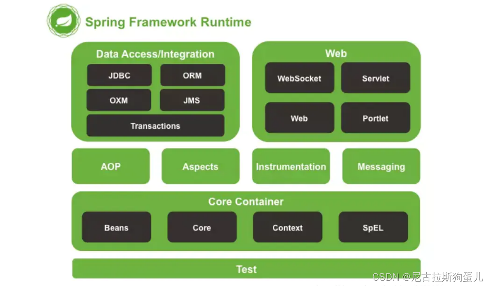

1、什么是spring?
    概念：Spring是一个轻量级的开源框架
    目的：简化Java开发
    作用：降低对象之间的耦合度；管理对象，即如何创建对象和维护对象之间的关系

2、Spring的俩大核心概念
    IOC（Inversion of Control，控制翻转）：
        控制翻转，也叫依赖注入；不需要手动new来创建对象，对象的创建、管理由Spring容器来负责
        DI（依赖注入）： 实现IoC的一种方式；动态的向某个对象提供它所需的其他对象属性（对象）
    AOP（Aspect-Oriented Programming，面对切面编程）：
        定义：解决oop中遇到的一些问题，是oop的延续和扩展；
        作用：在不修改源代码的情况下，对功能进行增强

3、Spring的优缺点是什么？
    优点‌：简化开发、解耦、支持AOP编程、支持声明式事务、方便集成优秀框架‌、支持Junit4
    缺点：配置繁琐、性能问题（使用了大量的反射机制）

4、Spring由哪些模块组成？
    spring core：提供了框架的基本组成部分，包括控制反转（Inversion of Control，IOC）和依赖注入（Dependency Injection，DI）。
    spring aop：提供了面向切面的编程实现，让你可以自定义拦截器、切点等。    
    spring beans：提供了BeanFactory，是工厂模式的一个经典实现，Spring将管理对象称为Bean。
    spring context：是spring core的扩展，使得Spring应用更加易于配置和管理。
    spring Web：提供了构建Web应用所需的各种功能，例如文件上传，如请求处理、视图解析、表单处理等
    spring test：提供了对JUnit等测试框架的支持，得单元测试和集成测试更加便捷。
    spring jdbc：简化JDBC，消除了烦琐的JDBC编码和数据库厂商特有的错误代码解析。

5、Spring 框架中都用到了哪些设计模式？
    工厂模式：BeanFactory就是简单工厂模式的体现，用来创建对象的实例；
    单例模式：Bean默认为单例模式。
    代理模式：Spring的AOP功能用到了JDK的动态代理和CGLIB字节码生成技术；

6、详细讲解一下核心容器（spring context应用上下文) 模块
    概述：提供了Spring应用运行时的环境，管理着Spring应用中的bean及其生命周期，并支持依赖注入、事件传播、国际化、资源加载等多种功能。
    ApplicationContext 接口：是Spring Context模块的核心接口，它继承自BeanFactory接口，并提供了更多企业级应用开发所需的功能。
    Bean的管理：ApplicationContext负责管理bean的创建、装配、初始化、销毁等全生命周期的管理。
    注解支持：Spring Context模块还提供了对注解的全面支持，简化配置工作

7、什么是Spring IOC 容器？
    IOC即 控制反转(Inversion of Control)，负责创建对象，管理对象（通过依赖注入（DI），装配，配置及生命周期管理），从而减轻了开发者的负担，提高了应用的可维护性和可扩展性
    实现机制：工厂模式+反射机制（根据传入的全类名，反射调用创建对象）

8、BeanFactory 和 ApplicationContext有什么区别？
    关系：都可以当做Spring的容器，ApplicationContext是BeanFactory的子接口
    功能范围：
        BeanFactory：最底层的接口，创建和管理对象
        ApplicationContext：BeanFactory的子接口，提供了更多企业级功能，如：事件传播、声明式机制、国际化支持以及更方便的与Spring AOP、Spring MVC等框架的集成
    加载方式：
        BeanFactroy：延迟实例化，只有在使用到某个Bean时，才对进行加载实例化。（不能发现一些潜在的配置问题）
        ApplicationContext：非延迟实例化，在容器启动时，一次性创建了所有的Bean。（提前发现一些潜在的配置问题；当运行期使用到该Bean的时候无需再实例化，加快运行的效率；Bean以缓存的方式保存，占用内存空间）

9、ApplicationContext通常的实现是什么？
    // 创建ClassPathXmlApplicationContext实例 加载src下的.XML配置文件，生成Spring容器：
    ApplicationContext  applicationContext  = new   ClassPathXmlApplicationContext("applicationContext.xml");
    // 创建FileSystemXmlApplicationContext实例，指定文件系统路径下的XML配置文件位置
    ApplicationContext context = new FileSystemXmlApplicationContext(path/to/your/beans.xml);

10、什么是Spring的依赖注入？
    依赖注入（Dependency Injection，DI）就是控制反转（IOC）的一种实现方式；控制反转（IOC）是一个很大的概念，可以用不同的方式来实现。
    注入方式：构造函数注入、setter方法注入、注解注入‌
    

11、什么是Spring beans？
    Spring beans是被Spring容器管理的对象

12、一个 Spring Bean 定义 包含什么？
    容器必知的所有配置元数据：标识（ID）、名称（Name）、全类名(Class)、作用域（Scope）、造函数参数、属性

13、如何给Spring 容器提供配置元数据？Spring有几种配置方式
    XML配置文件
    基于注解的配置
    基于java的配置：在配置注解类中定义，被管理的bean

14、自定义注解
    // 指定注解的作用范围：方法上
    @Target(ElementType.METHOD)
    // 指定注解的保留策略，RUNTIME表示注解会在运行时保留，可通过反射获取
    @Retention(RetentionPolicy.RUNTIME)
    public @interface MyCustomAnnotation {
    // 注解的元素，这里定义了一个名为value的字符串元素，有默认值"default"
    String value() default "default";
    }

15、解释Spring支持的几种bean的作用域
    singleton : 单例（默认）,bean在每个Spring ioc 容器中只有一个实例。
    prototype：多例，一个bean的定义可以有多个实例。
    request：每次http请求都会创建一个bean
    session：在一个HTTP Session中，一个bean定义对应一个实例。
    global-session：在一个全局的HTTP Session中，一个bean定义对应一个实例

16、Spring框架中的单例bean是线程安全的吗？
    Spring框架中的单例bean不是线程安全的，spring 框架并没有对单例 bean 进行多线程的封装处理

17、解释Spring框架中bean的生命周期
    Bean的实例化‌：Spring对bean进行实例化；
    Bean属性的填充（依赖注入）：Spring将值和bean的引用注入到bean对应的属性中；
    Bean的初始化‌：容器会调用Bean的初始化方法（如果有的话）
    Bean的使用‌：容器会将Bean存储在内部的缓存中，以便在需要时能够快速获取
    Bean的销毁‌：当容器关闭时，或者当Bean的作用域结束时（如request或session作用域的Bean），容器会调用Bean的销毁方法（如果有的话）

18、哪些是重要的bean生命周期方法？ 你能重载它们吗？
    初始化方法‌：
        init-method属性：自定义初始化方法名
        @PostConstruct注解：来标记一个方法作为初始化方法
    销毁方法‌：
        destroy-method属性：自定义销毁方法名
        @PreDestroy注解：来标记一个方法作为销毁方法

19、什么是bean装配？
    Spring 容器中把bean组装到一起，依赖注入就是Bean装配的一种方式‌

20、什么是bean的自动装配？
    Spring容器自动地处理Bean之间的依赖关系，而无需开发者显式地在配置文件或代码中指定这些依赖。如@Autowired注解
    

21、解释不同方式的自动装配，spring 自动装配 bean 有哪些方式？
    xml配置自动装配：autowire="byName"、autowire="byType"或autowire="constructor"等
    注解自动装配：
        按类型装配（@Autowired）：根据类型自动查找并注入依赖
        按名称装配（@Resource）：首先按名称查找Bean，如果找不到则按类型查找

22、你可以在Spring中注入一个null 和一个空字符串吗？
    可以通过配置或编程的方式注入null值或一个空字符串（""）
    示例：
        @Value("#{null}")
        private String myProperty;
        
        <bean id="myBean" class="com.example.MyBean">
            <property name="myProperty">
                <null/>
            </property>
        </bean>

23、@Component, @Controller, @Repository, @Service 有何区别？
    @Component：通用的注解；用于标注一个普通bean
    @Controller：用于标注Spring MVC中的控制器类
    @Service：用于标注服务层的组件
    @Repository：用于标注数据持久层（DAO层）类注解

24、@Autowired 注解有什么作用
    默认是按照类型装配注入的，默认情况下它要求依赖对象必须存在；
    修饰setter方法、构造器、属性
    如果@Autowired(required=false)表示依赖项不是必需的

25、@Autowired和@Resource之间的区别
    @Autowired和@Resource可用于：构造函数、成员变量、Setter方法
    @Autowired和@Resource之间的区别：
        @Autowired：Spring提供，只能按类型注入，当属性类型具有多个bean时不知道选择哪一个（可以设置它required属性为false）。
        @Resource：JDK提供，默认是按照名称来注入，只有当找不到与名称匹配的bean才会按照类型来注入

26、@Qualifier 注解有什么作用
    与 @Autowired配合使用，解决 @Autowired多个相同类型的 bean的缺点。Spring提供

27、@RequestMapping 注解有什么用？
    描述：用于映射HTTP请求到控制器方法的关键注解，
    作用：将特定的HTTP请求（包括请求方法、URL路径、请求参数、请求头等）与控制器中的某个方法关联起来

28、Spring支持的事务管理类型， spring 事务实现方式有哪些？
    事物管理类型：
        编程式事务管理：编程的方式管理事务，给你带来极大的灵活性，但是难维护。
        声明式事务管理：注解和XML配置来管理事务
    事物实现方式：
        编程式事务管理：PlatformTransactionManager 或者 TransactionTemplate
        声明式事务管理： xml结合aop配置事务      注解使用 @Transactional(参数可设置传播行为、隔离级别、超时时间、只读标志和回滚规则)
    实现原理：基于AOP（面向切面编程）和代理模式

29、说一下Spring的事务传播行为
    PROPAGATION_REQUIRED‌（默认行为）： 如果当前存在事务，则加入该事务； 如果当前没有事务，则创建一个新的事务。
    PROPAGATION_REQUIRES_NEW‌： 创建一个新的事务，如果当前存在事务，则把当前事务挂起。
    PROPAGATION_SUPPORTS‌： 如果当前存在事务，则加入该事务； 如果当前没有事务，则以非事务方式执行。
    PROPAGATION_NOT_SUPPORTED‌： 以非事务方式执行操作，如果当前存在事务，则将当前事务挂起。
    PROPAGATION_NEVER‌： 以非事务方式执行，如果当前存在事务，则抛出异常。
    PROPAGATION_MANDATORY‌： 如果当前存在事务，则加入该事务； 如果当前没有事务，则抛出异常。
    PROPAGATION_NESTED‌： 如果当前存在事务，则在嵌套事务内执行； 如果当前没有事务，则创建一个新的事务； 嵌套事务是独立提交的，但如果外层事务回滚，嵌套事务也会回滚

30、说一下 spring 的事务隔离？ 
    ISOLATION_DEFAULT‌： 使用数据库默认的隔离级别。不同的数据库可能有不同的默认隔离级别。
    ISOLATION_READ_UNCOMMITTED‌（读未提交）：可能会导致脏读（Dirty Read）
    ISOLATION_READ_COMMITTED‌（读已提交）： 可以避免脏读，但可能会出现不可重复读（Non-repeatable Read）
    ISOLATION_REPEATABLE_READ‌（可重复读）： 可以避免不可重复读，但可能会出现幻读（Phantom Read），
    ISOLATION_SERIALIZABLE‌（串行化）：事务之间互不干扰。这可以避免脏读、不可重复读和幻读。可能会显著降低性能。

31、更倾向用那种事务管理类型？
    声明式事务管理：对应用代码的影响最小
    不足：最细粒度只能作用到方法级别

32、什么是AOP
    概念：面向切面编程，作为面向对象（OOP）的一种补充，用于将那些与业务无关，但却对多个对象产生影响的公共行为;
    名词：
        1）Joinpoint     连接点：目标对象中所有可以增强的方法，叫做连接点
        2）Pointcut      切入点： 匹配 增强/通知 所要 织入 的连接点，叫做切入点
        3）Advice        增强/通知：新增的功能 如：前置通知（before advice）、后置通知（after advice）、环绕通知（around advice）等
        4）Weaving       织入：将 增强/通知 应用到连接点形成切入点的过程，叫做织入
        5）aspect        切面：切入点+增强
        6）Proxy         代理：将增强织入到目标对象后形成的对象，叫做代理对象
        7）Target        目标对象： 被代理的对象
    实现：使用的动态代理
        JDK 的动态代理 :针对实现了接口的类产生代理.
        cglib的动态代理：针对没有实现接口的类产生代理，生成当前类的子类对象

33、Spring通知有哪些类型？
    前置通知（Before）：在目标方法被调用之前调用通知功能；
    后置通知（After）：在目标方法完成之后调用通知，无论是否异常；
    返回通知（After-returning ）：在目标方法成功执行之后调用通知；
    异常通知（After-throwing）：在目标方法抛出异常后调用通知；
    环绕通知（Around）：通知包裹了被通知的方法，在被通知的方法调用之前和调用之后执行自定义的行为

34、什么是切面 Aspect？
    aspect 由 pointcount 和 advice 组成（切面是通知和切点的结合）; 切面通常是一个使用@Aspect注解标注的类

35、基于注解的切面实现
    创建@Aspect注解修饰的增强对象，并在方法上加注解 Before、 Around、AfterReturning、 AfterThrowing、 After

