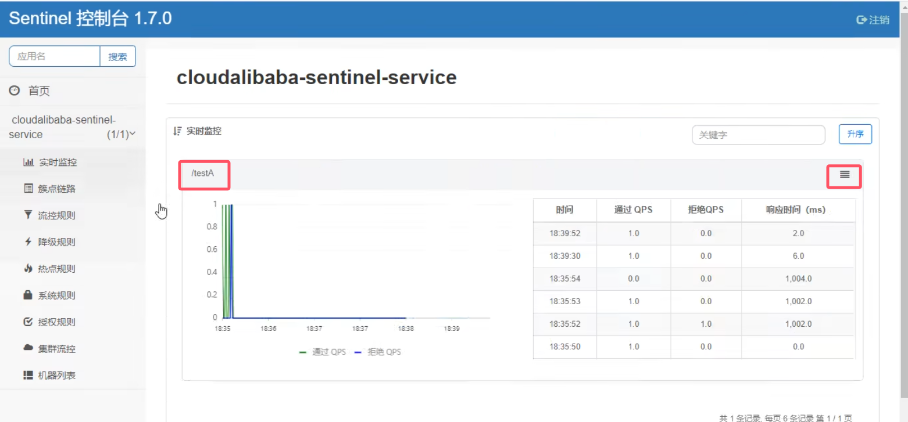
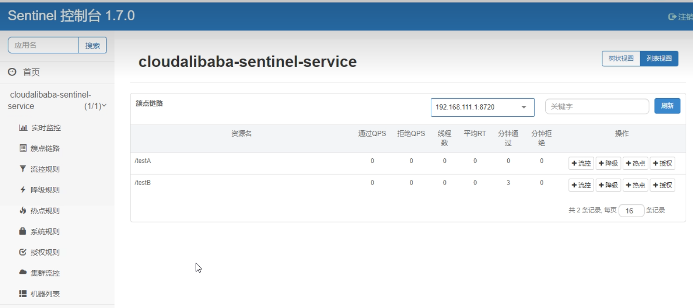
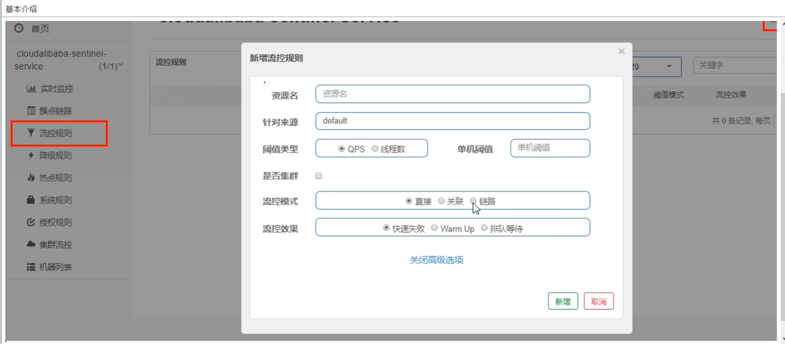
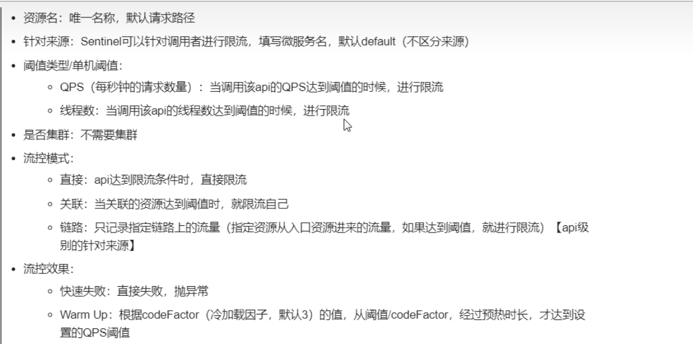
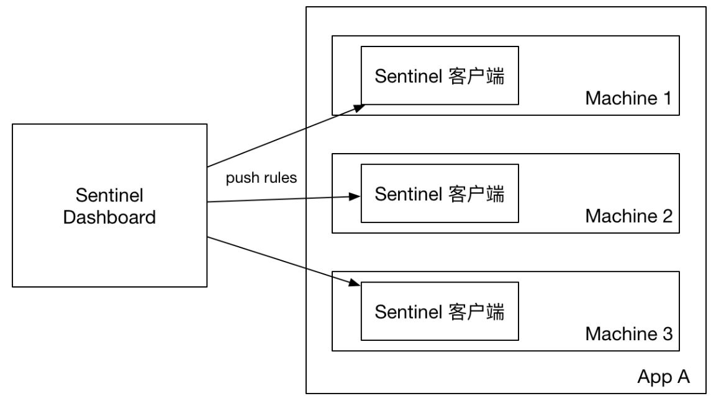
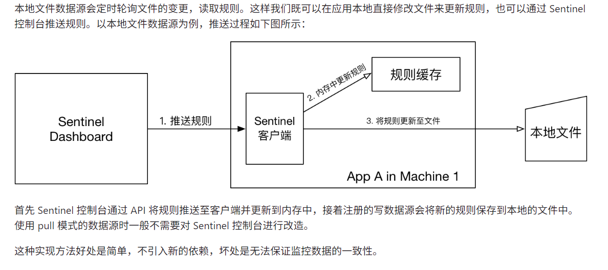
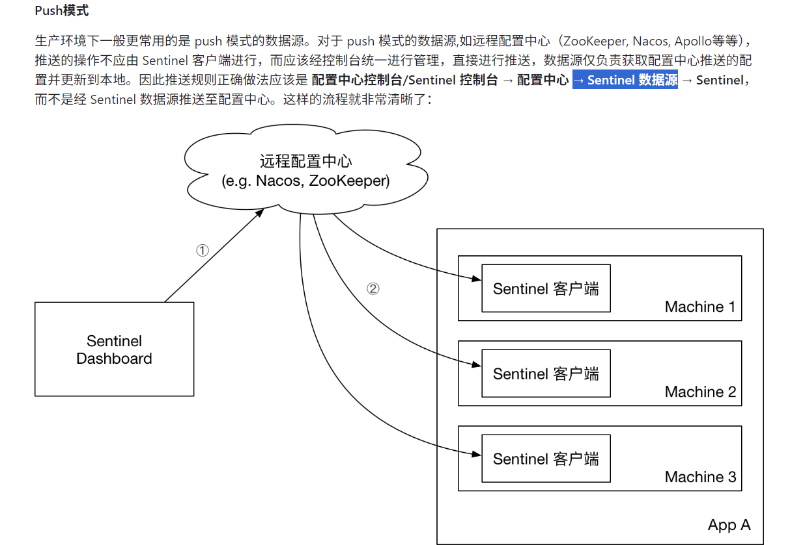

=======================================Gateway：网关=================================================

=======================================Nacos：配置中心、服务注册与发现 8848===================================
引依赖：nacos-discover      nacos-config
改yml：server-addr:nacos服务地址    namespace:开发环境  data-id：配置中心文件名  refresh-enabled：是否开启动态刷新(默认开启)  shared-configs：共享配置
主启动：SpringCloud的H版之后就不需要添加@EnableDiscoveryClient注解，
业务类： @Value("${app.value}")   @RefreshScope: 动态刷新

=======================================OpenFein:服务调用==============================================
引依赖：starter-openfeign      starter-loadbalancer
改yml：配置Nacos注册中心地址‌
主启动： @EnableFeignClients
调用方：接口上加  @FeignClient("provider-service")  注解；  方法上加  @GetMapping("")  注解

=======================================Sentinel：流量控制、降级控制、熔断控制、热点参数限流  8080===================
官网地址：https://sentinelguard.io/zh-cn/index.html
仓库地址：https://github.com/alibaba/Sentinel
引依赖：starter-alibaba-sentinel   sentinel-datasource-nacos    nacos-discover
改yml：持久化到nacos  可视化配置  
主启动：
业务类:
dashboard控制台：懒加载(需要调研了，才会监控对应接口)    默认8080端口
控制台功能：
    实时监控：汇总资源信息 
    簇点链路：显示刚刚调用的资源   
    流量监控：   
    降级规则：  
    热点规则：   
    系统规则：   
    授权规则：   
    集群流控：   
    机器列表：
规则推送模式：
    原始模式：通过 API 将规则推送至客户端，并保存到内存中，重启即消失；不保证一致性 
    Pull模式：定期轮询向 本地文件 拉取规则，不保证一致性，拉取过于频繁也可能会有性能问题 
    Push模式：注册中心Nacos实时监听规则变化， 保证实时性和一致性  

=======================================Seata：分布式事物解决方案：流量控制、降级控制、熔断控制、热点参数限流======