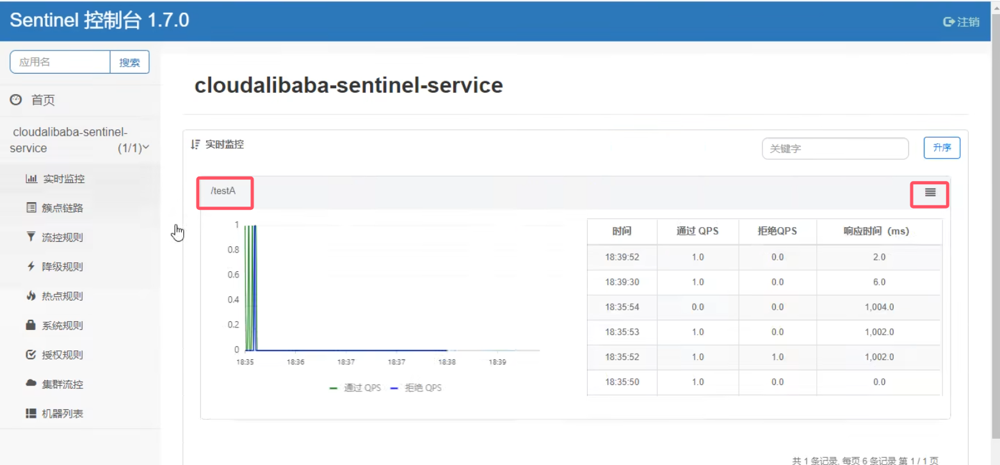
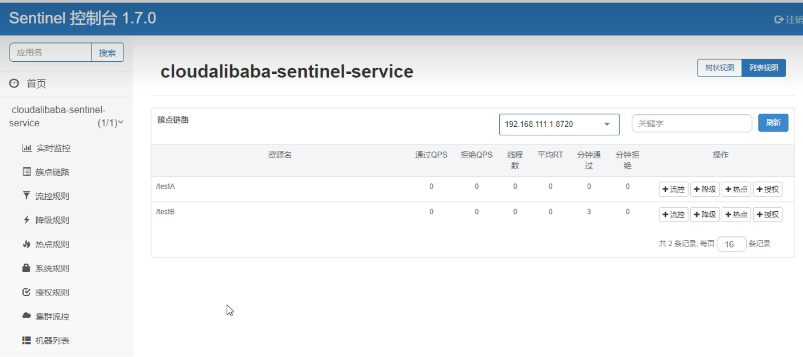
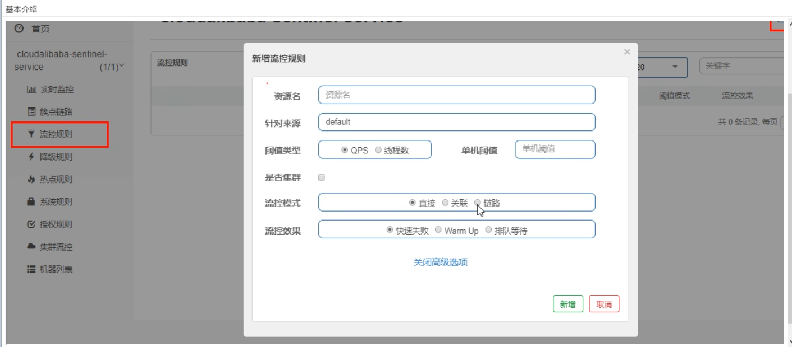
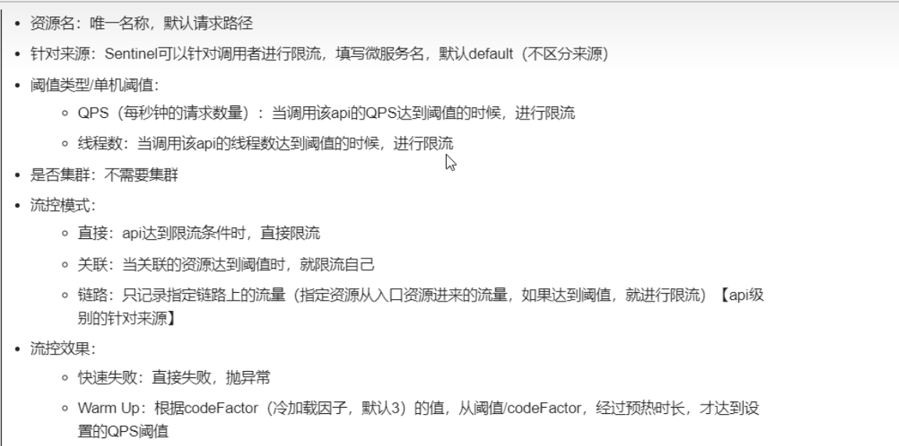
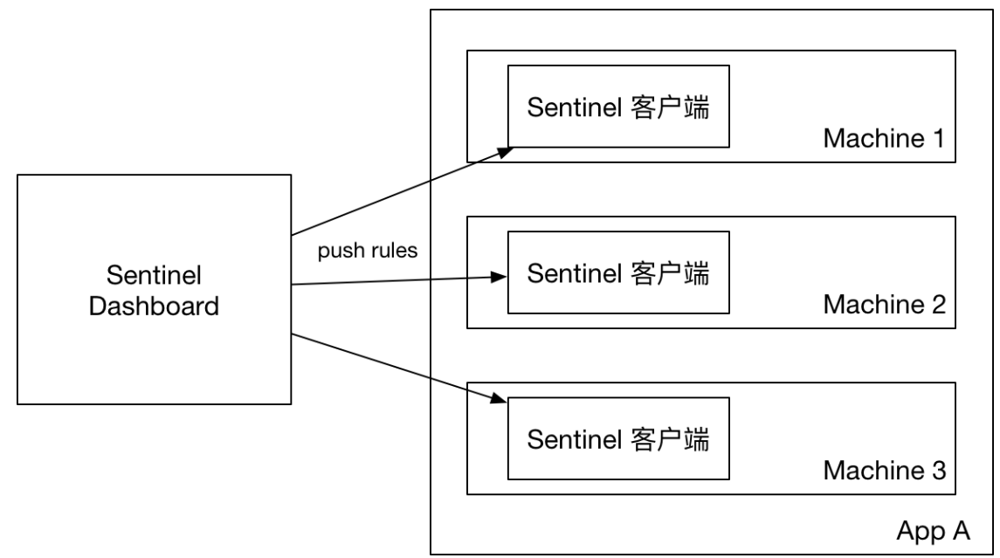
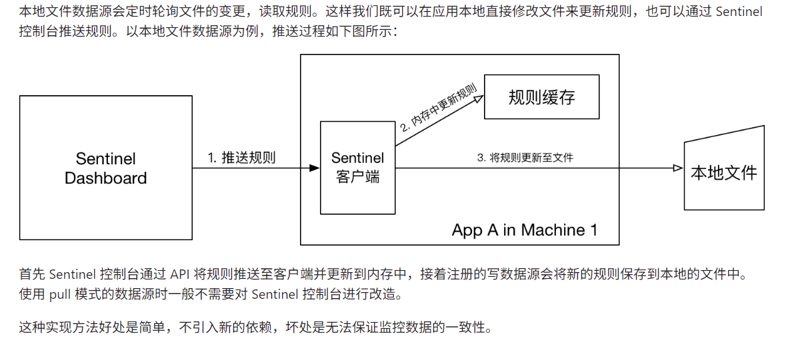
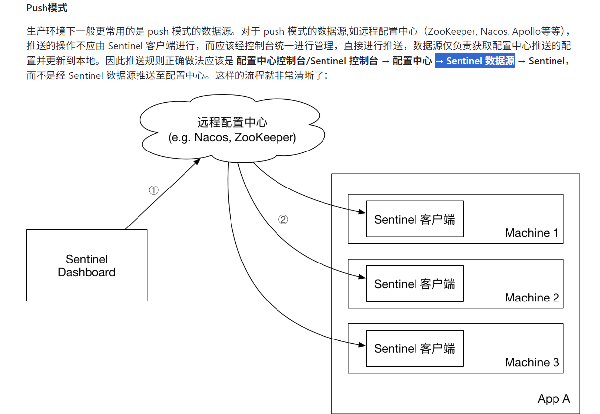

======================完整流转路径====================================

用户浏览器
│
▼
┌─────────────────────────────────────────────────────────────────────┐
│                          Nginx (`反向代理/静态资源`)                    │
│  部署方式：单独部署 (Docker/K8s)                                      │
│  作用：SSL证书、静态资源托管、Gateway负载均衡                         │
└──────────────────────┬──────────────────────────────────────────────┘
│ 转发到 Gateway 集群
▼
┌─────────────────────────────────────────────────────────────────────┐
│               Spring Cloud Gateway (API网关)                         │
│  部署方式：单独部署 (独立微服务)                                       │
│  依赖：spring-cloud-starter-gateway, spring-boot-starter-security,  │
│        spring-cloud-starter-`loadbalancer`                             │
│  作用：统一`鉴权`、`路由`、`限流`、日志                             │
└──────────────────────┬──────────────────────────────────────────────┘
│ `携带鉴权Token`转发
▼
┌─────────────────────────────────────────────────────────────────────┐
│                    Nacos (注册中心 + 配置中心)                        │
│  部署方式：单独部署 (独立服务)                                         │
│  作用：`服务注册发现、配置动态刷新`                                      │
└──────────────────────┬──────────────────────────────────────────────┘
│ 服务发现 + 负载均衡
▼
┌─────────────────────────────────────────────────────────────────────┐
│              Order-Service (订单服务+`远程调用+限流与熔断++分布式事务`)                                 │
│  部署方式：业务系统引入依赖 (独立微服务)                               │
│  依赖：spring-cloud-starter-alibaba-nacos-discovery,                │
│        spring-cloud-starter-`openfeign`,                              │
│        spring-cloud-starter-alibaba-`sentinel`,                       │
│        spring-cloud-starter-alibaba-`seata`                           │
│  作用：`订单业务逻辑、Feign调用商品服务、Sentinel限流、Seata事务`       │
└──────────────────────┬──────────────────────────────────────────────┘
│ Feign远程调用
▼
┌─────────────────────────────────────────────────────────────────────┐
│              Product-Service (商品服务)                               │
│  部署方式：业务系统引入依赖 (独立微服务)                               │
│  依赖：同上 + seata-spring-boot-starter                             │
│  作用：`商品库存扣减、Seata分支事务`                                    │
└─────────────────────────────────────────────────────────────────────┘

请求完整流转过程
    用户发起请求：浏览器访问 https://mall.com/api/order/create，携带JWT Token。
    Nginx 反向代理：SSL终止，静态资源直接返回，API请求转发到Gateway集群（负载均衡）。
    Gateway 鉴权：AuthFilter-过滤器 校验Token合法性，白名单路径放行，非法请求返回401，合法请求将用户ID放入请求头。
    Gateway 路由转发：根据路径匹配规则，将请求转发到 lb://order-service。
    Nacos 服务发现：LoadBalancer 从Nacos获取order-service的所有健康实例列表。
    负载均衡：根据策略（如轮询）选择一个order-service实例。
    Order-Service 处理：
        Sentinel 拦截请求，校验限流规则，超限则返回降级响应。
        @GlobalTransactional 开启Seata全局事务，生成XID并放入请求头。
        通过OpenFeign调用product-service，自动传递XID。
    Product-Service 处理：
        Feign拦截器将XID放入请求头。
        Seata拦截器识别XID，开启分支事务，执行库存扣减，记录undo_log。
        返回结果给order-service。
    事务提交/回滚：
        所有分支成功：Seata TC通知所有RM提交事务，删除undo_log。
        任一分支失败：Seata TC通知所有RM根据undo_log回滚，保证数据一致性。
        响应返回：结果沿原路返回，Gateway记录访问日志，Nginx返回给用户

=======================================Nginx=================================================
部署方式：单独部署
作用：代理、负载均衡、静态资源管理、SSL证书

Nginx：职责-守门与分流
    `负载均衡与高可用`：作为Gateway集群的前置入口，将海量请求均匀分发到多个Gateway实例，避免单点故障
    `静态资源管理`：直接高效地返回HTML、CSS、JS、图片等静态文件，无需将请求透传到后端的Gateway和微服务
    SSL/TLS 卸载：统一在这里配置`HTTPS证书`，完成复杂的SSL解密，然后将明文的HTTP请求转发给内网的Gateway，为后端服务“减负”
    安全防护：可以在入口层配置IP黑名单、基础的限流策略等，抵御大流量攻击

=======================================Spring Cloud Gateway：网关集群=================================================
│  部署方式：单独部署 (独立微服务)                                       
│  依赖：spring-cloud-starter-gateway, spring-boot-starter-security   
│  作用：鉴权、路由、限流

Gateway：职责-治理与路由
智能`路由`：根据请求路径、Header等信息，将请求动态路由到正确的后端微服务
统一`鉴权`与认证：集中处理所有请求的身份验证（如JWT Token校验），确保非法请求无法进入内部服务
限流、熔断与降级：对特定服务或API进行精细化的流量控制，防止单个服务故障引发系统“雪崩”
服务发现集成：与注册中心（如Nacos）无缝集成，动态感知服务实例的上线和下线，无需手动配置IP

鉴权实现逻辑：创建鉴权过滤器，实现`GlobalFilter接口`； 1-白名单放行   2-Token合法性校验

=======================================Nacos：配置中心/服务注册与发现 8848===================================
引依赖：nacos-discover      nacos-config
改yml：server-addr:nacos服务地址    namespace:开发环境  data-id：配置中心文件名  refresh-enabled：是否开启动态刷新(默认开启)  shared-configs：共享配置
主启动：SpringCloud的H版之后就不需要添加@EnableDiscoveryClient注解，
业务类： @Value("${app.value}")   `@RefreshScope: 动态刷新`

==========================================Spring Cloud LoadBalancer：负载均衡=================================================================
在 网关中 引入依赖， 路由转发时，从Nacos获取 order-service 的所有健康实例列表，根据负载均衡策略选择一个 order-service实例

=======================================OpenFein:服务调用==============================================
引依赖：starter-openfeign      starter-loadbalancer
改yml：配置Nacos注册中心地址‌
主启动： `@EnableFeignClients`
调用方：接口上加 ` @FeignClient("provider-service")`  注解；  方法上加  `@GetMapping("")`  注解

=======================================Sentinel：流量控制、降级控制、熔断控制、热点参数限流  8080===================
官网地址：https://sentinelguard.io/zh-cn/index.html
仓库地址：https://github.com/alibaba/Sentinel
引依赖：starter-alibaba-sentinel   sentinel-datasource-nacos    nacos-discover
改yml：持久化到nacos  可视化配置  
主启动：
业务类:
`    @SentinelResource(
    value = "createOrder",           // 资源名
    blockHandler = "handleBlock",    // 限流/熔断时的降级方法
    fallback = "handleFallback"      // 业务异常时的降级方法
    blockHandlerClass / fallbackClass   // 方法不在当前类
    defaultFallback    // 通用的 fallback,兜底
    exceptionsToIgnore    // 某些异常不触发 fallback 逻辑,直接抛出
)`

dashboard控制台：懒加载(需要调研了，才会监控对应接口)    默认8080端口
控制台功能：
    实时监控：汇总资源信息 
    簇点链路：显示刚刚调用的资源   
    流量监控：   
    降级规则：  
    热点规则：   
    系统规则：   
    授权规则：   
    集群流控：   
    机器列表：
规则推送模式：
    原始模式（本地）：通过 API 将规则推送至客户端，并保存到内存中，重启即消失；不保证一致性 
    Pull模式（轻量）：定期轮询向 本地文件 拉取规则，不保证一致性，拉取过于频繁也可能会有性能问题 
    Push模式（生产）：注册中心Nacos实时监听规则变化， 保证实时性和一致性  

=======================================Seata：分布式事物解决方案：流量控制、降级控制、熔断控制、热点参数限流======
`@GlobalTransactional `// 关键注解：开启全局事务

