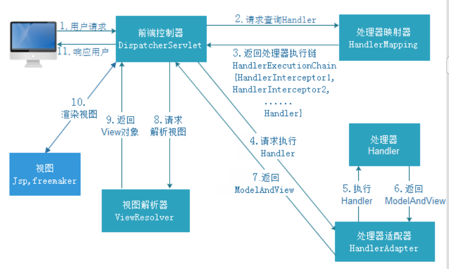
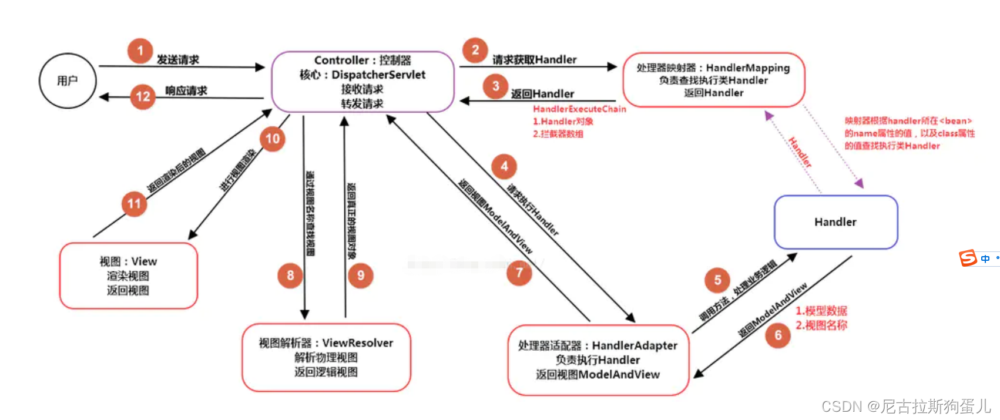

1什么是Spring MVC？简单介绍下你对Spring MVC的理解？
    描述：基于Java的 实现了MVC设计模式 的请求驱动类型的 轻量级Web框架
    组成：模型（Model）、视图（View）和控制器（Controller）
    优点：
        ‌灵活性‌：支持多种视图技术
        ‌松耦合‌：通过接口和注解，组件间的耦合度较低，便于维护和扩展
        ‌丰富的扩展性‌：可以通过拦截器、过滤器等方式扩展功能，满足各种复杂需求

2、Spring MVC的主要组件？
    前端控制器(DispatcherServlet)：接收HTTP请求、响应结果，相当于转发器。
    处理器映射器(HandlerMapping)：根据请求的URL映射到具体处理器(Handler)
    处理器适配器(HandlerAdapter)：前端控制器（DispatcherServlet）通过 处理器适配器（HandlerAdapter）调用处理器（Handler）处理请求
    处理器(Handler)：处理具体的业务逻辑,并返回ModelAndView对象给前端控制器（DispatcherServlet）
    视图解析器(ViewResolver)：根据ModelAndView中的视图名找到具体的视图对象，并将其返回给 前端控制器（DispatcherServlet）
    视图(View)：将模型数据渲染到用户界面上

3、工作原理
    （1）用户发送请求至前端控制器DispatcherServlet；
    （2） DispatcherServlet收到请求后，调用HandlerMapping处理器映射器；
    （3）处理器映射器根据请求url找到具体的处理器，生成处理器对象及处理器拦截器(如果有则生成)一并返回给DispatcherServlet；
    （4）DispatcherServlet 调用 HandlerAdapter处理器适配器；
    （5）HandlerAdapter 经过适配调用具体的处理器(Handler，也叫后端控制器)；
    （6）Handler执行完成返回ModelAndView；
    （7）HandlerAdapter将Handler执行结果ModelAndView返回给DispatcherServlet；
    （8）DispatcherServlet将ModelAndView传给ViewResolver视图解析器进行解析；
    （9）ViewResolver解析后返回具体View；
    （10）DispatcherServlet对View进行渲染视图（即将模型数据填充至视图中）
    （11）DispatcherServlet响应用户

4、注解原理是什么
    ‌本质：注解是一个继承了  Annotation 的特殊接口，具体实现类是Java运行时生成的动态代理类，返回的是Java运行时生成的动态代理对象
    实现：通过@interface关键字定义的，可以包含一些元素（类似于接口中的方法），这些元素可以有默认值。注解可以被附加到类、方法、字段、参数等元素上，以提供额外的信息或指示‌
    // 指定注解的作用范围：方法上
    @Target(ElementType.METHOD)
    // 指定注解的保留策略，RUNTIME表示注解会在运行时保留，可通过反射获取
    @Retention(RetentionPolicy.RUNTIME)
    public @interface MyCustomAnnotation {
    // 注解的元素，这里定义了一个名为value的字符串元素，有默认值"default"
    String value() default "default";
    }

5、Spring MVC常用的注解有哪些？
    @Conntroller：控制器的注解，将一个类标记为控制器
    @RestController：是@Controller和@ResponseBody的组合
    @RequestMapping：用于处理请求 url 映射的注解，可用于类或方法上。
    @RequestBody：接收http请求的json数据，将json转换为java对象。
    @ResponseBody：将返回值转化为json对象响应给客户。
    @RequestParam：参数名不一致‌时使用

6、@PathVariable（路径变量）和@RequestParam的区别
    @PathVariable（路径变量）：用于从URI模板变量中获取值，通常用于RESTful风格的URL
    @RequestParam：用于从请求参数中获取值

7、Spring MVC怎么样设定重定向和转发的？   补充代码实例
    （1）转发：浏览器的地址栏url不变；会携带之前的请求参数；在返回值前面加"forward:“
    （2）重定向：浏览器的地址栏url变化；不会携带之前的请求参数；（要传递参数可以拼接在url后）；在返回值前面加"redirect:“

8、Spring MVC中函数的返回值是什么？
    有String, ModelAndView。ModelAndView类把视图和数据都合并的一起的，但一般用String比较好