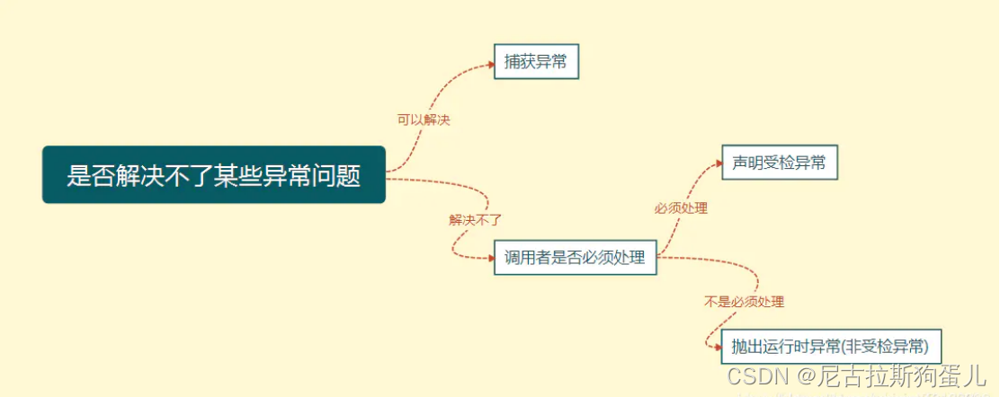

1、Java异常简介
    一种识别及响应错误的一致性机制

2、Java异常架构
    Throwable：是 Java 语言中所有错误与异常的超类;包含两个子类Error（错误）和 Exception（异常）
    Error:系统内部错误，通常无法恢复，程序员通常不处理 比如：JVM问题 OutOfMemoryError：内存不足错误  StackOverflowError：栈溢出错误
    Exception:程序运行中的异常情况，可分为两类：
                                受检查异常（Checked Exception）‌：编译时就需要被处理，如‌IOException SQLException ClassNotFoundException
                                ‌运行时异常（Runtime Exception）‌：编译时不需要强制处理，如‌NullPointerException ArrayIndexOutBoundException  ClassCastException

3、Java异常关键字(重点)
    try – 用于监听。将可能抛出异常的代码放在try语句块内
    catch – 用于捕获异常。catch用来捕获try语句块中发生的异常。
    finally – 总是会被执行。主要用于回收在try块里打开的资源(如数据库连接、网络连接和磁盘文件)。
                只有finally块，执行完成之后，才会回来执行try或者catch块中的return或者throw语句
                如果finally中使用了return或者throw等终止方法的语句，则就不会跳回执行，直接停止。
    throw – 抛出一个异常对象
    throws – 用于声明该方法可能抛出的异常

4、如何选择异常处理方式(重点)
    如图：
    try-catch: 可以解决的异常
    throw：解决不了的异常问题，且调用者不是必须处理
    throws：解决不了的异常问题，且调用者必须处理

5、Error 和 Exception 区别是什么？
    Error ：类型的错误通常为虚拟机相关错误，旦这类错误发生，通常应用程序会被终止，仅靠应用程序本身无法恢复；
    Exception ：类型的错误是可以在程序中进行捕获并处理的

6、运行时异常和一般异常(受检异常)区别是什么？
    是否强制要求调用者必须处理此异常，如果强制要求调用者必须进行处理，那么就使用受检异常，否则就选择非受检异常

7、NoClassDefFoundError 和 ClassNotFoundException 区别？
    NoClassDefFoundError： Error 类型的异常，是由 JVM 引起的，不应该尝试捕获这个异常；引起该异常的原因是编译时该类存在，但是在运行时却找不到了 如 jar冲突
    ClassNotFoundException： Exception类型的异常，需要捕获和处理。如 使用Class.forName, ClassLoader.loadClass 或 ClassLoader.findSystemClass动态加载类的时候没有找到该类

8、try-catch-finally 中哪个部分可以省略？
    try块不能省略 catch块可以省略 finally块可以省略

9、try-catch-finally 中，如果 try 中 return 了，finally 还会执行吗？ TryCatchExmaple.java (重点)
    会执行，在 return 前执行。
    注意：如果finally中有return 无论 try-catch中是否有ruturn 都执行 finally中的return

10、类 ExampleA 继承 Exception，类 ExampleB 继承ExampleA
    try {
    throw new ExampleB("b")
    } catch（ExampleA e）{
    System.out.println("ExampleA");
    } catch（Exception e）{
    System.out.println("Exception");
    }
    输出：ExampleA [根据里氏代换原则 能使用父类型的地方一定能使用子类型]

11、 try-with-resource 语法  TryCatchExmaple.java (重点)
    如果资源实现java.lang.AutoCloseable或java.io.Closeable接口。
    在try块中声明的资源，无论是正常完成还是由于异常退出，都会自动调用资源的close方法,无需在final手动关闭资源