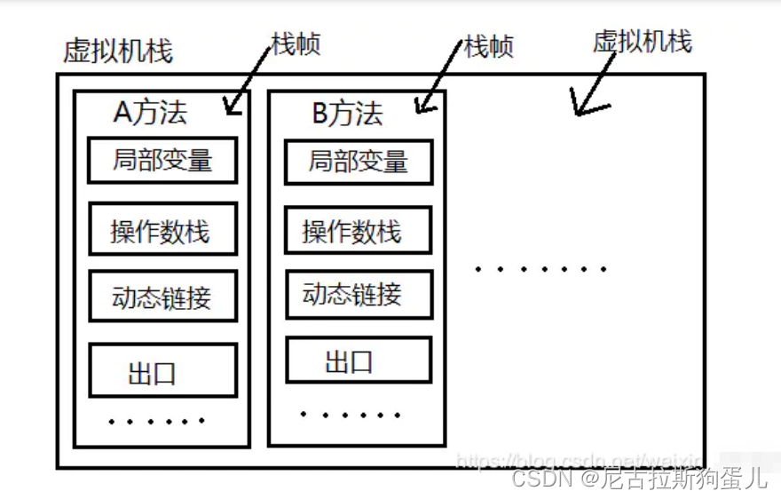

1、Java文件编译的过程
    .java文件—————编译器—————》.class文件—————jvm—————》二进制文件

2、说一下 JVM由那些部分组成，运行流程是什么？
    组成示意图：
    JVM包含两个子系统和两个组件:
        Class loader(类加载)子系统：根据给定的全限定名类名来加载class文件到Runtime data area中的method area
        Execution engine（执行引擎）子系统：执行classes中的指令。
        Native Interface(本地接口)组件：与native libraries（本地方法库）交互，‌实现与底层系统的交互（实现跨语言调用、访问系统级库‌）。
        Runtime data area(运行时数据区域)组件：这就是我们常说的JVM的内存
    流程 ：
        编译器把 Java 代码转换成字节码(calss文件)，
        类加载器（ClassLoader）再把字节码加载到 运行时数据区（Runtime data area）的 方法区的内存中，
            而字节码文件只是 JVM 的一套指令集规范，并不能直接交给底层操作系统去执行，因此需要特定的命令解析器
        执行引擎（Execution Engine），将字节码翻译成机器码，再交由 CPU 去执行， 而这个过程中需要调用其他语言的
        本地库接口（Native Interface）来实现整个程序的功能

3、说一下 JVM 运行时数据区
    程序计数器（Program Counter Register）：存放当前线程下一条指令的地址(行号)
    Java 虚拟机栈（Java Virtual Machine Stacks）：每个方法在执行时都会在Java 虚拟机栈中创建一个栈帧（Stack Frame）用于存储局部变量表、操作数栈、动态链接、方法出口等信息；
    本地方法栈（Native Method Stack）：与虚拟机栈的作用是一样的，只不过虚拟机栈是服务Java方法的，而本地方法栈是服务于虚拟机调用的 Native 方法；Native 关键字修饰的方法是看不到的，Native 方法的源码大部分都是 C和C++ 的代码
    Java 堆（Java Heap）：Java 虚拟机中内存最大的一块，是被所有线程共享的，几乎所有的对象实例都在这里分配内存；
    方法区（Methed Area）：所有线程共享的，用于存储已被虚拟机加载的类信息、常量、静态变量、即时编译后的代码等数据

4、详细的介绍下程序计数器？（重点理解）
    定义：存放当前线程下一条指令的地址(行号)
    线程私有的：线程切换后能恢复到正确的执行位置，每条线程都有一个独立的程序计数器（也可以把它叫做线程计数器）

5、详细介绍下Java虚拟机栈?（重点理解）
    定义：线程私有的，生命周期和线程相同。（虚拟机执行Java方法时所使用的数据结构，每个线程在创建时都会分配一个Java虚拟机栈。）
    作用‌：用于存储栈帧，方法调用时创建的数据结构，用于存储局部变量、操作数栈、动态链接和方法出口等信息。
    栈帧：虚拟机栈的单位就是栈帧，一个方法一个栈帧。
    栈帧的组成：如图（）
        局部变量表（Local Variables）：存入参和局部变量。
        操作数栈（Operand Stack）：用于计算表达式和中间结果，计算后再存入局部变量表。
        动态链接（Dynamic Linking）：指向运行时常量池的符号引用（类、接口、字段和方法的符号引用）
        方法出口（Return Address）：存放方法被调用后应该返回的地址或是指向的指令（程序计数器的值）
    特点：后进先出（LIFO）的数据结构，每次方法调用都会创建一个新的栈帧并压入栈中，方法返回时栈帧从栈中弹出；栈的深度是有限的
    与本地方法栈的区别‌：虚拟机栈执行Java方法，而本地方法栈用于执行本地方法（即使用Java以外的语言编写并通过JNI调用的方法）
    优化与调优‌：栈的大小可以通过-Xss参数进行设置（-Xss：每个线程的堆栈大小）；关注栈的使用情况，避免栈溢出或内存浪费

6、一个方法调用另一个方法，会创建很多栈帧吗？
    会创建。如果一个栈中有动态链接调用别的方法，就会去创建新的栈帧

7、栈指向堆是什么意思？
    栈中存储一个指向堆内存的引用（方法中创建一个对象）

8、递归的调用自己会创建很多栈帧吗？
    会创建多个栈帧，就是在栈中一直从上往下排下去（压栈）

9、你能给我详细的介绍Java堆吗?（重点理解）
    定义：线程共享，存放对象实例和数组，虚拟机启动时创建
    特点：
        ‌动态性‌：堆内存在程序运行时动态分配，可根据需要扩展或收缩（-Xmx‌：堆内存允许扩张的最大值  -Xms‌：堆内存初始大小）
        垃圾收集‌：堆是垃圾收集器的主要工作区域（也被成为“GC堆”）
        分代收集：新生代存储新创建的对象；老生代存储生命周期较长的对象
        结构：新生代（eden/from/to）、老年代、永久代
        线程共享

10、能不能解释一下方法区（重点理解）
    定义：所有线程共享，用于存储类的元数据信息、静态变量、常量池等；JVM启动时创建
    内存回收‌：方法区的内存回收效率较低，主要涉及常量池和类型卸载，不是垃圾收集的重点‌

11、能不能解释一下本地方法栈？
    定义：本地方法栈与Java栈类似，但主要用于存储和管理本地方法的调用（方法上带了 native 关键字 如C或C++编写的代码）

12、什么是JVM字节码执行引擎
    概述：将字节码翻译成机器码，再交由 CPU 去执行；这个过程中需要调用本地库接口（Native Interface）来实现整个程序的功能（利用到本地方法栈）

13、知道垃圾收集系统吗？
    检测并回收没有引用指向的内存对象，以优化内存。垃圾收集系统自动处理，开发人员无需手工清理

14、静态变量如何存储
    静态变量的引用，存储在方法区；静态变量引用的对象，上存放在堆内存中

15、深拷贝和浅拷贝
    浅拷贝（shallowCopy）：增加一个引用指向已存在的内存地址，
    深拷贝（deepCopy）：增加一个引用并且申请一个新的内存，使这个增加的引用指向这个新的内存

16、java会存在内存泄漏吗？请说明为什么？MemoryLeakExample.java
    答案：存在着内存泄漏;长生命周期的对象持有短生命周期对象的引用就很可能发生内存泄露。如数据库连接、网络连接等
    定义:程序在申请内存后，无法释放已申请的内存空间，导致内存占用不断增加

17、简述Java垃圾回收机制
    没有被引用的对象，由虚拟机自行回收，无需开发者手动回收；

18、GC是什么？为什么要GC
    GC : 垃圾收集的意思，将没有被引用的对象，由虚拟机自行回收，无需开发者手动回收；
    原因：避免内存问题，简化内存管理。
    优点：不需手动处理
    缺点：不能实时处理

19、垃圾回收器的原理是什么？有什么办法手动进行垃圾回收？
    原理：
        垃圾识别‌：通过标记-清除算法或根搜索算法，从根对象出发，递归遍历所有可达对象，未标记的对象视为垃圾。
        ‌垃圾回收‌：回收被标记为垃圾的对象，清理内存，并形成连续内存块供后续分配
    手动回收‌：调用System.gc()方法，但不保证调用后垃圾回收器一定会立即执行

20、JVM 中都有哪些引用类型？
    强引用：发生 gc 的时候不会被回收。Object obj = new Object();
    软引用：有用但不是必须的对象，在发生内存溢出之前会被回收。SoftReference<Object> softReference = new SoftReference<>(obj);
    弱引用：有用但不是必须的对象，在下一次GC时会被回收。WeakReference<Object> weakReference = new WeakReference<>(obj);
    虚引用：对象被垃圾回收时返回一个通知，必须和引用队列联合使用，用 PhantomReference、ReferenceQueue 实现虚引用

21、怎么判断对象是否可以被回收？
    可达性分析算法：根对象（通常是全局变量、静态变量和线程栈中的局部变量）开始,递归地遍历所有可达的对象。任何从根对象不可达的对象都被视为垃圾并回收。
    引用计数器法：每个对象添加一个引用计数器；对象被创建时，计数器初始化为0；引用指向该对象时，计数器加1；引用失效（如引用被置为null或指向其他对象）时，计数器减1；将计数器为0的对象视为垃圾并回收
    缺点：不能解决循环引用的问题（已经淘汰）

22、Full GC是什么
    清理整个堆空间—包括年轻代和老年代和永久代

23、JVM中的永久代中会发生垃圾回收吗
    垃圾回收不会发生在永久代，如果永久代满了或者是超过了临界值，会触发完全垃圾回收(Full GC)

24、讲一下新生代、老年代、永久代的区别
    示意图：
    新生代：采用复制算法进行回收
        Eden区‌：存储新创建的对象，Eden区内存不足时，会触发MinorGC进行垃圾回收；
        From Survivor（幸存者）区：也称为From区，存放上一次GC后存活的对象，作为这一次GC的被扫描者
        To Survivor区‌：也称为To区，在MinorGC后，存活的对象从Eden区和From Survivor区复制到To Survivor区，并清空Eden区和From Survivor区，然后To区和From区互换角色
    老年代：存放经过多次新生代GC仍然存活的对象；采用“标记-清理”或“标记-整理”算法进行回收
    永久代：存储类信息、静态变量、常量等数据

25、Minor GC、Major GC、Full GC是什么
    Minor GC：新生代GC，inor GC非常频繁，回收速度也比较快。（一般采用复制算法回收垃圾）
    Major GC：老年代GC，Major GC的速度要比Minor GC慢的多。（可采用标记清楚法和标记整理法）
    Full GC：清理整个堆空间，包括新生代和老年代和永久代

26、Minor GC、Major GC、Full GC区别及触发条件
    Minor GC：eden区满时
    Major GC：老年代空间不足、Minor GC后老年代空间仍不足
    Full GC：老年代空间不足、方法区空间不足、System.gc()调用

27、为什么新生代要分Eden和两个 Survivor 区域？
    Survivor的存在意义：减少送到老年代的对象，从而减少Full GC的发生
    两个Survivor：每次Minor GC时，存活对象从一个区域复制到另一个空闲区域，减少内存碎片‌化。
    内存碎片化的缺点:内存资源浪费、性能下降‌、内存分配失败‌

28、Java堆老年代( Old ) 和新生代 ( Young ) 的默认比例？
    新生代 ( Young ) 与老年代 ( Old ) 的比例的值： 1:2  (可以通过参数 –XX:NewRatio来指定 默认：–XX:NewRatio=2 )
    即：新生代 ( Young ) = 1/3 的堆空间大小；老年代 ( Old ) = 2/3 的堆空间大小
    Edem 和俩个Survivor 区域比例 是 = 8 : 1 : 1 ( 可以通过参数 –XX:SurvivorRatio 来设定 默认：–XX:SurvivorRatio=8 )

29、类加载的机制及过程  ClassLoaderExample.java
    机制：Java类加载器遵循一个称为双亲委派模型的机制。当一个类加载器需要加载一个类时，它首先将这个任务委托给它的父类加载器。如果父类加载器找不到该类，子类加载器才会尝试自己加载。
    过程：使用某个类时，如果该类还未被加载到内存中，则JVM会通过加载、连接、初始化3个步骤。
        加载：将类的class文件读入到内存；由类加载器 找到对应的字节码文件，并从这个文件中创建一个Class对象读入到内存。
        连接：分为验证（Verification）、准备（Preparation）和解析（Resolution）三个阶段
            验证：确保加载的类信息的正确性，防止恶意代码对JVM造成危害
            准备：为类的静态变量分配内存，并将其初始化为默认值
            解析：将类中的符号引用转换为直接引用（比如将方法名转换为指向方法区的指针）
        初始化：JVM会执行类的构造器方法<clinit>()，为类的静态变量赋予正确的初始值，执行静态代码块
    类加载器：系统类加载器---》扩展类加载器----》引导类加载器‌三类
        引导类加载器（Bootstrap ClassLoader）‌：负责加载Java的核心库（如java.lang.*等）
        扩展类加载器（Extension ClassLoader）‌：负责加载JDK扩展目录中的类库（通常是$JAVA_HOME/lib/ext目录中的JAR包）
        系统类加载器（System ClassLoader）（也被称为‌应用程序类加载器）：加载Java类,默认的类加载器 （父类加载器是扩展类加载器）

30、JVM 调优的参数可以在那设置参数值
    可以在IDEA，Eclipse里设置
    如果上线了是WAR包的话可以在Tomcat设置，修改server.xml
    如果是Jar包直接 ：java -jar 是直接插入JVM命令就好了 如： java -Xms1024m -Xmx1024m ...等等等 JVM参数 -jar springboot_app.jar &

31、说一下 JVM 调优的工具？
    JDK 的 bin 目录下，其中最常用的是 jconsole

32、常用的 JVM 调优的参数都有哪些？
    -Xms：初始堆大小，JVM 启动的时候，给定堆空间大小。
    -Xmx：最大堆大小，JVM 运行过程中，如果初始堆空间不足的时候，最大可以扩展到多少。
    -Xss：设置每个线程的堆栈大小。JDK5后每个线程 Java 栈大小为 1M，以前每个线程堆栈大小为 256K。
    -Xmn：设置堆中年轻代大小。整个堆大小=年轻代大小+年老代大小+持久代大小。
    -XX:NewSize=n 设置年轻代初始化大小
    -XX:MaxNewSize=n 设置年轻代最大值
    -XX:NewRatio=n 设置年轻代和年老代的比值。如: -XX:NewRatio=3，表示年轻代与年老代比值为 1： 3，年轻代占整个年轻代+年老代和的 1/4
    -XX:SurvivorRatio=n 年轻代中 Eden 区与两个 Survivor 区的比值。注意 Survivor 区有两个。8 表示两个Survivor :eden=2:8 ,即一个Survivor占年轻代的1/10，默认就为8
    -XX:ThreadStackSize=n 线程堆栈大小
    -XX:PermSize=n 设置持久代初始值
    -XX:MaxPermSize=n 设置持久代大小
    -XX:MaxTenuringThreshold=n 设置年轻带垃圾对象最大年龄。如果设置为 0 的话，则年轻代对象不经 过 Survivor 区，直接进入年老代。
    #下面是一些不常用的
    -XX:LargePageSizeInBytes=n 设置堆内存的内存页大小
    -XX:+UseFastAccessorMethods 优化原始类型的getter方法性能
    -XX:+DisableExplicitGC 禁止在运行期显式地调用System.gc()，默认启用
    -XX:+AggressiveOpts 是否启用JVM开发团队最新的调优成果。例如编译优化，偏向锁，并行年老代收集 等，jdk6纸之后默认启动
    -XX:+UseBiasedLocking 是否启用偏向锁，JDK6默认启用
    -Xnoclassgc 是否禁用垃圾回收
    -XX:+UseThreadPriorities 使用本地线程的优先级，默认启用 等等等…

33、JVM的GC收集器设置
    模版：-xx:+Use xxx GC ： xxx 代表垃圾收集器名称
    实例：
        -XX:+UseSerialGC:设置串行收集器，年轻带收集器
        -XX:+UseParNewGC:设置年轻代为并行收集。可与 CMS 收集同时使用。JDK5.0 以上，JVM 会根据系统 配置自行设置，所以无需再设置此值。
        -XX:+UseParallelGC:设置并行收集器，目标是目标是达到可控制的吞吐量
        -XX:+UseParallelOldGC:设置并行年老代收集器，JDK6.0 支持对年老代并行收集。
        -XX:+UseConcMarkSweepGC:设置年老代并发收集器
        -XX:+UseG1GC:设置 G1 收集器，JDK1.9默认垃圾收集器

    