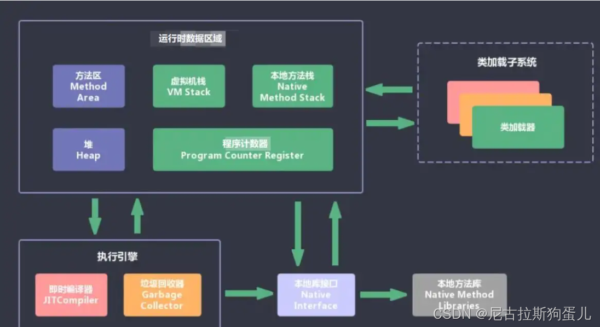
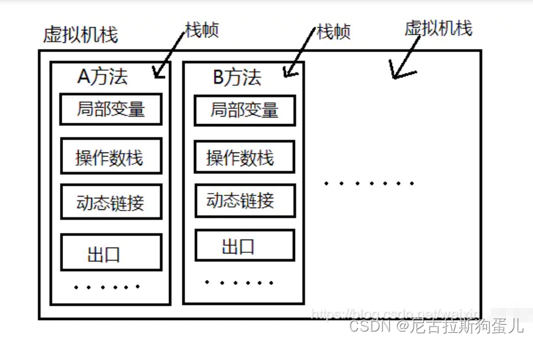
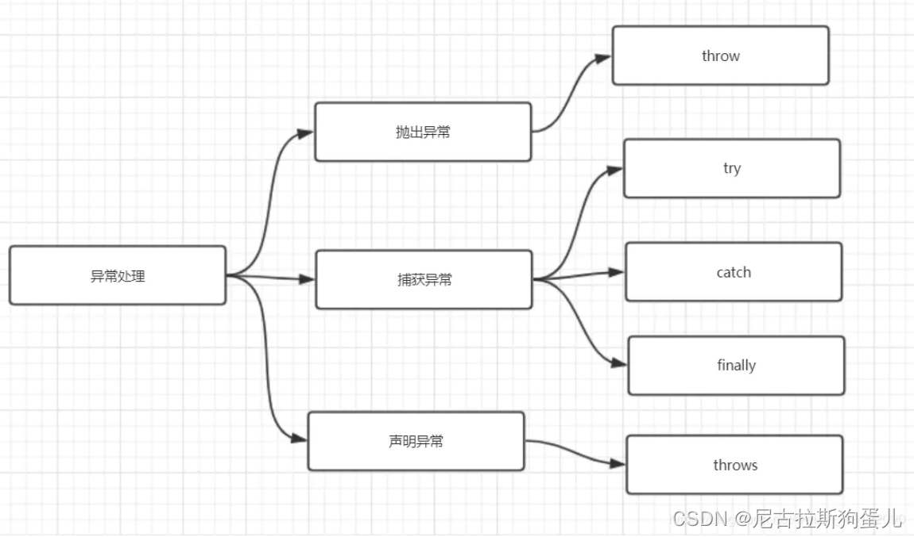
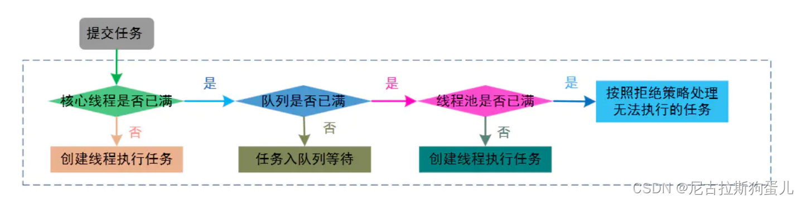
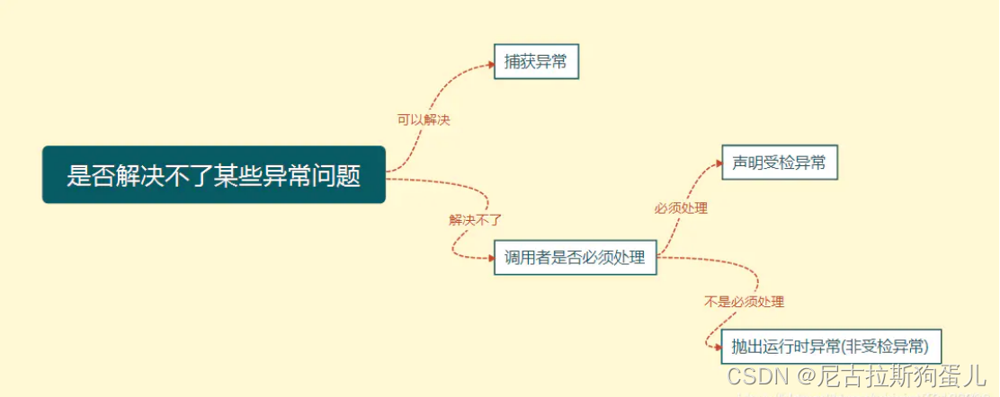

学习：
activiti工作流
spring security：认证、授权、权限控制
Nginx深入
推荐一个githut java高并发实战项目
推荐一个githut java云原生实战项目：Docker K8s  DevOps  声明式API
推荐一个githut VUE实战项目
kafak  es  JMeter  Jenkins  

本次面试准备重点：

===================================java基础：=============================================
Jdk和Jre和JVM
Java有哪些数据类型：8+1
Java语言有哪些特点
面向对象三大特性
抽象类和接口的对比
Jdk8接口提供了哪些新特性
重载（Overload）和重写（Override）的区别
== 和 equals 的区别是什么
String、StringBuilder、StringBuffer 的区别: final修饰  动态拼接  线程安全
java 中 IO 流分为几种
什么是反射机制
Java获取反射的三种方法

List，Set，Map常见集合 和  特点： Arraylist LinkedList HashSet LinkedHashSet TreeSet HashMap LinkedHashMap TreeMap  线程安全集合
Iterator 和 ListIterator 有什么区别
遍历一个 List 有哪些不同的方式 和 特点
HashMap的实现原理: 结构、扩容机制、哈希冲突、红黑树特点
HashMap 的长度为什么是2的幂次方： &比%快   扩容需要移动的数据更少
讲讲ConcurrentHashMap线程安全的原理：cas+Synchronized
comparable 和 comparator的区别

如何选择异常处理方式：3种
try-with-resource 语法： 不需要手动关闭资源

同步与异步、阻塞与非阻塞区别：调用者是否等待结果返回、 调用者线程是否挂起
形成死锁的四个必要条件是什么
如何避免线程死锁
创建线程的三种方式及各自区别
线程的5种状态
sleep() 和 wait() 有什么区别？
Java 中 interrupt 和 isInterrupted 方法的区别？ interrupted
什么是线程同步，有哪几种实现方式？/ 怎么保证多线程的运行安全
单例模式了解吗？给我解释一下双重检验锁方式实现单例模式！
synchronized 底层实现原理: 监视器构成及各自作用
synchronized可重入的原理： 重入计数器
多线程中 synchronized 锁升级的原理是什么: 偏向锁、轻量级锁、自旋、重量级锁
什么是自旋：特点、作用
synchronized、Lock、volatile、CAS 比较： 各自特点
什么是ThreadPoolExecutor： 7种参数、执行原理、拒绝策略
如何合理分配线程池大小：CUP密集型（线程使用高）  IO密集
线程池都有哪些状态： 5种

JVM由那些部分组成：4种 、 作用
JVM 运行时数据区：5个区域、 存储内容、共享性
Java堆：存放对象实例和数组、线程共享、占用内存最大、GC核心区域、内存可变、分区存储（新生代、老年代）
方法区：线程共享、存储类加载信息、元空间存储
Java虚拟机栈：共享性、存储单元、 存储内容
程序计数器：作用
java会存在内存泄漏吗: 会  静态集合重灾区   本质
Full GC是什么：清理的是整个 Java 堆空间
讲一下新生代、老年代、元空间的区别
Minor GC、Major GC、Full GC是什么及触发条件
JVM 调优的参数都有哪些？
arthas(阿尔萨斯)监控：特点-非侵入式动态、命令

======================================redis应用场景 ====================================================
什么是Redis： 开发语言   单线程   存储方式    数据结构及5种value
Redis应用场景及作用： 临时存储-无需入库   热点数据-减轻数据库压力   分布式锁-分布式线程安全   跨服务共享-Token、用户信息
Redis 的持久化机制： RDB AOF 各种优缺点
过期键的删除策略：惰性 定期
内存淘汰策略： LRU  LFU  TTL  Random
Redisson分布式锁：可重入锁、公平锁、读写锁；内置了看门狗（Watchdog）机制；在删除锁之前，客户端需要确保它仍然持有锁；   Lua 脚本 + Redis 单线程 + Hash（key锁名 Field持锁线程 value重入次数） 结构保证了原子性
缓存击穿： 描述  方案-重建缓存加锁、逻辑过期
缓存穿透： 描述  方案-布隆过滤器、设置临时key-null
缓存雪崩： 描述  方案-随机过期时间、多级缓存架构、redis集群、限流与降级
证缓存与数据库双写时的数据一致性：延迟双删 + 事务回调（最终一致性,高性能）、分布式读写锁‌(强一致性，低性能)、 版本号控制+缓存CAS(乐观锁，中性能)

=================================mysql优化、事物====================================
@Transactional失效的三种情况： public   自调用   try-catch
事物导致锁表： 长耗时逻辑，在事物外处理（多接口调用）
MyISAM 和InnoDB 的区别：事物 锁  索引
聚簇索引与非聚簇索引区别：
回表
并发事务引发的三大问题
四种事务隔离级别
事务四个特性ACID
数据库优化策略：读写分离(MySQL主从配置+ShardingSphere)  分库分表(ShardingSphere)  分区（MySQL配置）   垂直拆分-扩展表    SQL语句优化   SQL索引优化   
索引的底层B+树结构特点： 非叶子节点存索引  叶子节点存数据  二分查找
B+树中查询数据的全过程： SQL 解析与优化、 缓存查找、 检索过程-二分查找
索引失效场景：最左前缀  字段使用函数/运算  like   范围查询    隐式类型转换   or   结果集过大
索引优缺点：查询快  维护需要消耗时间空间   建立原则
undo redo binlog 日志作用
事务的二阶段提交
MySQL中跟踪排查慢SQL： 开启慢SQL日志  explain检查
EXPLAIN分析字段说明： type  key rows  Extra
SQL执行顺序
大字段建索引： 前缀索引、 全文索引
三层B+树: 第一层：1170 个索引    第二层：1170 × 1170   第三层：1170 × 1170 × 1170=2000w条数据,最优的设计结构；    超过三层需要引入 分库分表 策略

====================================== RabbitMQ消息队列 ====================================================
MQ（消息队列）作用： 解耦、异步、削峰
Rabbit五种模式：队列、消费者、交换机特点
如何保证顺序消费：3种
如何保证消息不丢：生产者  Rabbit自身  消费端   
如何防止重复消费：入库-新增、修改    不入库-新增、修改    Redis的set、hash
死信队列: 实现方式   用途

====================================== spring框架集 ====================================================
Spring的俩大核心概念：IOC的特点 AOP的特点、实现方式、关键名称、通知类型
自定义注解实现方式
bean的作用域：4种
什么是自动装配：bean查找、注入属性、三种注入方式
解释Spring框架中bean的生命周期： 实例化‌ 、 属性填充、 初始化、 初始化前后置处理、使用、销毁
Spring 启动过程：容器初始化(加载Bean配置文件、扫描Bean注解)、
                加载Bean定义(解析配置：读取配置文件的 <bean> 定义、扫描容器化管理注解；‌注册到容器：将 Bean 的元信息（如类名、作用域、依赖）存储到容器)、 
                处理扩展点(替换 ${} 占位符为实际值、插入AOP 代理)、
                实例化 Bean(创建对象、依赖注入、初始化回调)、
                容器就绪
哪些是重要的bean生命周期方法： @PostConstruct;   @PreDestroy ;  实现 BeanPostProcessor 接口,重写前/后置方法
@Autowired和@Resource之间的区别： 注入方式   bean冲突解决方案
spring 的事务隔离： 默认+4种
Spring的事务传播行为：7种
什么是循环依赖：两个或多个 Bean 相互引用对方；`三级缓存机制‌ 解决 ‌单例 Bean 的属性/setter注入（无法解决构造器注入）‌ 循环依赖`

什么是Spring MVC：组成、组件、工作原理

#{}和${}的区别： #{}防止SQL注入
模糊查询like语句该怎么写： CONCAT
MyBatis的一二级缓存及作用： 作用  作用域  默认状态  失效触发条件

SpringBoot 是什么：快速开发、自动配置、内嵌服务器、‌Starter 预置依赖(自动集成所有相关依赖)
Spring Boot 的核心注解：组成 作用
SpringBoot Starter的工作原理：扫描Jar包的spring.factories 文件、 手动排除、  条件筛选：@Conditional 系列注解 、  生成 Bean 并注入容器
如何在 Spring Boot 启动的时候运行一些特定的代码：容器启动时，实现ApplicationRunner接口；  Bean初始化相关
SpringBoot 启动过程：启动入口(调用主启动类的SpringApplication.run()方法)、
                    初始化配置(判断应用类型；加载 spring.factories 中的配置类、监听器)、
                    环境准备(加载配置源：命令行参数、配置文件、环境变量等；激活环境配置：开发、测试、生产环境‌)、
                    应用上下文创建(根据应用类型创建对应的上下文对象)、
                    刷新上下文(加载 Bean定义：注解 、加载并过滤 spring.factories 中的自动配置类;  实例化单例 Bean； 启动内嵌服务器;)、
                    完成启动
读取 配置文件 属性值的方式：4种 特点
什么是 JavaConfig： 定义、实现

微服务请求完整流转过程
    用户发起请求：浏览器访问 https://mall.com/api/order/create，携带JWT Token。
    Nginx 反向代理：SSL终止，静态资源直接返回，API请求转发到Gateway集群（负载均衡）。
    Gateway 鉴权：AuthFilter-过滤器 校验Token合法性，白名单路径放行，非法请求返回401，合法请求将用户ID放入请求头。
    Gateway 路由转发：根据路径匹配规则，将请求转发到 lb://order-service。
    Nacos 服务发现：LoadBalancer 从Nacos获取order-service的所有健康实例列表。  注解：@Value("${app.value}")   @RefreshScope: 动态刷新
    负载均衡：根据策略（如轮询）选择一个order-service实例。
    Order-Service 处理：
    Sentinel 拦截请求，校验限流规则，超限则返回降级响应。   `    @SentinelResource(value = "createOrder",// 资源名      blockHandler = "handleBlock",// 限流/熔断时的降级方法    fallback = "handleFallback" // 业务异常时的降级方法)`
    ` @GlobalTransactional` 开启Seata全局事务，生成XID并放入请求头。
    通过OpenFeign调用product-service，自动传递XID。   注解：启动类 `@EnableFeignClients`   接口上加 ` @FeignClient("provider-service")`  注解；  方法上加  `@GetMapping("")`  注解
    Product-Service 处理：
    Feign拦截器将XID放入请求头。
    Seata拦截器识别XID，开启分支事务，执行库存扣减，记录undo_log。
    返回结果给order-service。
    事务提交/回滚：
    所有分支成功：Seata TC通知所有RM提交事务，删除undo_log。
    任一分支失败：Seata TC通知所有RM根据undo_log回滚，保证数据一致性。
    响应返回：结果沿原路返回，Gateway记录访问日志，Nginx返回给用户

====================================== Linux常见命令 ====================================================

====================================== Docker部署问题 ====================================================
Docker组成：客户端  、 主机  、 镜像（应用市场、共享）   

Docker客户端常用命令：
Docker pull xxx: 下载镜像
Docker run xxx: 运行镜像
Docker build xxx: 构建镜像
Docker push xxx: 上传镜像

主机构成：
Docker daemon: 守护进程，后台运行，监听docker命令，管理镜像、容器
Docker 容器：运行镜像的进程
Docker 镜像：拉取的镜像

镜像市场：共享镜像

Docker安装：
1.购买云服务器: 获取公网IP  配置关机不收费模式
2.下载安装远程客户端工具-WindTerm免费： 用公网连接
3.Docker安装： Docker源下载源（配置阿里云镜像）、 安装Docker引擎  、  启动Docker服务  、 配置开机启动Docker 、 配置Docker加速

Docker常见命令：

    帮助： Docker run --help:  当前命令如何使用，有哪些参数列表
    
    镜像相关：（xxx 为镜像名称）
        搜索： docker search xxx
        下载： docker pull xxx （可指定版本：https://hub.docker.com/ 获取版本信息）
        列表： docker images
        删除： docker rmi xxx
    
    容器相关： (xxx:容器名称   yyy: 镜像名称)
        运行： docker run yyy    （启动后，窗口不能关闭也不能做其他操作）
        后台运行： docker run -d --name xxx -p 8088:8080  yyy   (-d 后台运行; --name  指定容器名称 ; -p  映射端口 :8088 映射到容器的8080端口； yyy: 镜像名称)
        开机启动：docker run -d --restart=<策略> --name <容器名> <镜像名>  （--restart=<参数列表：no  on-failure:5  always  unless-stopped>）
        详细：docker inspect xxx   （查看容器详情）
        查看： docker ps      （-a  包括停止的容器）
        停止： docker stop xxx
        启动： docker start xxx   
        重启： docker restart xxx
        状态： docker stats  （内存 CPU  网络 等）
        日志： docker logs
        进入： docker exec -it xxx bash  (-it: 交互模式进入容器，可操作容器内的文件； bash: 进入容器的bash)
        删除： docker rm xxx
    
    修改的容器保存为镜像：
        进入： docker exec -it xxx bash  (-it: 交互模式进入容器，可操作容器内的文件； bash: 进入容器的bash)
        提交： docker commit -m "xxx" -a "xxx" xxx yyy:tag   （提交修改的容器为镜像；   -m: 提交信息 ; -a: 提交作者; xxx: 容器名称; yyy:tag: 镜像名称:标签(版本)）
        保存： docker save -o zzz.tar yyy:tag   (保存镜像为文件；   -o: 定义保存文件名; xxx:tag: 镜像名称:标签(版本))
        加载： docker load -i zzz.tar   ( 加载镜像；   -i: 加载镜像的文件名)
    
    分享镜像到社区：
        0.创建账号：https://hub.docker.com/
        1.登录： docker login
        2.命名： docker tag source_image:tag  target_image:tag   (按Docker命名规则命名镜像；  原镜像名:标签(版本)    账号名/新镜像名:标签(版本))
        3.推送： docker push target_image:tag
    
    卷相关： 
        关联：docker run -d --name my-app -v my-vol:/app/data nginx     （关联容器 my-app   卷：my-vol   镜像：nginx）
        创建：docker volume create xxx
        列表：docker volume ls
        详细：docker volume inspect xxx
        删除：docker volume rm xxx
        清理: docker volume prune   （删除未关联容器的卷）

    网络相关：
        关联：docker run -d --name my-app --network my-net nginx      （关联容器：my-app  网络：my-net   镜像：nginx）
        创建：docker network create  xxx      (创建自定义网络)
        列表：docker network ls
        详细：docker network inspect xxx
        删除：docker network rm xxx
        清理：docker network prune      （删除未关联容器的网络）
        连接：docker network connect my-net my-container  (将 my-container容器 连接到 my-net网络)
        断开：docker network disconnect my-net my-container

浏览器访问：
1.Docker运行时，做端口映射，容器启动成功后，浏览器访问： http://ip:端口
2.云服务器配置：安装组-开放端口

Docker存储：
作用：容器run时创建，实现容器数据不丢失
两种方式：
目录挂载： -v /app/nghtml:/usr/share/nginx/html  （-v 容器外部目录:容器内部目录   作用：挂载的目录会直接覆盖容器内的原有目录内容  缺点：只会自动创建目录，文件需手动创建）
卷映射（推荐）：-v ngconf:/etc/nginx   (-v 卷名:容器内部目录   作用：容器内的目录内容会自动复制到卷中     卷统一存放位置：/var/1ib/docker/volumes/卷名)

网络访问：
Docker网络：
容器IP： Docker 会为 每一个容器分配一个IP  （通过 docker inspect xxx  查看）
容器访问：容器之间访问可以通过 curl ip:port
自定义网络：
容器IP：自定义网络会为 每一个容器分配一个IP
容器访问：curl http://容器名：端口

redis集群：
docker商店下载redis镜像 （非官网镜像：bitnami）
环境变量配置： 在执行run 命令时，按要求配置主从配置 网络配置 端口配置
测试连接：使用redis链接工具测试连接， 修改主数据，查看从数据是否同步

Dockerfile镜像制作：             （https://docs.docker.com/reference/dockerfile/）
1.Dockerfile文件编写：  
2.镜像构建：  docker build -f Dockerfile -t myjavaapp:v1.0 . (-f 文件名称   -t 镜像名称+版本号   . 当前目录-指定app.jar位置)

Docker Compose(Docker 容器集编排)：   
1.创建compose.yaml文件  (配置相关容器启动命令)
2.配置顶级元素： name-名称    services-服务/容器     networks-网络   volumes-卷     configs-配置     secrets-秘钥     （配置官网说明：https://docs.docker.com/compose/compose-file/）
3.services配置详情： 镜像  端口映射    环境配置    绑定卷（配置目录挂载 和  卷映射）   开机自启    绑定网络     依赖容器
4.网络配置
5.volumes配置详情：在service中配置的 卷映射的  需要在 volumes中 指定
6.上线：docker compose -f xxx up -d  (compose.yaml 配置文件)

Docker Compose命令：
上线：docker compose -f xxx up -d  (启动 xxx 配置文件)
下线：docker compose -f xxx down
启动指定容器：docker compose start x1 x2
停止指定容器：docker compose stop x1 x2
扩容指定容器：docker compose scale x1=3             （同一个镜像，启动多个容器）

